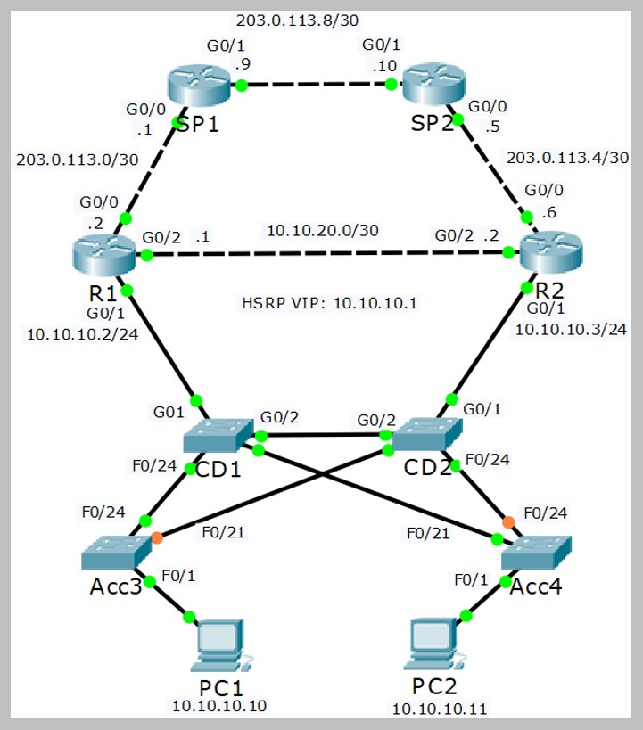

# HSRP Configuration (Source: Udemy)
## Instructor: Neil Anderson  
### **Pkt file:** [Here](https://mega.nz/file/Dto2wD7b#ugMehOJul9ykX1rN5JKGuDjvJrYurnSHIzgD9MMv2_o)
### Scenario: 


## **Basic HSRP**

📣 1)	Configure basic HSRP for the 10.10.10.0/24 network using the IP addresses shown in the topology diagram.
- Check to see if the physical IP addresses for the HSRP interface GigabitEthernet0/1 have been configured on R1 and R2. They haven’t been configured yet so correct that. 
```
R1(config)#int g0/1
R1(config-if)#ip address 10.10.10.2 255.255.255.0 
R1(config-if)#no shut
R2(config)#int g0/1
R2(config-if)#ip address 10.10.10.3 255.255.255.0
R2(config-if)#no shut
```
```
R1(config)#int g0/1
R1(config-if)#standby 1 ip 10.10.10.1
R2(config)#int g0/1
R2(config-if)#standby 1 ip 10.10.10.1
```
📣 2)	Wait for HSRP to come up on both routers and then check which is the active router.
- Both routers have the same default priority so the router with the highest IP address will be preferred. If you complete the configuration on both routers before HSRP comes up on both then R2 will be active. (If you configure HSRP on R1 before R2, and HSRP has already come up on R1 before HSRP comes up on R2, then R1 will be active.)
```
R1#sh standby
GigabitEthernet0/1 - Group 1
  State is Active
    5 state changes, last state change 00:05:37
  Virtual IP address is 10.10.10.1
  Active virtual MAC address is 0000.0C07.AC01
    Local virtual MAC address is 0000.0C07.AC01 (v1 default)
  Hello time 3 sec, hold time 10 sec
    Next hello sent in 0.646 secs
  Preemption disabled
  Active router is local ✅
  Standby router is 10.10.10.3 ✅
  Priority 100 (default 100) 
  Group name is hsrp-Gig0/1-1 (default)
```
📣 3)	Verify that the PCs can ping their default gateway using the HSRP address 10.10.10.1.
```
C:\>ping 10.10.10.1

Pinging 10.10.10.1 with 32 bytes of data:

Reply from 10.10.10.1: bytes=32 time<1ms TTL=255
Reply from 10.10.10.1: bytes=32 time<1ms TTL=255
Reply from 10.10.10.1: bytes=32 time<1ms TTL=255
Reply from 10.10.10.1: bytes=32 time<1ms TTL=255

Ping statistics for 10.10.10.1:
    Packets: Sent = 4, Received = 4, Lost = 0 (0% loss),
Approximate round trip times in milli-seconds:
    Minimum = 0ms, Maximum = 0ms, Average = 0ms
```
📣 4)	Verify that the PCs have upstream connectivity via their HSRP default gateway. Ping SP1 at 203.0.113.1
```
C:\>ping 203.0.113.1

Pinging 203.0.113.1 with 32 bytes of data:

Request timed out.
Reply from 203.0.113.1: bytes=32 time=10ms TTL=254
Reply from 203.0.113.1: bytes=32 time<1ms TTL=254
Reply from 203.0.113.1: bytes=32 time=1ms TTL=254

Ping statistics for 203.0.113.1:
    Packets: Sent = 4, Received = 3, Lost = 1 (25% loss),
Approximate round trip times in milli-seconds:
    Minimum = 0ms, Maximum = 10ms, Average = 3ms
```
📣 5)	What is the MAC address on the physical interface of the active router?
```
R1#sh int g0/1
GigabitEthernet0/1 is up, line protocol is up (connected)
  Hardware is CN Gigabit Ethernet, address is 00d0.ffeb.2d02 ✅
```
📣 6)	What is the MAC address of the HSRP virtual interface?
```
R1#sh standby
GigabitEthernet0/1 - Group 1
  State is Active
    5 state changes, last state change 00:05:37
  Virtual IP address is 10.10.10.1
  Active virtual MAC address is 0000.0C07.AC01 ✅
    Local virtual MAC address is 0000.0C07.AC01 (v1 default)
  Hello time 3 sec, hold time 10 sec
    Next hello sent in 2.558 secs
  Preemption disabled
  Active router is local
  Standby router is 10.10.10.3
  Priority 100 (default 100)
  Group name is hsrp-Gig0/1-1 (default)
```
📣 7)	Verify the PCs are using the virtual MAC address for their default gateway.
```
C:\>arp -a
  Internet Address      Physical Address      Type
  10.10.10.1            0000.0c07.ac01 ✅     dynamic
```
## **Priority and Pre-emption**

📣 8)	Configure HSRP so that R2 will be the preferred router. Use a single command.
- From the prvious command we can see that R1 is the active router. Now we manually configure so that R2 will be the active router. 
```
R2(config)#int g0/1
R2(config-if)#standby 1 priority 110
```
📣 9)	Which router do you expect will be active now? Verify this.
- R1 will remain active because we didn’t configure pre-emption.
```
R2(config-if)#do sh standby
GigabitEthernet0/1 - Group 1
  State is Standby
    3 state changes, last state change 00:05:55
  Virtual IP address is 10.10.10.1
  Active virtual MAC address is 0000.0C07.AC01
    Local virtual MAC address is 0000.0C07.AC01 (v1 default)
  Hello time 3 sec, hold time 10 sec
    Next hello sent in 0.177 secs
  Preemption disabled
  Active router is 10.10.10.2 ✅
  Standby router is local ✅
  Priority 110 (configured 110)
  Group name is hsrp-Gig0/1-1 (default)
```
📣 10)	Ensure that R1 is the active router. Do not reboot.
```
R2(config)#int g0/1
R2(config-if)#standby 1 preempt
```
```
R2#sh standby
GigabitEthernet0/1 - Group 1
  State is Active
    4 state changes, last state change 00:19:20
  Virtual IP address is 10.10.10.1
  Active virtual MAC address is 0000.0C07.AC01
    Local virtual MAC address is 0000.0C07.AC01 (v1 default)
  Hello time 3 sec, hold time 10 sec
    Next hello sent in 2.414 secs
  Preemption enabled
  Active router is local ✅
  Standby router is 10.10.10.3, priority 100 (expires in 0 sec)
  Priority 110 (configured 110) ✅
  Group name is hsrp-Gig0/1-1 (default)
```
## **Test HSRP**

11)	Run a continuous ping to the HSRP IP address from PC1 with the ‘ping 10.10.10.1 –n 1000’ command.
12)	Save the configuration on R2 then reboot.
13)	View the ping output on PC1. You should see a few dropped pings as R1 transitions to active following the outage of R2.
14)	Verify R1 has transitioned to HSRP active.
15)	Wait for R2 to complete booting and HSRP to come up. Verify R2 transitions to HSRP active because pre-emption is enabled.
16)	Hit ‘Ctrl-C’ to cancel the ping on PC1. If you scroll back you should see a dropped ping or two as R2 transitioned back to HSRP active.
- Watch this video

https://github.com/EZAZ-2281/CCNA-200-301-Lab/assets/81481142/7cb624f4-6dd4-4f0f-8dd0-2e19787770df

- Another alternative way for testing 

https://github.com/EZAZ-2281/CCNA-200-301-Lab/assets/81481142/4a985601-2b19-4d77-acf5-a2a58415b79e

## **[The End]**