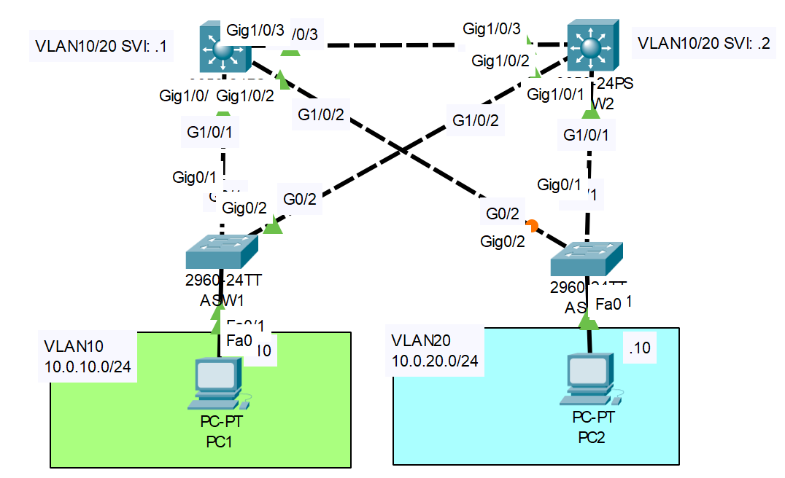

# **STP and HSRP Synchronization**
## Source (YouTube: Jeremy's IT Lab)

### Video Link: [Here](https://youtu.be/BgIEhyoETgU?si=5VXNLjLyjbLtaWss)
### Lab File Link (pkt): [Here Day-52](https://mega.nz/file/qgAVSABD#Nzq12BvDR30uq6tcnfe0kf6wB_sCrYOzNLjMSgSLIoQ)
### Scenario:



> This lab is not very important for the CCNA. Because this configuration is not necessary. You can skip it...!  

## **Configure HSRP on DSW1/DSW2, and ensure sychronization with STP.**
In VLAN 10:  
-DSW1 is HSRP active/STP root  
-DSW2 is HSRP standby/STP secondary root

In VLAN 20:  
-DSW2 is HSRP active/STP root  
-DSW1 is HSRP standby/STP secondary root

**Solution**
```
DSW1(config)#spanning-tree vlan 10 root primary 
DSW1(config)#spanning-tree vlan 20 root secondary 

DSW1(config)#int vlan 10
DSW1(config-if)#standby version 2
DSW1(config-if)#standby 10 ip 10.0.10.254
DSW1(config-if)#standby 10 priority 105
DSW1(config-if)#standby 10 preempt

DSW1(config-if)#int vlan 20
DSW1(config-if)#standby version 2
DSW1(config-if)#standby 20 ip 10.0.20.254
DSW1(config-if)#standby 20 priority 95
DSW1(config-if)#standby 20 preempt
```
```
DSW2(config)#spanning-tree vlan 10 root secondary
DSW2(config)#spanning-tree vlan 20 root primary 

DSW2(config)#int vlan 10
DSW2(config-if)#standby version 2
DSW2(config-if)#standby 10 ip 10.0.10.254
DSW2(config-if)#standby 10 priority 95
DSW2(config-if)#standby 10 preempt

DSW2(config-if)#int vlan 20
DSW2(config-if)#standby version 2
DSW2(config-if)#standby 20 ip 10.0.20.254
DSW2(config-if)#standby 20 priority 105
DSW2(config-if)#standby 20 preempt
```

**Verification**
```
DSW1#sh spanning-tree vlan 10
VLAN0010
  Spanning tree enabled protocol ieee
  Root ID    Priority    24586
             Address     000C.856A.50BD
             This bridge is the root ✅
             Hello Time  2 sec  Max Age 20 sec  Forward Delay 15 sec

  Bridge ID  Priority    24586  (priority 24576 sys-id-ext 10)
             Address     000C.856A.50BD
             Hello Time  2 sec  Max Age 20 sec  Forward Delay 15 sec
             Aging Time  20

Interface        Role Sts Cost      Prio.Nbr Type
---------------- ---- --- --------- -------- --------------------------------
Gi1/0/1          Desg FWD 4         128.1    P2p
Gi1/0/2          Desg FWD 4         128.2    P2p
Gi1/0/3          Desg FWD 4         128.3    P2p

DSW1#sh standby brief
                     P indicates configured to preempt.
                     |
Interface   Grp  Pri P State    Active          Standby         Virtual IP
Vl10        10   105 P Active   local           10.0.10.2       10.0.10.254    
Vl20        20   95  P Standby  10.0.20.2       local           10.0.20.254
```
```
DSW2#sh spanning-tree vlan 20
VLAN0020
  Spanning tree enabled protocol ieee
  Root ID    Priority    24596
             Address     0001.C912.B090
             This bridge is the root ✅
             Hello Time  2 sec  Max Age 20 sec  Forward Delay 15 sec

  Bridge ID  Priority    24596  (priority 24576 sys-id-ext 20)
             Address     0001.C912.B090
             Hello Time  2 sec  Max Age 20 sec  Forward Delay 15 sec
             Aging Time  20

Interface        Role Sts Cost      Prio.Nbr Type
---------------- ---- --- --------- -------- --------------------------------
Gi1/0/3          Desg FWD 4         128.3    P2p
Gi1/0/1          Desg FWD 4         128.1    P2p
Gi1/0/2          Desg FWD 4         128.2    P2p
```

## **[The End]**