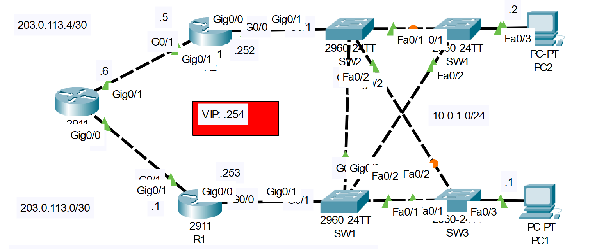

# **HSRP Configuration**
## Source (YouTube: Jeremy's IT Lab)
## This HSRP configuration is not necessary for the CCNA.
### Video Link: [Here](https://youtu.be/uho5Z2nFhb8?si=yL109VWUpuKRtdp5)
### Lab File Link (pkt): [Here Day-29](https://mega.nz/file/b4gyyAjZ#qMc0Aowxm6TTYQoZPtN2hy0zwkJSu3hvV6blfFn-SU4)
### Scenario:


```
1. Ping external server 8.8.8.8 from PC1/PC2. What is the default gateway configured as?

2. Configure HSRPv2 on R1/R2.
- Raise R1's priority above the default, lower R2's priority below the default.
- Enable preemption.

3. Configure the VIP as the default gateway of PC1/PC2.
- Ping 8.8.8.8 from the PCs.  Check the PCs' ARP table.
- What MAC address is mapped to the VIP?

4. Turn off R1 (save the config first!).
- After it restarts, ping from PC1 to 8.8.8.8 again.
- Is R2 used as the default gateway?

5. Turn on R1 again.  
- Does it become the active router again?
```
### **Watch this video for Step-01 & 02**
https://github.com/EZAZ-2281/CCNA-200-301-Lab/assets/81481142/0382cb89-da1c-48dd-b185-ecde85347db3


### **Watch this video for Step-03, 04 & 05**
https://github.com/EZAZ-2281/CCNA-200-301-Lab/assets/81481142/8d405535-425b-4fe6-9ca2-a41a94ba7349

### **All necessary command at a glance.**
```
R1(config)#int g0/0
R1(config-if)#standby version 2
R1(config-if)#standby 1 ip 10.0.1.254
R1(config-if)#standby 1 priority 200
R1(config-if)#standby 1 preempt

R1#sh standby

C:\>ping 8.8.8.8
C:\>tracert 8.8.8.8
C:\>arp -a
```
## **[The End]**