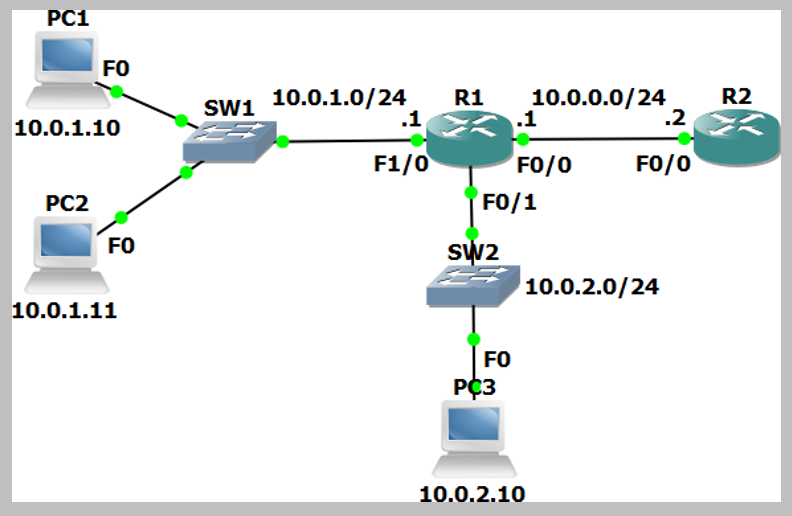

# Access-Control List Configuration (Source: Udemy)
## Instructor: Neil Anderson  
### **Pkt file:** [Here](https://mega.nz/file/SsJAFDqQ#6I05eQWzaUE7aFOjwKQodDwnI9A9yWZwv9rh6Sfe1yo)
### Scenario: 

## **Numbered Standard ACL**

1)	Verify that all PCs have connectivity to each other, to R1 and to R2.
- From PC1, ping PC2, PC3, R1 and R2.
```
C:\>ping 10.0.1.11
C:\>ping 10.0.1.1
C:\>ping 10.0.2.10
C:\>ping 10.0.0.2
```
- We have already verified connectivity between the PCs in both subnets. Ping R1 and R2 from PC3.
```
C:\>ping 10.0.1.1
C:\>ping 10.0.0.2
```
2)	Configure and apply a numbered standard ACL on R1 which denies traffic from all hosts in the 10.0.2.0/24 subnet to R2.
- The PCs in the 10.0.1.0/24 and 10.0.2.0/24 subnets must maintain connectivity to each other.
- The PCs in the 10.0.1.0/24 subnet must maintain connectivity to R2.  
**Solution**
- The task specifies that a numbered standard ACL be used on R1. This checks the source address only. This prevents us from configuring an ACL inbound on the F0/1 interface which denies traffic from the 10.0.2.0/24 subnet to R2 but permits it to the 10.0.1.0/24 network – that would require an extended ACL.
- The only way the task can be completed is by applying the ACL outbound on the F0/0 interface facing R2.
- Configure a numbered standard ACL that denies traffic from 10.0.2.0/24. Do not forget to permit from 10.0.1.0/24 as the implicit deny any at the end of the ACL would block the traffic otherwise. **Do not forget to apply the ACL to the interface.**
```
R1(config)#access-list 1 permit 10.0.1.0 0.0.0.255
R1(config)#access-list 1 deny 10.0.2.0 0.0.0.255
R1(config)#int f0/0
R1(config-if)#ip access-group 1 out 
```
3)	Test that traffic is secured exactly as required.
- Verify PC1 and PC2 can ping R2. 
- PC3 cannot ping R2.
- PC3 can ping PC1 and PC2.
```
Watch this: 
```
https://github.com/EZAZ-2281/CCNA-200-301-Lab/assets/81481142/183563b9-94ee-45c0-abb9-09f20f3a21b1

## **[The End]**

## **Numbered Extended ACL**

4)	Configure and apply a numbered extended ACL on R1 which permits Telnet access from PC1 to R2. Telnet to R2 must be denied for all other PCs in the network.
- All other connectivity must be maintained. Do not change the existing ACL.
- Telnet access has already been enabled on R2. The password is ‘Flackbox’
```
Solution: 
```
- All traffic from the 10.0.2.0/24 subnet to R2 is already denied by the numbered standard ACL we configured.
- We need to create an ACL which will allow Telnet traffic to R2 at 10.0.0.2 from PC1 at 10.0.1.10 but deny it from all other hosts in the 10.0.1.0/24 subnet.
- The implicit deny all at the end of the ACL would block Telnet traffic from the other hosts to R2, but it would also block all other traffic from the 10.0.1.0/24 subnet including other applications to R2 and traffic to the 10.0.2.0/24 subnet. We need to explicitly block the Telnet traffic but allow other traffic.
- The access list should be applied as close to the source as possible, so apply it inbound on interface F1/0. We already have an outbound ACL on F0/0 so we could not apply it there anyway.
```
R1(config)#access-list 100 permit tcp 10.0.1.10 0.0.0.0 10.0.0.2 0.0.0.0 eq telnet 
R1(config)#access-list 100 deny tcp 10.0.1.0 0.0.0.255 10.0.0.2 0.0.0.0 eq telnet 
R1(config)#access-list 100 permit ip any any 
R1(config)#int f1/0
R1(config-if)#ip access-group 100 in 
```
5)	Test that traffic is secured exactly as required. Use the command ‘telnet 10.0.0.2’ from the PCs to test and the password ‘Flackbox’. Type ‘exit’ to leave the Telnet session.
- Verify that PC1 can ping and Telnet to R2. 
- PC2 can ping R2 but not Telnet to it.
- PC3 cannot ping or Telnet to R2. 
- The PCs can all ping each other.
```
Watch this: 
```
https://github.com/EZAZ-2281/CCNA-200-301-Lab/assets/81481142/2e6a721d-8109-4aa7-acc6-7b5d09e4c7af

6)	How many Telnet packets were permitted by the ACL?
```
R1#sh access-lists 
Standard IP access list 1
    10 permit 10.0.1.0 0.0.0.255 (78 match(es))
    20 deny 10.0.2.0 0.0.0.255 (16 match(es))
Extended IP access list 100
    10 permit tcp host 10.0.1.10 host 10.0.0.2 eq telnet (54 match(es)) ✅
    20 deny tcp 10.0.1.0 0.0.0.255 host 10.0.0.2 eq telnet (12 match(es))
    30 permit ip any any (16 match(es))
```
## **[The End]**

## **Named Extended ACL**

7) Remove the numbered extended ACL you just configured from the interface. Do not delete the ACL.
```
R1(config)#int f1/0
R1(config-if)#no ip access-group 100 in 
```
8)	Configure and apply a named extended ACL on R1 as follows:
= Permit Telnet from PC1 to R2. Telnet to R2 must be denied for all other PCs in the network.
- Permit ping from PC2 to R2. Ping to R2 must be denied for all other PCs in the network.
- All other connectivity must be maintained.
```
R1(config)#ip access-list extended 111
R1(config-ext-nacl)#permit tcp 10.0.1.10 0.0.0.0 10.0.0.2 0.0.0.0 eq telnet
R1(config-ext-nacl)#deny tcp 10.0.1.0 0.0.0.255 10.0.0.2 0.0.0.0 eq telnet 
R1(config-ext-nacl)#permit icmp 10.0.1.11 0.0.0.0 10.0.0.2 0.0.0.0 echo
R1(config-ext-nacl)#deny icmp 10.0.1.0 0.0.0.255 10.0.0.2 0.0.0.0 echo
R1(config-ext-nacl)#permit ip any any 
R1(config-ext-nacl)#exit
R1(config)#int f1/0
R1(config-if)#ip access-group 111 in 
```
9) Test that traffic is secured exactly as required.
- Verify that PC1 cannot ping R2 but can Telnet to it. 
- PC2 can ping R2 but cannot Telnet to it.
- PC3 cannot ping or Telnet to R2. 
- The PCs can all ping each other.

https://github.com/EZAZ-2281/CCNA-200-301-Lab/assets/81481142/d46bfd51-8f43-4860-97a0-6eaf044e2a02

- Here in this video we can see that PC1 still ping R2. Just do the following command on R1 and it will works fine now...! 
```
R1(config)#ip access-list extended 111
R1(config-ext-nacl)#no 30
R1(config-ext-nacl)#60 permit ip any any 
```
## **[The End]**