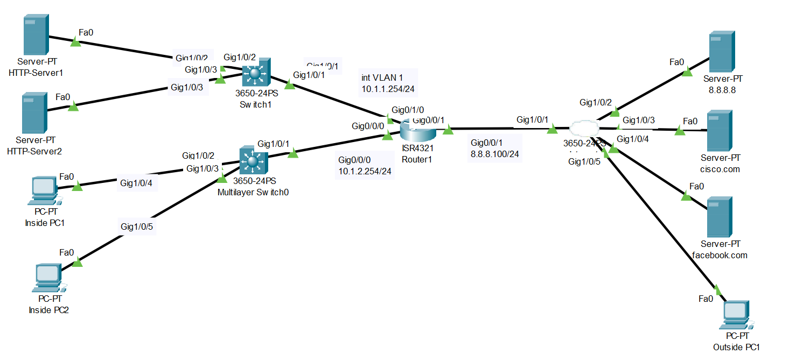

# Access Control List Configuration (Source: Udemy)
## Instructor: David Bombal  
### **Pkt file:** [Here](https://mega.nz/file/f4x0UbTZ#lzNInUN59rKgXHWvX87Ys_7zSHwxZFy6dLBaKXJ-x9A)
### Scenario: 



# **Configure ACLs as follows:**

## **1) Restrict traffic internally using Router1 as follows:**
- Use access list number 100
- Inside PC1 can only access the HTTP server 1 using HTTP on subnet 10.1.1.0/24
- Inside PC2 can only access the HTTP server 2 using HTTPS on subnet 10.1.1.0/24
- No other PCs or servers on subnet 10.1.2.0/24 can access subnet 10.1.1.0/24 (Explicitly add this line. This is normally done to log the traffic with the word log, but PT does not support logging)
- Hosts on subnet 10.1.2.0/24 can access any other network
- Bind access list in the most efficient place on Router1
```
R1(config)#ip access-list extended 100
R1(config-ext-nacl)#permit tcp 10.1.2.101 0.0.0.0 10.1.1.100 0.0.0.0 eq 80
R1(config-ext-nacl)#permit tcp 10.1.2.102 0.0.0.0 10.1.1.101 0.0.0.0 eq 443
R1(config-ext-nacl)#deny ip 10.1.2.0 0.0.0.255 10.1.1.0 0.0.0.255 
R1(config-ext-nacl)#permit ip 10.1.2.0 0.0.0.255 any
R1(config-ext-nacl)#exit
R1(config)#int g0/0/0
R1(config-if)#ip access-group 100 in 
```
```
R1#sh run | include access-list
access-list 100 permit tcp host 10.1.2.101 host 10.1.1.100 eq www
access-list 100 permit tcp host 10.1.2.102 host 10.1.1.101 eq 443
access-list 100 deny ip 10.1.2.0 0.0.0.255 10.1.1.0 0.0.0.255
access-list 100 permit ip 10.1.2.0 0.0.0.255 any

R1#sh access-list
Extended IP access list 100
    10 permit tcp host 10.1.2.101 host 10.1.1.100 eq www
    20 permit tcp host 10.1.2.102 host 10.1.1.101 eq 443
    30 deny ip 10.1.2.0 0.0.0.255 10.1.1.0 0.0.0.255
    40 permit ip 10.1.2.0 0.0.0.255 any
```
2) Verification:
- Verify that Inside PC1 can access the internal HTTP server 1 using HTTP, but not ping HTTP server 2
- Verify that Inside PC2 can access the internal HTTP server 2 using HTTPS, but not ping HTTP server 1
- Verify that both inside PC1 and PC2 can browse to cisco.com and facebook.com
```
Watch this for verification:  
```
https://github.com/EZAZ-2281/CCNA-200-301-Lab/assets/81481142/610d7743-80f9-491a-bee9-607695c791b6


- Traffic is sent from the clients to the servers, we don't want to receive the traffic, then process it and then drop it. We want to permit or deny the traffic as it hits the router. Extended IP access control lists give us a lot of power. The idea is that you want to bind your access list as close as possible to the source that you can.

## **[The End]**