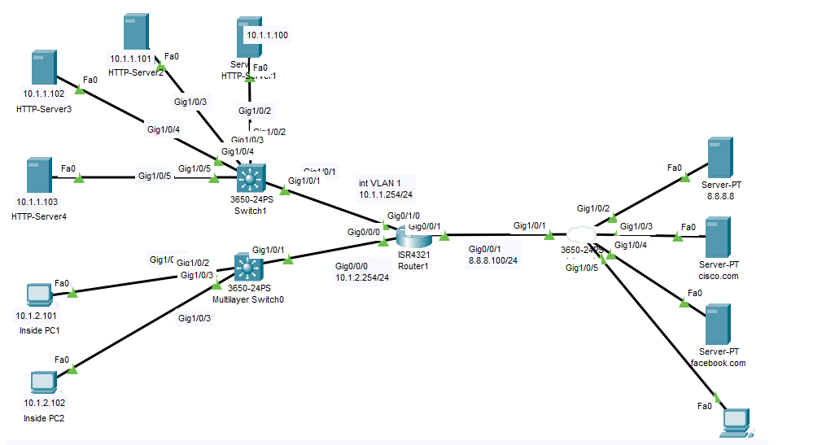
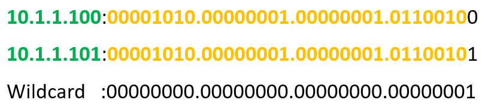

# Access Control List Configuration (Source: Udemy)
## Instructor: David Bombal  
### **Pkt file:** [Here](https://mega.nz/file/K4QHQTxL#7RrB_TIJQEx6zxa3nTpklsPPps4CbMU-9VgGFquK930)
### Scenario: 


# **Configure ACLs as follows (hints below):**
## **1) Restrict traffic internally as follows:**
- Use access list number 100
- Inside PC 1 on subnet 10.1.2.0/24 can only access HTTP servers 1 and 2 on subnet 10.1.1.0/24 using HTTP and HTTPS (Use only two lines in your ACL to accomplish this).
- No other PCs or servers on subnet 10.1.2.0/24 can access subnet 10.1.1.0/24 (Explicitly add this line. This is normally done to log the traffic with the word log, but PT does not support logging)
- Hosts on subnet 10.1.2.0/24 can access any other network
- Bind access list in the most efficient place on Router1
```
R1(config)#ip access-list extended 100
R1(config-ext-nacl)#permit tcp 10.1.2.101 0.0.0.0 10.1.1.100 0.0.0.1 eq 80
R1(config-ext-nacl)#permit tcp 10.1.2.101 0.0.0.0 10.1.1.100 0.0.0.1 eq 443 
R1(config-ext-nacl)#deny ip 10.1.2.0 0.0.0.255 10.1.1.0 0.0.0.255
R1(config-ext-nacl)#permit ip 10.1.2.0 0.0.0.255 any 
R1(config-ext-nacl)#exit
R1(config)#int g0/0/0
R1(config-if)#ip access-group 100 in 
```



## **2) Restrict traffic externally as follows:**
- Use access list number 101
- Any external device can access internal HTTP Servers using HTTP or HTTPS
- No external device can access the user subnet 10.1.2.0/24 (Explicitly add this line. This is normally done to log the traffic with the word log, but PT does not support logging)
- Bind access list in the most efficient place on Router1
```
R1(config)#ip access-list extended 101
R1(config-ext-nacl)#permit tcp any 10.1.1.0 0.0.0.255 eq 80
R1(config-ext-nacl)#permit tcp any 10.1.1.0 0.0.0.255 eq 443
R1(config-ext-nacl)#permit udp 8.8.8.8 0.0.0.0 eq 53 10.1.2.0 0.0.0.255
R1(config-ext-nacl)#permit tcp any 10.1.2.0 0.0.0.255 established
R1(config-ext-nacl)#deny ip any 10.1.2.0 0.0.0.255
R1(config-ext-nacl)#exit
R1(config)#int g0/0/1
R1(config-if)#ip access-group 101 in 
```
```
R1#sh access-lists 
Extended IP access list 100
    10 permit tcp host 10.1.2.101 10.1.1.100 0.0.0.1 eq www
    20 permit tcp host 10.1.2.101 10.1.1.100 0.0.0.1 eq 443
    30 deny ip 10.1.2.0 0.0.0.255 10.1.1.0 0.0.0.255
    40 permit ip 10.1.2.0 0.0.0.255 any
Extended IP access list 101
    10 permit tcp any 10.1.1.0 0.0.0.255 eq www
    20 permit tcp any 10.1.1.0 0.0.0.255 eq 443
    30 permit udp host 8.8.8.8 eq domain 10.1.2.0 0.0.0.255
    40 permit tcp any 10.1.2.0 0.0.0.255 established
    50 deny ip any 10.1.2.0 0.0.0.255
```
## **3) Verification:**
- Verify that Inside PC1 can access the internal HTTP servers 1 and 2, but not other HTTP servers (server 3 and 4)
- Verify that Inside PC2 cannot access the internal HTTP servers
- Verify that both inside PC1 and PC2 can browse to cisco.com and facebook.com
- Verify that Outside PC1 can access both internal servers using HTTP (server 1) and HTTPS (Server), but not ping the inside PCs
```
Watch this:
```
https://github.com/EZAZ-2281/CCNA-200-301-Lab/assets/81481142/4b2e54bd-c6a5-4729-ba0e-339b36628232


Hints:
1) Think about how binary works
2) Think about DNS traffic
3) Think about return traffic from the Internet servers
 
```
Meaning of established
```
- In simpler terms, the firewall rule `permit tcp any 10.1.2.0 0.0.0.255 established` allows incoming TCP traffic from any source to the destination IP range 10.1.2.0/24 only if it's part of an established connection. An established connection means that the traffic is a response to an outgoing connection initiated from the network with the IP range 10.1.2.0/24. This helps in allowing only the return traffic for established connections, enhancing security by preventing unauthorized incoming connections.

## **[The End]**