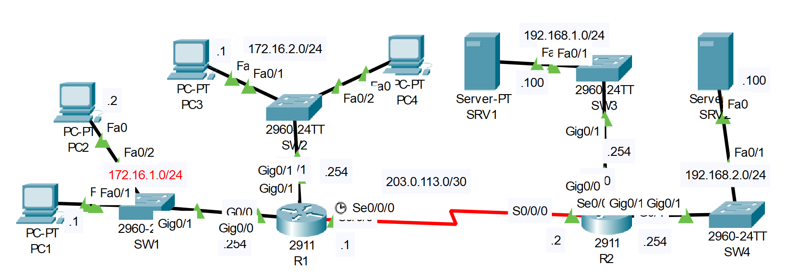

# **Access Control List Configuration**
## Source (YouTube: Jeremy's IT Lab)
### Video Link: [Here](https://youtu.be/1cuMzWBrEYs?si=vJ7mHbm_DG20_7x6)
### Lab File Link (pkt): [Here Day-35](https://mega.nz/file/SkhzCB4a#RIMQFLb6Q8Sg4IyqtDX3JYZnW4yngyhhYE5rU71HJLM)
### Scenario:

1. Configure extended ACLS to fulfill the following network policies:
```
- Hosts in 172.16.2.0/24 can't communicate with PC1.
- Hosts in 172.16.1.0/24 can't access the DNS service on SRV1.
- Hosts in 172.16.2.0/24 can't access the HTTP or HTTPS services on SRV2.
```
- Hosts in 172.16.1.0/24 can't access the DNS service on SRV1.
```
R1(config)#ip access-list extended 100
R1(config-ext-nacl)#deny tcp 172.16.1.0 0.0.0.255 192.168.1.100 0.0.0.0 eq 53
R1(config-ext-nacl)#deny udp 172.16.1.0 0.0.0.255 192.168.1.100 0.0.0.0 eq 53 
R1(config-ext-nacl)#permit ip any any 
R1(config-ext-nacl)#exit
R1(config)#int g0/0
R1(config-if)#ip access-group 100 in 
```
- Hosts in 172.16.2.0/24 can't communicate with PC1.
- Hosts in 172.16.2.0/24 can't access the HTTP or HTTPS services on SRV2.
```
R1(config)#ip access-list extended 101 
R1(config-ext-nacl)#deny ip 172.16.2.0 0.0.0.255 172.16.1.1 0.0.0.0 
R1(config-ext-nacl)#deny tcp 172.16.2.0 0.0.0.255 192.168.2.100 0.0.0.0 eq 80
R1(config-ext-nacl)#deny tcp 172.16.2.0 0.0.0.255 192.168.2.100 0.0.0.0 eq 443
R1(config-ext-nacl)#permit ip any any 
R1(config-ext-nacl)#exit
R1(config)#int g0/1
R1(config-if)#ip access-group 101 in 
```
```
R1#sh access-lists 
Extended IP access list 100
    10 deny tcp 172.16.1.0 0.0.0.255 host 192.168.1.100 eq domain
    20 deny udp 172.16.1.0 0.0.0.255 host 192.168.1.100 eq domain
    30 permit ip any any
Extended IP access list 101
    10 deny ip 172.16.2.0 0.0.0.255 host 172.16.1.1
    20 deny tcp 172.16.2.0 0.0.0.255 host 192.168.2.100 eq www
    30 deny tcp 172.16.2.0 0.0.0.255 host 192.168.2.100 eq 443
    40 permit ip any any
---------------------------------------------------------------------------
R1#sh run | section access-list
access-list 100 deny tcp 172.16.1.0 0.0.0.255 host 192.168.1.100 eq domain
access-list 100 deny udp 172.16.1.0 0.0.0.255 host 192.168.1.100 eq domain
access-list 100 permit ip any any
access-list 101 deny ip 172.16.2.0 0.0.0.255 host 172.16.1.1
access-list 101 deny tcp 172.16.2.0 0.0.0.255 host 192.168.2.100 eq www
access-list 101 deny tcp 172.16.2.0 0.0.0.255 host 192.168.2.100 eq 443
access-list 101 permit ip any any
```

- Testing Connectivity: 

https://github.com/EZAZ-2281/CCNA-200-301-Lab/assets/81481142/d41a4b7b-7dc9-4cc0-af12-0b3c116d853e

## **[The End]**