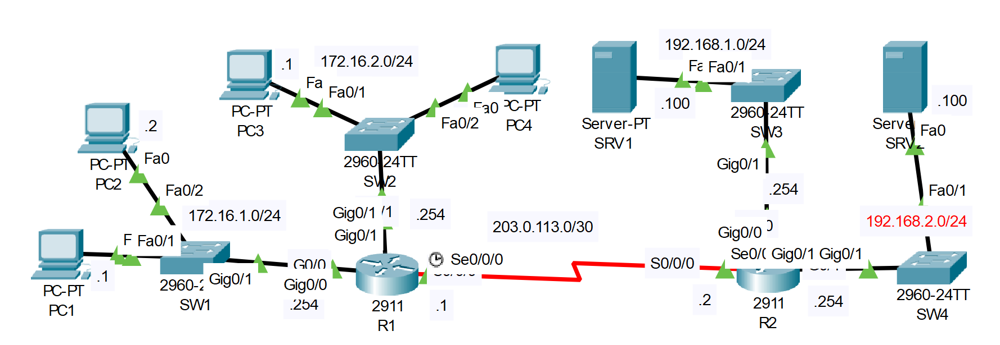

# **Access Control List Configuration**
## Source (YouTube: Jeremy's IT Lab)
### Video Link: [Here](https://youtu.be/sJ8PXmiAkvs?si=5fOc1SYUIlXIWKyB)
### Lab File Link (pkt): [Here Day-34](https://mega.nz/file/TlARTaDA#KBleCJltkHRWu8E6q-jlLfRrKC79T0wY9k6gEC0HRWA)
### Scenario:


1. Configure OSPF on R1 and R2 to allow full connectivity between the PCs and servers.
```
R1(config)#router ospf 1
R1(config-router)#network 172.16.0.0 0.0.255.255 area 0
R1(config-router)#network 203.0.113.0 0.0.0.3 area 0
-----------------------------------------------------------------
R2(config)#router ospf 1 
R2(config-router)#network 192.168.0.0 0.0.255.255 area 0
R2(config-router)#network 203.0.113.0 0.0.0.3 area 0 
-----------------------------------------------------------------
R1#sh ip route ospf
O    192.168.1.0 [110/65] via 203.0.113.2, 00:00:19, Serial0/0/0
O    192.168.2.0 [110/65] via 203.0.113.2, 00:00:19, Serial0/0/0
```
2. Configure standard numbered ACLS on R1 and standard named ACLs on R2 to fulfill the following network policies:
```
-Only PC1 and PC3 can access 192.168.1.0/24
-Hosts in 172.16.2.0/24 can't access 192.168.2.0/24
-172.16.1.0/24 can't access 172.16.2.0/24
-172.16.2.0/24 can't access 172.16.1.0/24
```
- Only PC1 and PC3 can access 192.168.1.0/24
```
R2(config)#ip access-list standard one
R2(config-std-nacl)#permit 172.16.1.1 
R2(config-std-nacl)#permit 172.16.2.1
R2(config-std-nacl)#deny any
R2(config-std-nacl)#exit
R2(config)#int g0/0
R2(config-if)#ip access-group one out
```
- Hosts in 172.16.2.0/24 can't access 192.168.2.0/24
```
R2(config)#ip access-list standard two
R2(config-std-nacl)#deny 172.16.2.0 0.0.0.255
R2(config-std-nacl)#permit any 
R2(config-std-nacl)#exit
R2(config)#int g0/1
R2(config-if)#ip access-group two out 
```
- 172.16.1.0/24 can't access 172.16.2.0/24
```
R1(config)#access-list 1 deny 172.16.1.0 0.0.0.255
R1(config)#access-list 1 permit any 
R1(config)#int g0/1
R1(config-if)#ip access-group 1 out
```
- 172.16.2.0/24 can't access 172.16.1.0/24
```
R1(config)#access-list 2 deny 172.16.2.0 0.0.0.255
R1(config)#access-list 2 permit any 
R1(config)#int g0/0
R1(config-if)#ip access-group 2 out 
```
- **Testing Connectivity:** [Here](https://drive.google.com/file/d/1TmMZZ3SCsPestxxaBbROcqpjlWnacDtd/view?usp=sharing)

## **[The End]**