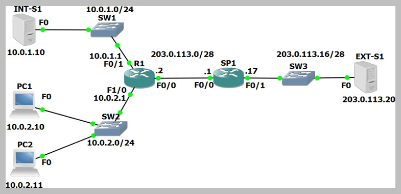

# NAT Configuration (Source: Udemy)
## Instructor: Neil Anderson  
### **Pkt file:** [Here](https://mega.nz/file/zo5hwL5R#jhB9JwvLZL8Kin6LrvCVTd6yI7OsEhneV8M5_lDeJu8)
### Scenario: 


# **Static NAT**


1)	Int-S1 is your company’s web server. It must be reachable from external customers browsing the Internet. Configure NAT on R1 so that external customers can reach the server using the public IP address 203.0.113.3. Do not change any IP addressing or routing information.
- Int-S1 needs a fixed public IP address so we must configure static NAT. Configure the F0/0 interface facing the Internet as the NAT outside interface.
- Configure the F0/1 interface facing Int-S1 as a NAT inside interface.
- Configure a static NAT rule mapping the inside local address 10.0.1.10 to the global IP address 203.0.113.3.
```
R1(config)#int f0/1
R1(config-if)#ip nat inside 
R1(config-if)#int f0/0
R1(config-if)#ip nat outside
R1(config-if)#exit
R1(config)#ip nat inside source static 10.0.1.10 203.0.113.3
```
2)	Ping Ext-S1 from Int-S1 to check the NAT rule is working and you have connectivity.
3)	On Ext-S1, click on ‘Desktop’ then open ‘Web Browser’. Open the NAT’d public IP address of Int-S1 at https://203.0.113.3 in the browser to verify that external customers on the Internet can reach your web server.
4)	Verify the connection appears in the NAT translation table. Note that entries age out quickly so generate the traffic again if you did not check the table quickly enough.
```
Watch this video for step 2 to 4. 
```
https://github.com/EZAZ-2281/CCNA-200-301-Lab/assets/81481142/92586491-170c-4f14-a3f3-3042e3c81026

# **Dynamic NAT**


5) Configure NAT on R1 so that PCs in the 10.0.2.0/24 subnet have connectivity to external networks on a first come first served basis. Assign global addresses from the range 203.0.113.4 to 203.0.113.12. Do not enable Port Address Translation.
```
R1(config)#int f1/0
R1(config-if)#ip nat inside
R1(config-if)#int f0/0
R1(config-if)#ip nat outside
R1(config-if)#exit
R1(config)#access-list 1 permit 10.0.2.0 0.0.0.255
R1(config)#ip nat pool POOL1 203.0.113.4 203.0.113.12 netmask 255.255.255.240
R1(config)#ip nat inside source list 1 pool POOL1
```


6) Turn on NAT debugging on R1. Ping Ext-S1 from PC1. View the debug output on R1. You should see NAT entries for the 5 pings. Which global address was PC1 translated to?
```
R1#debug ip nat
IP NAT debugging is on

On PC1:

C:\>ping 203.0.113.20
Pinging 203.0.113.20 with 32 bytes of data: Request timed out.
Reply from 203.0.113.20: bytes=32 time<1ms TTL=126 Reply from 203.0.113.20: bytes=32 time<1ms TTL=126 Reply from 203.0.113.20: bytes=32 time=1ms TTL=126

Ping statistics for 203.0.113.20:
Packets: Sent = 4, Received = 3, Lost = 1 (25% loss), Approximate round trip times in milli-seconds: Minimum = 0ms, Maximum = 1ms, Average = 0ms

R1#	
*Mar	01,	03:19:48.1919:	NAT: s=10.0.2.10->203.0.113.4, d=203.0.113.20 [1]
R1#			
*Mar	01,	03:19:54.1919:	NAT: s=10.0.2.10->203.0.113.4, d=203.0.113.20 [2]
*Mar	01,	03:19:54.1919:	NAT*: s=203.0.113.20, d=203.0.113.4->10.0.2.10 [30]
R1#			
*Mar	01,	03:19:55.1919:	NAT: s=10.0.2.10->✅203.0.113.4, d=203.0.113.20 [3]
*Mar	01,	03:19:55.1919:	NAT*: s=203.0.113.20, d=203.0.113.4->10.0.2.10 [31]
R1#			
*Mar	01,	03:19:56.1919:	NAT: s=10.0.2.10->203.0.113.4, d=203.0.113.20 [4]
*Mar	01,	03:19:56.1919:	NAT*: s=203.0.113.20, d=203.0.113.4->10.0.2.10 [32]

```
7) Verify the ping connection appears in the NAT translation table.
```
R1#sh ip nat translations 
Pro  Inside global     Inside local       Outside local      Outside global
icmp 203.0.113.4:1     10.0.2.10:1        203.0.113.20:1     203.0.113.20:1
icmp 203.0.113.4:2     10.0.2.10:2        203.0.113.20:2     203.0.113.20:2
icmp 203.0.113.4:3     10.0.2.10:3        203.0.113.20:3     203.0.113.20:3
icmp 203.0.113.4:4     10.0.2.10:4        203.0.113.20:4     203.0.113.20:4
---  203.0.113.3       10.0.1.10          ---                ---
tcp 203.0.113.3:443    10.0.1.10:443      203.0.113.20:1025  203.0.113.20:1025
tcp 203.0.113.3:443    10.0.1.10:443      203.0.113.20:1026  203.0.113.20:1026
```
8) When all the addresses in the pool 203.0.113.4 to 203.0.113.12 have been allocated, what will happen when the next PC tries to send traffic to an external host?
- It will not get a global IP address because they have all been given out. The traffic will fail. The user could try again after waiting for a translation to time out and its global address to be released back into the pool.
9) Enable Port Address Translation so that the last IP address in the range can be reused when all IP addresses have been allocated to clients.
```
R1#clear ip nat translation * 
R1#config t
R1(config)#ip nat inside source list 1 pool Flackbox overload
```
10) Cleanup: Completely remove the access list and all NAT configuration from R1. Use the commands ‘show run | section nat’ and ‘show access- list’ to verify all configuration is removed.
```
R1(config)#int f0/0
R1(config-if)#no ip nat outside R1(config-if)#int f0/1 R1(config-if)#no ip nat inside R1(config-if)#int f1/0 R1(config-if)#no ip nat inside
R1(config-if)#no ip nat inside source static 10.0.1.10 203.0.113.3
R1(config)#end
R1#clear ip nat translation *
R1#config t
R1(config)#no ip nat inside source list 1 pool Flackbox overload 
R1(config)#no ip nat pool Flackbox 203.0.113.4 203.0.113.12 netmask 255.255.255.240
R1(config)#no access-list 1


R1#show run | section nat 
R1#
R1#show access-list 
R1#
```
# **Port Address Translation PAT**


11)	Your company no longer has a range of public IP addresses. Instead you will receive a single public IP address via DHCP from your service provider.
- Shutdown interface F0/0 on R1 and remove its IP address. Reconfigure it to receive its IP address via DHCP from the service provider router SP1.
```
R1(config)#int f0/0 
R1(config-if)#shutdown 
R1(config-if)#no ip address
R1(config-if)#ip address dhcp
```
12)	Bring the interface back up and wait for DHCP. What IP address is it assigned?
```
R1(config)#int f0/0 
R1(config-if)#no shutdown

R1#sh ip int br
Interface              IP-Address      OK? Method Status                Protocol 
FastEthernet0/0        203.0.113.13    YES DHCP   up                    up  ✅
FastEthernet0/1        10.0.1.1        YES manual up                    up 
FastEthernet1/0        10.0.2.1        YES manual up                    up 
FastEthernet1/1        unassigned      YES manual administratively down down 
Vlan1                  unassigned      YES unset  administratively down down
```
13)	Configure NAT on R1 so that PCs in the 10.0.2.0/24 subnet have connectivity to external networks on a first come first served basis. Allow multiple PCs to reuse the IP address on interface F0/0 on R1. Ensure that NAT continues to work if the DHCP address assigned by the provider changes.
```
R1(config)#int f1/0
R1(config-if)#ip nat inside
R1(config-if)#int f0/0
R1(config-if)#ip nat outside
R1(config)#access-list 1 permit 10.0.2.0 0.0.0.255
R1(config)#ip nat inside source list 1 int f0/0 overload
```
14)	Ensure NAT debugging on R1 is still enabled. On PC1, click on ‘Desktop’ then open ‘Web Browser’. Open the public IP address of Ext-S1 at https://203.0.113.20 in the browser to verify that PAT is working and you can reach external servers.
15)	View the debug output on R1. Which global IP address was PC1 translated to?
- PC1 is translated to the address on R1’s F0/0 interface, 203.0.113.13.
16)	On PC2, click on ‘Desktop’ then open ‘Web Browser’. Open the public IP address of Ext-S1 at http://203.0.113.20 in the browser. Which global IP address is PC2 translated to?
17)	Verify the connections in the NAT translation table.
18)	Show the NAT statistics on R1.
```
Watch this video for step 14-18:
```
https://github.com/EZAZ-2281/CCNA-200-301-Lab/assets/81481142/e5fee320-f6aa-47f7-8802-8b5855a7ca42


## **[The End]**