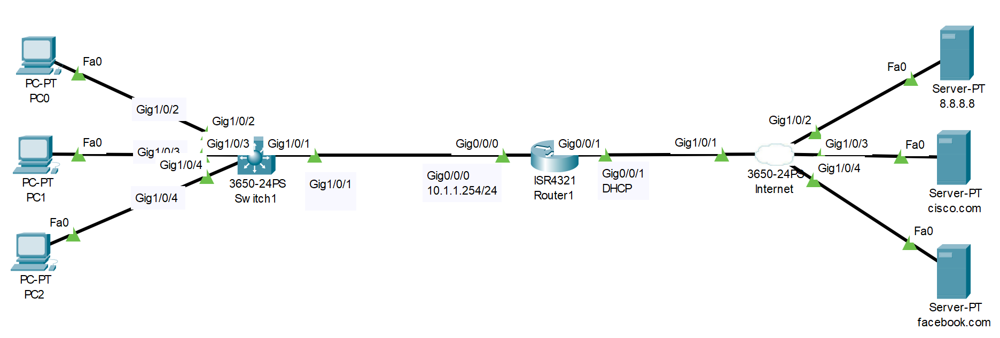
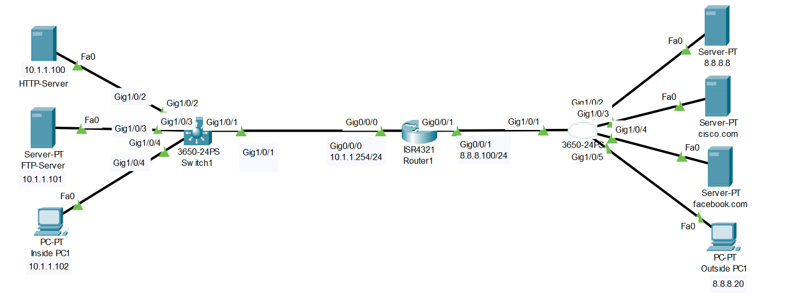

# NAT Configuration (Source: Udemy)
## Instructor: David Bombal 
### **Pkt file:** [Here](https://mega.nz/file/jkI2HSIT#ZUWZSU5eKcEcCX3D_MHqxbdH9nx3k-YxKG60xF97ad8)
### Scenario: 


# **Configure the network as follows-01:**
1) Configure the router to get an IP address via DHCP from your ISP
```
R1(config)#int g0/0/1
R1(config-if)#ip address dhcp
R1(config-if)#no shut
```
2) Configure the router to allocate IP addresses via DHCP to clients in your network:
> Network = 10.1.1.0/24  
> Default Gateway = 10.1.1.254  
> DNS = 8.8.8.8
```
R1(config)#int g0/0/0
R1(config-if)#ip address 10.1.1.254 255.255.255.0
R1(config-if)#no shut

R1(config)#ip dhcp pool ccna
R1(dhcp-config)#network 10.1.1.0 255.255.255.0
R1(dhcp-config)#default-router 10.1.1.254
R1(dhcp-config)#dns-server 8.8.8.8
```
```
R1#sh ip dhcp binding 
R1#sh ip dhcp pool	
```
3) Configure the router so internal hosts can access the internet servers using PAT (router IP address)
```
R1(config)#int g0/0/0
R1(config-if)#ip nat inside
R1(config-if)#int g0/0/1
R1(config-if)#ip nat outside
R1(config-if)#exit
R1(config)#access-list 1 permit 10.1.1.0 0.0.0.255
R1(config)#ip nat inside source list 1 int g0/0/1 overload
```
```
R1#sh ip nat translations 
Pro  Inside global     Inside local       Outside local      Outside global
icmp 8.8.8.100:1       10.1.1.2:1         8.8.8.8:1          8.8.8.8:1
icmp 8.8.8.100:2       10.1.1.2:2         8.8.8.8:2          8.8.8.8:2
icmp 8.8.8.100:3       10.1.1.2:3         8.8.8.8:3          8.8.8.8:3
icmp 8.8.8.100:4       10.1.1.2:4         8.8.8.8:4          8.8.8.8:4
```
> Watch this video also:  

## [**Here**](https://drive.google.com/file/d/1MrHCfEw6ECTLh_Fq7QLFy1uzHsqoQWJO/view?usp=sharing)

## **[The End]**


# **Configure the network as follows-02:**

### **Pkt file:** [Here](https://mega.nz/file/K0wxAbiR#afogK-3ISWF7zm7wwPIOYappw9b3Iaob0gujpdCwz1M)
1) Router details:
> Outside = 8.8.8.100/24  
> Inside = 10.1.1.254/24  
> Default Route to 8.8.8.8
```
R1(config)#int g0/0/1
R1(config-if)#ip address 8.8.8.100 255.255.255.0
R1(config-if)#no shut

R1(config-if)#int g0/0/0
R1(config-if)#ip address 10.1.1.254 255.255.255.0
R1(config-if)#no shut

R1(config-if)#exit
R1(config)#ip route 0.0.0.0 0.0.0.0 8.8.8.8
```
2) Configure static NAT so that the outside PC can access the internal HTTP, FTP and TFTP servers.
- HTTP = 8.8.8.200 (NAT only the required port). DNS = myhttp.com
- FTP = 8.8.8.201 (full static NAT). DNS = myftp.com
```
R1(config)#int g0/0/0
R1(config-if)#ip nat inside
R1(config-if)#int g0/0/1
R1(config-if)#ip nat outside 
R1(config-if)#exit
R1(config)#ip nat inside source static tcp 10.1.1.100 80 8.8.8.200 80
R1(config)#ip nat inside source static 10.1.1.101 8.8.8.201
```
```
R1#sh ip nat translations 
Pro  Inside global     Inside local       Outside local      Outside global
tcp 8.8.8.200:80       10.1.1.100:80      ---                ---
tcp 8.8.8.200:80       10.1.1.100:80      8.8.8.20:1025      8.8.8.20:1025
tcp 8.8.8.201:80       10.1.1.101:80      8.8.8.20:1026      8.8.8.20:1026
tcp 8.8.8.201:80       10.1.1.101:80      8.8.8.20:1027      8.8.8.20:1027
tcp 8.8.8.201:80       10.1.1.101:80      8.8.8.20:1028      8.8.8.20:1028
---  8.8.8.201         10.1.1.101         ---                ---
```
3) Verify that both the inside and the outside PCs can access the internal servers.
- Inside host to use internal IP addresses
- Outside host to use DNS names
> Watch this video: 

https://github.com/EZAZ-2281/CCNA-200-301-Lab/assets/81481142/8c5a1d7c-83db-46e9-88ef-51c70cbf7c9e

## **[The End]**


# **Configure the network as follows-03:**

### **Pkt file:** [Here](https://mega.nz/file/jxghUL4K#rtHT2mTJvo3s8ewgns0P9_0vQWDGONqtozS_UvMESrY)
1) Router details:
- Outside = 8.8.8.100/24
- Inside = 10.1.1.254/24
- Default Route to 8.8.8.8
```
R1(config)#int g0/0/1
R1(config-if)#ip address 8.8.8.100 255.255.255.0
R1(config-if)#no shut

R1(config-if)#int g0/0/0
R1(config-if)#ip address 10.1.1.254 255.255.255.0
R1(config-if)#no shut

R1(config-if)#exit
R1(config)#ip route 0.0.0.0 0.0.0.0 8.8.8.8
```
2) Configure static NAT so that the outside PC can access the internal HTTP, FTP servers.
- HTTP = 8.8.8.200 (NAT only the required port). DNS = myhttp.com
- FTP = 8.8.8.201 (full static NAT). DNS = myftp.com
```
R1(config)#int g0/0/0
R1(config-if)#ip nat inside
R1(config-if)#int g0/0/1
R1(config-if)#ip nat outside 
R1(config-if)#exit
R1(config)#ip nat inside source static tcp 10.1.1.100 80 8.8.8.200 80
R1(config)#ip nat inside source static 10.1.1.101 8.8.8.201
```
3) Configure Dynamic NAT using Router IP address so that internal PCs can access the Internet servers
```
R1(config)#access-list 1 permit any
R1(config)#ip nat inside source list 1 int g0/0/1 overload
```
4) Verify that the outside PC can access the internal servers using the server DNS names.
5) Verify that the internal PCs can access the internet servers using their DNS names.
> For verfication step 4 and 5 see this video.  

https://github.com/EZAZ-2281/CCNA-200-301-Lab/assets/81481142/57ddda3b-a1b1-4010-8bdd-71e5ba4bb00f


## **[The End]**