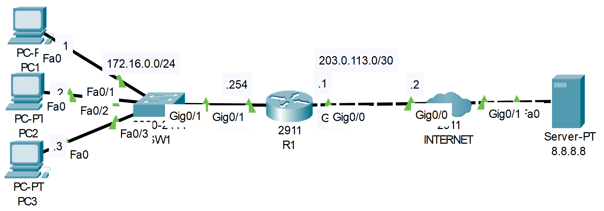

# **Static NAT Configuration**
## Source (YouTube: Jeremy's IT Lab)
### Video Link: [Here](https://youtu.be/vir6n_NVZFw?si=-lPN2OKNYYEu3MDn)
### Lab File Link (pkt): [Here Day-44](https://mega.nz/file/X9RjwD5T#pAkHeR5MqwWODRhV7z1BNWhnlGj1z9yYX0Hm64DpzIk)
### Scenario:



1. Attempt to ping from PC1 to 8.8.8.8.  Does the ping work?

2. Configure static NAT on R1.
- Configure the appropriate inside/outside interfaces  
- Map the IP addresses of PC1, PC2, and PC3 to 100.0.0.x/24

3. Ping 8.8.8.8 from PC1 again.  Does the ping work?

4. Ping google.com from each PC, and then check the NAT translations on R1.

5. Clear the NAT translations on R1.  Which entries remain?


## **Solution**
- Watch this video   

https://github.com/EZAZ-2281/CCNA-200-301-Lab/assets/81481142/faa745e2-3981-49c8-ae30-9c23bf042e8f

- All command at a glance
```
First ping doesn't word because of the private ip address..! 

R1(config)#int g0/1
R1(config-if)#ip nat inside 
R1(config-if)#int g0/0
R1(config-if)#ip nat outside 

R1(config)#ip nat inside source static 172.16.0.1 100.0.0.1
R1(config)#ip nat inside source static 172.16.0.2 100.0.0.2
R1(config)#ip nat inside source static 172.16.0.3 100.0.0.3

R1#sh ip nat translation
R1#sh ip nat statistics
R1#clear ip nat translation *
```
- 5. Only the static entry remain.  

## **[The End]**