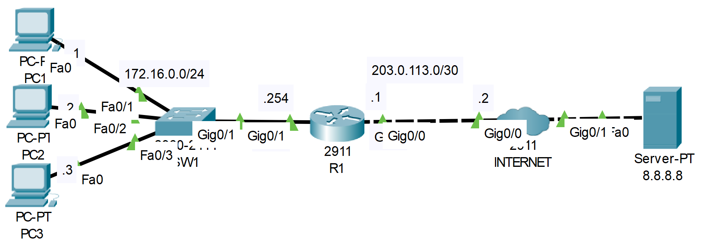

# **Dynamic NAT Configuration**
## Source (YouTube: Jeremy's IT Lab)
### Video Link: [Here](https://youtu.be/vNs1xxiwGJs?si=5VTRP8jKjimwXS8W)
### Lab File Link (pkt): [Here Day-45](https://mega.nz/file/rgZnAYAA#iA_LCbuYKljg8IHsG24BiCXSCHOaEFrqzZ40YphD4TU)
### Scenario:



1. Configure dynamic NAT on R1.
- Configure the appropriate inside/outside interfaces
- Translate all traffic from 172.16.0.0/24
- Create a pool of 100.0.0.1 to 100.0.0.2 from the 100.0.0.0/24 subnet

```
R1(config)#int g0/1
R1(config-if)#ip nat inside 
R1(config-if)#int g0/0
R1(config-if)#ip nat outside 
R1(config-if)#exit
R1(config)#access-list 1 permit 172.16.0.0 0.0.0.255
R1(config)#ip nat pool POOL1 100.0.0.1 100.0.0.2 netmask 255.255.255.0
R1(config)#ip nat inside source list 1 pool POOL1
```

2. Ping google.com from PC1 and PC2.  Then, ping it from PC3. What happens to PC3's ping?
3. Clear the NAT translations and remove the current NAT configuration. Switch the configuration to PAT using R1's public IP address.
4. Ping google.com from each PC.  Do the pings work? Examine the NAT translations on R1.
```
For answer 2 to 4 watch this video: 
```
https://github.com/EZAZ-2281/CCNA-200-301-Lab/assets/81481142/2fffdd75-ee46-4b41-a1bf-7350c30cee3c


## **[The End]**