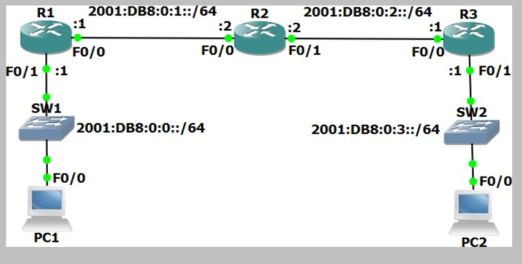

# IPv6 Configuration (Source: Udemy)
## Instructor: Neil Anderson  
### **Pkt file:** [Here](https://mega.nz/file/Os5jVTRT#rDcagtCj-RIfJICZajDzqdRHdbUNcBXTUPNBE-gq5U4)
### Scenario: 


> In this lab we will configure IPv6 addressing and static routing for a small campus network. The company already has IPv4 configured on their existing network but they will be introducing a new IPv6 application soon. Your task is to configure the network to be dual stack by adding support for IPv6 addresses. Routers R1, R2 and R3 have been configured with IPv4 addresses and connectivity has been established with between all networks. PC1 and PC2 are Cisco IOS routers mimicking end hosts. They have been configured with IPv4 addresses and an IPv4 default static route to their default gateways. There is no IPv6 configuration on any of the devices.   

## **Verify IPv4 Connectivity**

1)	Verify R1, R2, R3, PC1 and PC2 have been configured with IPv4 addresses as shown in the topology diagram.
2)	View the routing tables on R1, R2 and R3 to verify connectivity has been established between all networks. What routing protocol is being used?
3)	Verify PC1 and PC2 have been configured with the correct default gateway.
4)	Ping PC2 from PC1 to verify end to end reachability.
```
R1#sh ipv6 int brief 
R1#sh ipv6 route 
R1#sh ip pro 
```
- Watch this video for step 1 to 4: 

https://github.com/EZAZ-2281/CCNA-200-301-Lab/assets/81481142/4ed6daec-675c-4be2-9912-c09cd211b186


## **IPv6 Addressing**

5)	Configure global unicast IPv6 addresses on R1, R2, and R3, according to the network topology diagram. Do not enable ipv6 unicast-routing.
```
R1(config)#int f0/1
R1(config-if)#ipv6 address 2001:db8:0:0::1/64
R1(config-if)#no shut
R1(config-if)#int f0/0
R1(config-if)#ipv6 address 2001:db8:0:1::1/64
R1(config-if)#no shut

R2(config)#int f0/0
R2(config-if)#ipv6 address 2001:db8:0:1::2/64
R2(config-if)#no shut
R2(config-if)#int f0/1
R2(config-if)#ipv6 address 2001:db8:0:2::2/64
R2(config-if)#no shut

R3(config)#int f0/0
R3(config-if)#ipv6 address 2001:db8:0:2::1/64
R3(config-if)#no shut
R3(config-if)#int f0/1
R3(config-if)#ipv6 address 2001:db8:0:3::1/64
R3(config-if)#no shut
```
6)	Configure global unicast EUI-64 IPv6 addresses on the FastEthernet 0/0 interfaces on PC1 and PC2.
```
PC1(config)#int f0/0
PC1(config-if)#ipv6 address 2001:db8:0:0::/64 eui-64
PC1(config-if)#no shut

PC2(config)#int f0/0
PC2(config-if)#ipv6 address 2001:db8:0:3::/64 eui-64
PC2(config-if)#no shut
```
7)	Will the routers have IPv6 link local addresses on the interfaces where you just configured global unicast addresses (step-5)? What about the other interfaces? Verify this.
> EUI-64 link local addresses will be automatically configured when IPv6 is enabled on the interfaces (by applying the global unicast addresses). The other interfaces will not have link local addresses.
```
R1#sh ipv6 int brief
FastEthernet0/0            [up/up]
    FE80::20D:BDFF:FE2D:27D4 ✅
    2001:DB8:0:1::1
FastEthernet0/1            [up/up]
    FE80::2D0:97FF:FE64:3118 ✅
    2001:DB8::1
FastEthernet1/0            [administratively down/down]
    unassigned
FastEthernet1/1            [administratively down/down]
    unassigned
Vlan1                      [administratively down/down]
    unassigned
```
8)	Note down the EUI-64 global unicast addresses on PC1 and PC2.
```
PC1#sh ipv6 int br
FastEthernet0/0            [up/up]
    FE80::200:CFF:FE47:14C0
    2001:DB8::200:CFF:FE47:14C0 ✅

PC2#sh ipv6 int br
FastEthernet0/0            [up/up]
    FE80::201:C7FF:FE50:8E8A
    2001:DB8:0:3:201:C7FF:FE50:8E8A ✅
```
9)	Configure link local addresses on R1, R2 and R3. For each router, use the address shown below on each of its interfaces.
> R1: FE80::1/64   
> R2: FE80::2/64   
> R3: FE80::3/64   
```
R1(config)#int f0/0
R1(config-if)#ipv6 address fe80::1 link-local
R1(config-if)#no shut
R1(config-if)#int f0/1
R1(config-if)#ipv6 address fe80::1 link-local
R1(config-if)#no shut

R2(config)#int f0/0
R2(config-if)#ipv6 address fe80::2 link-local
R2(config-if)#no shut
R2(config-if)#int f0/1
R2(config-if)#ipv6 address fe80::2 link-local
R2(config-if)#no shut

R3(config)#int f0/0
R3(config-if)#ipv6 address fe80::3 link-local
R3(config-if)#no shut
R3(config-if)#int f0/1
R3(config-if)#ipv6 address fe80::3 link-local
R3(config-if)#no shut
```
10)	Verify the global unicast and link local addresses have been configured correctly on R1, R2 and R3.
```
R1#sh ipv6 int br
FastEthernet0/0            [up/up]
    FE80::1
    2001:DB8:0:1::1
FastEthernet0/1            [up/up]
    FE80::1
    2001:DB8::1
----------------------------------	
R2#sh ipv6 int br
FastEthernet0/0            [up/up]
    FE80::2
    2001:DB8:0:1::2
FastEthernet0/1            [up/up]
    FE80::2
    2001:DB8:0:2::2
----------------------------------
R3#sh ipv6 int br
FastEthernet0/0            [up/up]
    FE80::3
    2001:DB8:0:2::1
FastEthernet0/1            [up/up]
    FE80::3
    2001:DB8:0:3::1
```
11)	Ping R1 and R3 on their link local addresses from R2.
```
R2#ping fe80::1
Output Interface: FastEthernet0/0 ✅
Type escape sequence to abort.
Sending 5, 100-byte ICMP Echos to FE80::1, timeout is 2 seconds:
!!!!!
Success rate is 100 percent (5/5), round-trip min/avg/max = 0/0/0 ms

R2#ping fe80::3
Output Interface: FastEthernet0/1 ✅
Type escape sequence to abort.
Sending 5, 100-byte ICMP Echos to FE80::3, timeout is 2 seconds:
!!!!!
Success rate is 100 percent (5/5), round-trip min/avg/max = 0/0/0 ms
```
12)	View the IPv6 neighbors known by R2.
```
R2#sh ipv6 neighbors
IPv6 Address                              Age Link-layer Addr State Interface
FE80::1                                     0 000D.BD2D.27D4  REACH Fa0/0
FE80::3                                     0 0030.F2BA.30E7  REACH Fa0/1
```

## **Static Routing**


13)	Verify which IPv6 dynamic routing protocols are running on R1, R2 and R3. Do not use the ‘show run’ command.
> The routers are not running any IPv6 dynamic routing protocol.  
```
R1#sh ipv6 protocols
IPv6 Routing Protocol is "connected"
IPv6 Routing Protocol is "ND"
```
14)	Use the ‘show run | include ipv6 route’ command on R1, R2 and R3 to verify if they have been configured with IPv6 static routes.
> The routers have not been configured with any IPv6 static routes.  
```
R1#sh run | i ipv6 route
R1#
```
15)	Do you expect to see any routes in the IPv6 routing tables? Why or why not? Verify this.
> The routers have been configured with IPv6 addresses so connected and local routes will appear in the routing table.  
```
R1#sh ipv6 route
IPv6 Routing Table - 5 entries
Codes: C - Connected, L - Local, S - Static, R - RIP, B - BGP
       U - Per-user Static route, M - MIPv6
       I1 - ISIS L1, I2 - ISIS L2, IA - ISIS interarea, IS - ISIS summary
       ND - ND Default, NDp - ND Prefix, DCE - Destination, NDr - Redirect
       O - OSPF intra, OI - OSPF inter, OE1 - OSPF ext 1, OE2 - OSPF ext 2
       ON1 - OSPF NSSA ext 1, ON2 - OSPF NSSA ext 2
       D - EIGRP, EX - EIGRP external
C   2001:DB8::/64 [0/0]
     via FastEthernet0/1, directly connected
L   2001:DB8::1/128 [0/0]
     via FastEthernet0/1, receive
C   2001:DB8:0:1::/64 [0/0]
     via FastEthernet0/0, directly connected
L   2001:DB8:0:1::1/128 [0/0]
     via FastEthernet0/0, receive
L   FF00::/8 [0/0]
     via Null0, receive
```
16)	Do you expect PC1 to be able to ping PC2 on its IPv6 address? Why or why not? Verify this.
> No. IPv6 routing has been configured so there is no connectivity between different IPv6 subnets.   
```
PC1#ping 2001:DB8:0:3:201:C7FF:FE50:8E8A

Type escape sequence to abort.
Sending 5, 100-byte ICMP Echos to 2001:DB8:0:3:201:C7FF:FE50:8E8A, timeout is 2 seconds:
.....
Success rate is 0 percent (0/5)
```
17)	Configure PC1 to use R1 as its IPv6 default gateway.
```
PC1(config)#ipv6 route ::/0 2001:DB8::1
```
18)	Configure PC2 to use R3 as its IPv6 default gateway.
```
PC2(config)#ipv6 route ::/0 2001:DB8:0:3::1
```
19)	Verify PC1 and PC2 can ping their default gateways.
```
PC1#ping 2001:DB8::1 ✅

Type escape sequence to abort.
Sending 5, 100-byte ICMP Echos to 2001:DB8::1, timeout is 2 seconds:
!!!!!
Success rate is 100 percent (5/5), round-trip min/avg/max = 0/0/1 ms

PC2#ping 2001:DB8:0:3::1 ✅

Type escape sequence to abort.
Sending 5, 100-byte ICMP Echos to 2001:DB8:0:3::1, timeout is 2 seconds:
!!!!!
Success rate is 100 percent (5/5), round-trip min/avg/max = 0/0/0 ms
```
20)	Add a static route on R2 for the 2001:db8::/64 network (pc1 network).
```
R2(config)#ipv6 route 2001:db8:0:0::/64 2001:db8:0:1::1
```
21)	PC1 has reachability to its default gateway R1, and R2 has a route to the 2001:db8::/64 network. Do you expect PC1 be able to ping R2 on 2001:db8:0:1::2? Why or why not? Verify this.
> PC1 cannot ping R2 on 2001:db8:0:1::2 because ipv6 unicast-routing has not been enabled on the routers.  
```
PC1#ping 2001:db8:0:1::2

Type escape sequence to abort.
Sending 5, 100-byte ICMP Echos to 2001:db8:0:1::2, timeout is 2 seconds:
.....
Success rate is 0 percent (0/5)
```
22)	Fix the problem to allow PC1 to ping R2 on 2001:db8:0:1::2. Enter the command which will fix the problem on R1, R2 and R3.
```
R1(config)#ipv6 unicast-routing 
R2(config)#ipv6 unicast-routing 
R3(config)#ipv6 unicast-routing 
```
23)	Verify PC1 can ping R2 on 2001:db8:0:1::2 now.
```
PC1#ping 2001:db8:0:1::2

Type escape sequence to abort.
Sending 5, 100-byte ICMP Echos to 2001:db8:0:1::2, timeout is 2 seconds:
!!!!!
Success rate is 100 percent (5/5), round-trip min/avg/max = 0/6/21 ms
```
24)	Will PC1 be able to ping PC2 by IPv6 address? Why or why not? Verify this.
> PC1 cannot ping PC2 because routing has not been configured between the 2001:db8::/64 and 2001:db8:0:3::/64 networks.  
```
PC1#ping 2001:DB8:0:3:201:C7FF:FE50:8E8A

Type escape sequence to abort.
Sending 5, 100-byte ICMP Echos to 2001:DB8:0:3:201:C7FF:FE50:8E8A, timeout is 2 seconds:
U.U.U
Success rate is 0 percent (0/5)
```
25)	Configure static routes to allow reachability between all IPv6 networks.
```
R1(config)#ipv6 route 2001:db8:0:2::/64 2001:db8:0:1::2
R1(config)#ipv6 route 2001:db8:0:3::/64 2001:db8:0:1::2

R2(config)#ipv6 route 2001:db8:0:0::/64 2001:db8:0:1::1
R2(config)#ipv6 route 2001:db8:0:3::/64 2001:db8:0:2::1

R3(config)#ipv6 route 2001:db8:0:1::/64 2001:db8:0:2::2
R3(config)#ipv6 route 2001:db8:0:0::/64 2001:db8:0:2::2
```
26)	Verify the IPv6 routing tables on R1, R2 and R3.
```
R1(config)#do sh ipv6 route

C   2001:DB8::/64 [0/0]
     via FastEthernet0/1, directly connected
L   2001:DB8::1/128 [0/0]
     via FastEthernet0/1, receive
C   2001:DB8:0:1::/64 [0/0]
     via FastEthernet0/0, directly connected
L   2001:DB8:0:1::1/128 [0/0]
     via FastEthernet0/0, receive
S   2001:DB8:0:2::/64 [1/0]
     via 2001:DB8:0:1::2 ✅
S   2001:DB8:0:3::/64 [1/0]
     via 2001:DB8:0:1::2 ✅
L   FF00::/8 [0/0]
     via Null0, receive
```
27)	Verify PC1 can now ping PC2 by its IPv6 address.
```
PC1#ping 2001:DB8:0:3:201:C7FF:FE50:8E8A

Type escape sequence to abort.
Sending 5, 100-byte ICMP Echos to 2001:DB8:0:3:201:C7FF:FE50:8E8A, timeout is 2 seconds:
!!!!!
Success rate is 100 percent (5/5), round-trip min/avg/max = 0/3/15 ms
```

## **[The End]**