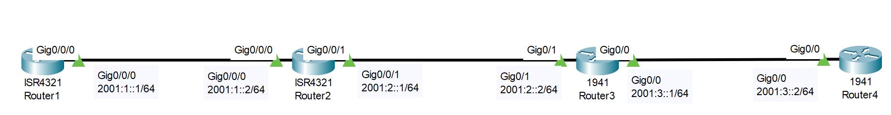

# IPv6 Configuration (Source: Udemy)
## Instructor: David Bombal 
### **Pkt file:** [Here](https://mega.nz/file/Okxi3RKL#YCdK7NXZBkQJGgtLUDAHlOjPNtR77Bo7iXqU7vu_6E8)
### Scenario: 


## **Complete the following tasks:**
1) Configure device host names
2) Configure IPv6 addresses as shown in the topology diagram
3) Configure IPv6 static routing using /64 networks
4) Verify connectivity

## Solution
```
✅ R1
int g0/0/0
ipv6 address 2001:1::1/64
no shut
✅ R2
int g0/0/0
ipv6 address 2001:1::2/64
no shut
int g0/0/1
ipv6 address 2001:2::1/64
no shut
✅ R3
int g0/1
ipv6 address 2001:2::2/64
no shut
int g0/0
ipv6 address 2001:3::1/64
no shut
✅ R4
int g0/0
ipv6 address 2001:3::2/64
no shut
```
```
Static Route: 
✅ R1
ipv6 route 2001:2::/64 2001:1::2
ipv6 route 2001:3::/64 2001:1::2

✅ R2
ipv6 route 2001:3::/64 2001:2::2

✅ R3
ipv6 route 2001:1::/64 2001:2::1

✅ R4
ipv6 route 2001:2::/64 2001:3::1
ipv6 route 2001:1::/64 2001:3::1
```
```
R1(config)#ipv6 unicast-routing 
R2(config)#ipv6 unicast-routing 
R3(config)#ipv6 unicast-routing 
R4(config)#ipv6 unicast-routing 
```
```
R1#ping 2001:3::2

Type escape sequence to abort.
Sending 5, 100-byte ICMP Echos to 2001:3::2, timeout is 2 seconds:
!!!!!
Success rate is 100 percent (5/5), round-trip min/avg/max = 0/0/0 ms
```
## **[The End]**

## Here is another part (Troubleshooting): 
[Pkt File](https://mega.nz/file/e4IAgTiY#TUCQXeqjDn7rbKWgE9tH5p-YmFYdsokODbrSdrKDCpc)

**Watch this video for solve:** 

https://github.com/EZAZ-2281/CCNA-200-301-Lab/assets/81481142/9860078d-946c-4880-8e1a-7f962fdd8fec

## **[The End]**