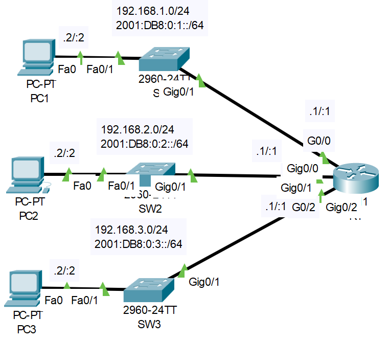

# **IPv6 Configuration**
## Source (YouTube: Jeremy's IT Lab)
### Video Link: [Here](https://youtu.be/BdsIahtrWIA?si=rdwlUwsFhK64scah)
### Lab File Link (pkt): [Here Day-31](https://mega.nz/file/D9ASgbJR#eQfSxGq6cUikTahJ8-U8hBXE_pRErqmPyGyZeAW79RU)
### Scenario:

> The IPv4 configuration of each device is complete.  
> Perform the following IPv6 configurations to create an IPv4/IPv6 'dual-stack' network.

> 1. Enable IPv6 routing on R1.
```
R1(config)#ipv6 unicast-routing
```
> 2. Configure the appropriate IPv6 addresses on R1.
```
R1(config)#int g0/0
R1(config-if)#ipv6 address 2001:db8:0:1::1/64
R1(config-if)#int g0/1
R1(config-if)#ipv6 address 2001:db8:0:2::1/64
R1(config-if)#int g0/2
R1(config-if)#ipv6 address 2001:db8:0:3::1/64
```
- The interface is already up. Because we also running ipv4 service. 

> 3. Confirm your configurations. What IPv6 addresses are present on each interface?
```
R1#sh ipv6 int br
GigabitEthernet0/0         [up/up]
    FE80::201:97FF:FE9A:AC01
    2001:DB8:0:1::1
GigabitEthernet0/1         [up/up]
    FE80::201:97FF:FE9A:AC02
    2001:DB8:0:2::1
GigabitEthernet0/2         [up/up]
    FE80::201:97FF:FE9A:AC03
    2001:DB8:3::1
Vlan1                      [administratively down/down]
    unassigned
```
> 4. Configure the appropriate IPv6 addresses on each PC. Configure the correct default gateway.   
> 5. Attempt to ping between the PCs (IPv4 and IPv6)  
- Watch this video for step 4 and 5: 

https://github.com/EZAZ-2281/CCNA-200-301-Lab/assets/81481142/565cbe95-71cd-4578-9105-46cb1cdd0b80

## **[The End]**