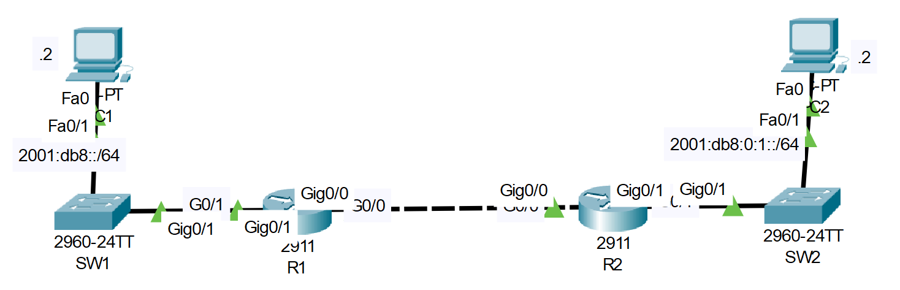
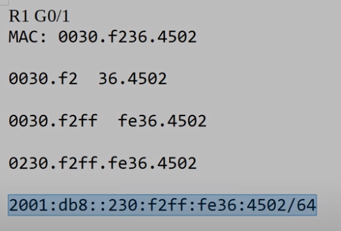
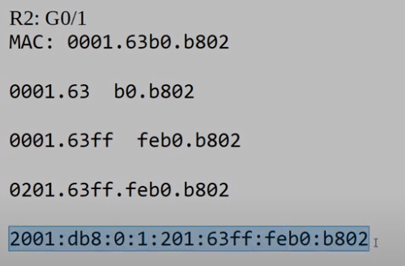

# **IPv6 Configuration Part-02**
## Source (YouTube: Jeremy's IT Lab)
### Video Link: [Here](https://youtu.be/Zfhpd7dl6QI?si=Puy_R1qPvGLcNUZf)
### Lab File Link (pkt): [Here Day-32](https://mega.nz/file/D4oxzTJY#HxHEggkUxnlbGnT1KPYTZyT2TSLnM-1jpVm9CbQQ4G4)
### Scenario:


## **Interfaces are enabled and configured with IPv4. You will configure IPv6 in the network.**

## **1. Use EUI-64 to configure IPv6 addresses on G0/1 of R1/R2**
- Before configuring the addresses, calculate the EUI-64 interface ID that will be generated on each interface.
```
R1(config)#ipv6 unicast-routing 

R1(config)#int g0/1
R1(config-if)#ipv6 address 2001:db8::/64 eui-64

R2(config)#int g0/1
R2(config-if)#ipv6 address 2001:db8:0:1::/64 eui-64
```
```
R1(config-if)#do sh ipv6 int br
GigabitEthernet0/0         [up/up]
    unassigned
GigabitEthernet0/1         [up/up]
    FE80::230:F2FF:FE36:4502
    2001:DB8::230:F2FF:FE36:4502
GigabitEthernet0/2         [administratively down/down]
    unassigned
Vlan1                      [administratively down/down]
    unassigned
```



2. Configure the appropriate IPv6 addresses/default gateways on PC1 and PC2.
## **3. Enable IPv6 on G0/0 of R1/R2 without explicitly configuring an IPv6 address.**
```
R1(config)#int g0/0
R1(config-if)#ipv6 enable
R2(config)#int g0/0
R2(config-if)#ipv6 enable
```
## **4. Configure static routes on R1/R2 to enable PC1 to ping PC2.**
```
R1(config)#ipv6 route 2001:db8:0:1::/64 g0/0 FE80::201:63FF:FEB0:B801
R2(config)#ipv6 route 2001:db8::/64 g0/0 FE80::230:F2FF:FE36:4501
```
> Watch this video also for step 2 and overall:  

[Here](https://drive.google.com/file/d/1YJ7SwYd4TG5XwZraJwALy1FSrKlusY6s/view?usp=sharing)

## **[The End]**


