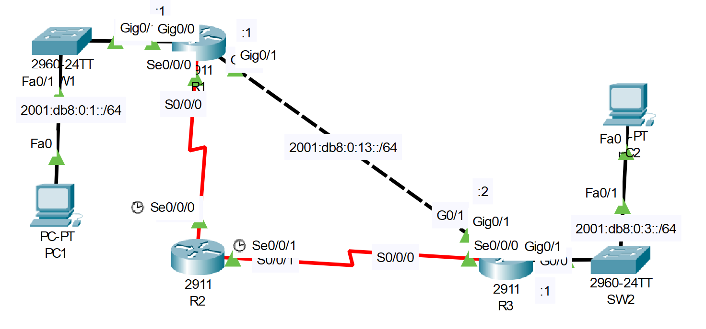

# **IPv6 Configuration Part-03**
## Source (YouTube: Jeremy's IT Lab)
### Video Link: [Here](https://youtu.be/WSBEVFANMmc?si=7LIQ_oNbporrCEBS)
### Lab File Link (pkt): [Here Day-33](https://mega.nz/file/ywYw3DQR#jB-SSUg25fM9_L3kGILst3NS15XJQltrA1DvmMCUQ7E)
### Scenario:



### **IPv6 addresses have been pre-configured on the routers. The serial connections use link-local addresses only.**

## **1. Enable IPv6 routing on each router.**
```
R1(config)#ipv6 unicast-routing 
R2(config)#ipv6 unicast-routing 
R3(config)#ipv6 unicast-routing 
```
## **2. Use SLAAC to configure IPv6 addresses on the PCs. What IPv6 address was configured on each PC?**
`PC1 > Desktop > IP Configuration > IPv6 Configuration > Automatic`

## **3. Configure static routes on the routers to allow PC1 and PC2 to ping each other. The path via R2 should be used only as a backup path.**
```
For R1: 
ipv6 route 2001:db8:0:3::/64 g0/1 2001:db8:0:13::2
ipv6 route 2001:db8:0:3::/64 s0/0/0/ FE80::20B:BEFF:FED7:4901 5

For R2:
ipv6 route 2001:db8:0:1::/64 s0/0/0 FE80::202:4AFF:FE23:E201
ipv6 route 2001:db8:0:3::/64 s0/0/1 FE80::290:2BFF:FECC:A101

For R3: 
ipv6 route 2001:db8:0:1::/64 g0/1 2001:db8:0:13::1
ipv6 route 2001:db8:0:1::/64 s0/0/0 FE80::20B:BEFF:FED7:4901 5
```
> Additional command:  
```
R1#sh ipv6 int br
R1#sh ipv6 route
R1#sh run | i ipv6 route
```
> We use 5 as the AD. So the static route will be prefer.   
> If the static route block or shut down for any reason the R2 will act as a backup router and network will be stable.  
- Watch this video also if necessary: 

[Here](https://drive.google.com/file/d/13Yxh6PQjvYePXhx1ueq5Un5cpu6zY48C/view?usp=sharing)

## **[The End]**