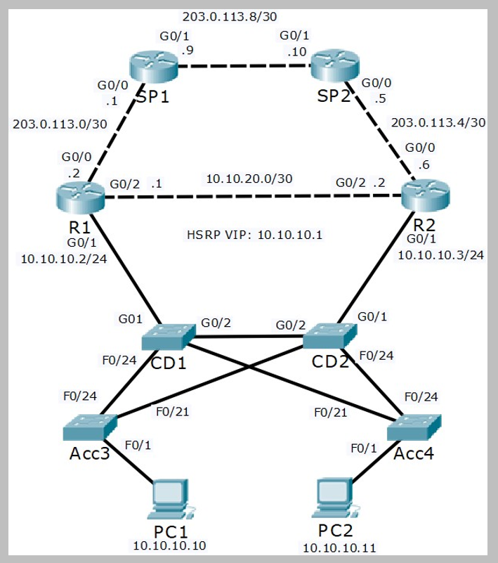

# STP Troubleshooting (Source: Udemy)
## Instructor: Neil Anderson  
### **Pkt file:** [Here](https://mega.nz/file/K8BTUaTK#55f6eBAuQNN248b-TrYIaGA-5iGR1z-Lv0CuCSv03rg)
### Scenario: 

## **Solution**
1)	The Network Operations Centre has reported that traffic is not following the most direct path from the branch office PCs to the Internet. Your task at this stage is to verify this.

Your task is to report which path traffic is currently taking from both PC1 and PC2 to 203.0.113.9. Do not change any configuration.

We can see that PC1 will take the path PC1 > Acc3 > CD1 > R1 to reach its HSRP default gateway. This is the most direct path and is good.

The end to end path from PC1 to 203.0.113.9 is `PC1 > Acc3 > CD1 > R1 > SP1`

PC2 however will use the path PC2 > Acc4 > CD2 > Acc3 > CD1 > R1. This is not the most direct path as traffic is transiting CD2 and Acc3 rather than going directly over the link from Acc4 to CD1.

The end to end path from PC2 to 203.0.113.9 is `PC2 > Acc4 > CD2 > Acc3 > CD1 > R1 > SP1`

> Watch this video:  

https://github.com/EZAZ-2281/CCNA-200-301-Lab/assets/81481142/603e71cf-8773-4d38-b539-3a0e25cf3257

## **[The End]**
