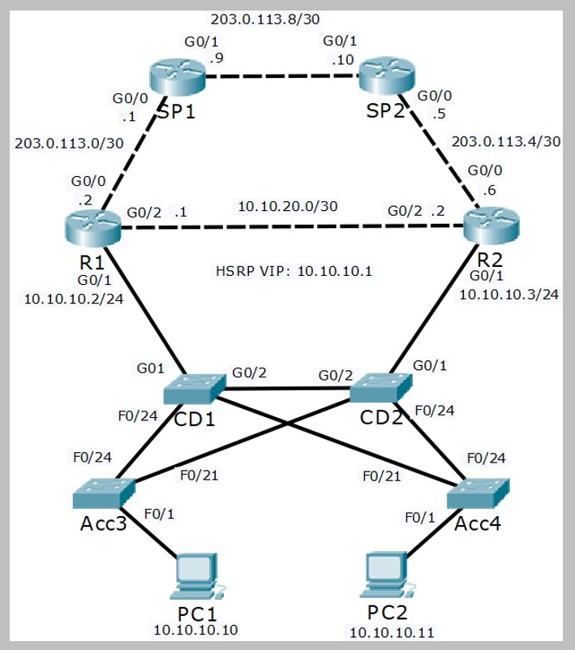

# STP Configuration (Source: Udemy)
## Instructor: Neil Anderson  
### **Pkt file:** [Here](https://mega.nz/file/35YxiaBK#4aLZLvs3_9Rt2Q6YswxHLMBrac8lUIACtTTy_7iSsVE)
### Scenario: 


### **First complete** [this](./anderson-01.md) **Part**

We can see that PC1 will take the path PC1 > Acc3 > CD1 > R1 to reach its HSRP default gateway. This is the most direct path and is good.  
The end to end path from PC1 to 203.0.113.9 is `PC1 > Acc3 > CD1 > R1 > SP1`

PC2 however will use the path PC2 > Acc4 > CD2 > Acc3 > CD1 > R1. This is not the most direct path as traffic is transiting CD2 and Acc3 rather than going directly over the link from Acc4 to CD1.  
The end to end path from PC2 to 203.0.113.9 is `PC2 > Acc4 > CD2 > Acc3 > CD1 > R1 > SP1`

We discovered that switch Acc3 is the Root Bridge in the previous Spanning Tree Troubleshooting lab and traffic is not taking the most direct path across the network. We will correct the configuration in this lab. So that traffic will take the most direct part from PC2 also. 

## **Spanning Tree Root Bridge Configuration**

1) Configure the network so that traffic between the PCs and the Internet travels along the shortest available path. If a core/distribution switch fails traffic should failover to the next shortest available path. Do not change any Layer 3 configuration such as HSRP settings.

- We need to configure the Spanning Tree so it aligns with the HSRP configuration. R1 is the HSRP active gateway. R1 is directly connected to the core/distribution switch CD1 (but not CD2) so we should make this the Spanning Tree Root Bridge.
```
CD1(config)#spanning-tree vlan 10 root primary
```
- If CD1 fails we need to ensure that the Spanning Tree Root Bridge will failover to CD2 rather than an access layer switch.
```
CD2(config)#spanning-tree vlan 10 root secondary
```
- Verify CD1 has the best Bridge Priority and becomes the Root Bridge.

[Watch this](https://drive.google.com/file/d/1n9o8WCTgc8HqqMUvkSE9Tcgm84mYSz0J/view?usp=sharing)

```
pc1 > acc3 > cd1 > r1
pc2 > acc4 > cd1 > r1
Now both pc's taking the most direct path. 
```
```
Now if I shut down R1 and let's check which part pc1 is taking now: 
PC1 > acc3 > cd2 > r2 
PC2 > acc4 > cd2 > r2
```

## **Portfast and BPDU Guard Configuration**


2)	A Layer 2 loop cannot be formed on a port where a single end host is connected. Disable spanning tree on these ports.

> You are concerned that a user may introduce a loop into the network by adding additional switches or changing the cabling. Also ensure that the ports where Spanning Tree is disabled will be automatically shut down if a switch is detected on the other side of the link.  
```
Acc3(config)#int f0/1
Acc3(config-if)#spanning-tree portfast 
Acc3(config-if)#spanning-tree bpduguard enable

Acc4(config)#int f0/1
Acc4(config-if)#spanning-tree portfast 
Acc4(config-if)#spanning-tree bpduguard enable

CD1(config)#int g0/1
CD1(config-if)#spanning-tree portfast 
CD1(config-if)#spanning-tree bpduguard enable

CD2(config)#int g0/1
CD2(config-if)#spanning-tree portfast 
CD2(config-if)#spanning-tree bpduguard enable
```
> For verification watch this:  

https://github.com/EZAZ-2281/CCNA-200-301-Lab/assets/81481142/ccbf3a35-269a-45f2-8b85-fb4dc921cce8

## **[The End]**