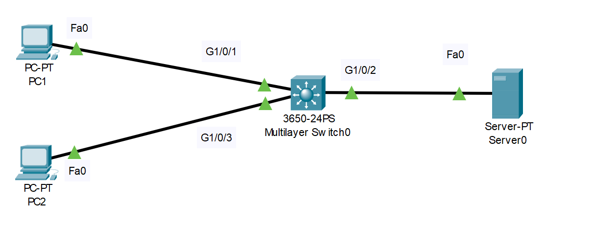

# PortFast Configuration (Source: Udemy)
## Instructor: David Bombal 
### **Pkt file:** [Here](https://mega.nz/file/L1oVzATY#vHBFcKgrpRSQgmA2m1urbv6iueTBc0IxJp0QqCb6lS0)
### Scenario: 

> watch this video:  

https://github.com/EZAZ-2281/CCNA-200-301-Lab/assets/81481142/e7c64d99-63cf-45b0-8a41-d9691de4a38d

## **[The End]**