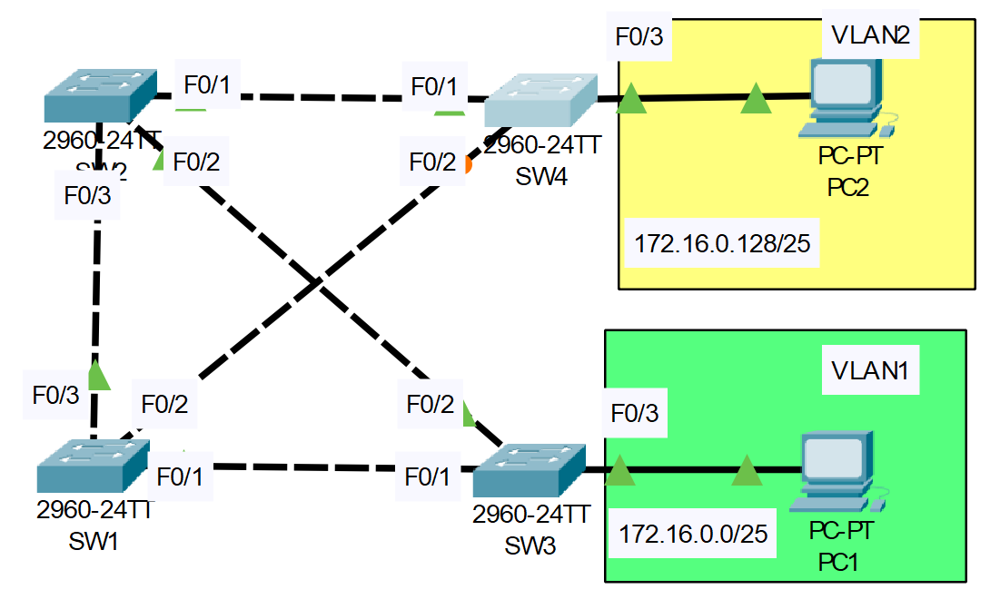

# **STP Configuration Part-02**
## Source (YouTube: Jeremy's IT Lab)
### Video Link: [Here](https://youtu.be/5rpaeJNig2o?si=jqXaBlI_3dh8n5cN)
### Lab File Link (pkt): [Here Day-21](https://mega.nz/file/T0pwUb7Q#gJuONHIkxBqP8tn3_ASLDEgyabCjRT1Wr_nGjlVfCjg)
### Scenario:


# **Spanning-Tree Configuration**
```
1. Use the CLI to check the current STP topology. What is the current root bridge?
    What is the STP role/state of each port on each switch?

2. Configure SW1 as the primary root for VLAN1 and the secondary root for VLAN2.
    Configure SW2 and the primary root for VLAN2 and the secondary root for VLAN1.
    What is the STP role/state of each port on each switch now?

3. Increase the VLAN1 cost of SW4's F0/2 interface to 100.
    Does SW4 select a different root port?  Why/why not?

4. Increase the VLAN1 port priority of SW1's F0/1 to 240.
    Does SW3 select a different root port?  Why/why not?

5. Configure PortFast and BPDU Guard on the F0/3 interfaces of SW3/SW4.
 
```
### **1. Use the CLI to check the current STP topology.  What is the current root bridge? What is the STP role/state of each port on each switch?**
```
SW2#sh spanning-tree 
VLAN0001 ✅
  Spanning tree enabled protocol ieee
  Root ID    Priority    32769
             Address     0001.4301.4B81
             This bridge is the root ✅
             Hello Time  2 sec  Max Age 20 sec  Forward Delay 15 sec

  Bridge ID  Priority    32769  (priority 32768 sys-id-ext 1)
             Address     0001.4301.4B81
             Hello Time  2 sec  Max Age 20 sec  Forward Delay 15 sec
             Aging Time  20

Interface        Role Sts Cost      Prio.Nbr Type
---------------- ---- --- --------- -------- --------------------------------
Fa0/1            Desg FWD 19        128.1    P2p
Fa0/2            Desg FWD 19        128.2    P2p
Fa0/3            Desg FWD 19        128.3    P2p

VLAN0002 ✅
  Spanning tree enabled protocol ieee
  Root ID    Priority    32770
             Address     0001.4301.4B81
             This bridge is the root ✅
             Hello Time  2 sec  Max Age 20 sec  Forward Delay 15 sec

  Bridge ID  Priority    32770  (priority 32768 sys-id-ext 2)
             Address     0001.4301.4B81
             Hello Time  2 sec  Max Age 20 sec  Forward Delay 15 sec
             Aging Time  20

Interface        Role Sts Cost      Prio.Nbr Type
---------------- ---- --- --------- -------- --------------------------------
Fa0/1            Desg FWD 19        128.1    P2p
Fa0/2            Desg FWD 19        128.2    P2p
Fa0/3            Desg FWD 19        128.3    P2p
```
### **2. Configure SW1 as the primary root for VLAN1 and the secondary root for VLAN2.**
- Configure SW2 and the primary root for VLAN2 and the secondary root for VLAN1.
- What is the STP role/state of each port on each switch now?
```
SW1(config)#spanning-tree vlan 1 root primary
SW1(config)#spanning-tree vlan 2 root secondary

SW2(config)#spanning-tree vlan 1 root secondary
SW2(config)#spanning-tree vlan 2 root primary
```
```
SW1#sh span vlan 1
VLAN0001
  Spanning tree enabled protocol ieee
  Root ID    Priority    24577
             Address     0060.2F90.D14A
             This bridge is the root ✅
             Hello Time  2 sec  Max Age 20 sec  Forward Delay 15 sec

  Bridge ID  Priority    24577  (priority 24576 sys-id-ext 1)
             Address     0060.2F90.D14A
             Hello Time  2 sec  Max Age 20 sec  Forward Delay 15 sec
             Aging Time  20

Interface        Role Sts Cost      Prio.Nbr Type
---------------- ---- --- --------- -------- --------------------------------
Fa0/2            Desg FWD 19        128.2    P2p
Fa0/3            Desg FWD 19        128.3    P2p
Fa0/1            Desg FWD 19        128.1    P2p
```
### **3. Increase the VLAN1 cost of SW4's F0/2 interface to 100.**
- Does SW4 select a different root port?  Why/why not?
```
SW4#sh spanning-tree vlan 1
VLAN0001
  Spanning tree enabled protocol ieee
  Root ID    Priority    24577
             Address     0060.2F90.D14A
             Cost        19
             Port        2(FastEthernet0/2)
             Hello Time  2 sec  Max Age 20 sec  Forward Delay 15 sec

  Bridge ID  Priority    32769  (priority 32768 sys-id-ext 1)
             Address     0090.0C03.2D70
             Hello Time  2 sec  Max Age 20 sec  Forward Delay 15 sec
             Aging Time  20

Interface        Role Sts Cost      Prio.Nbr Type
---------------- ---- --- --------- -------- --------------------------------
Fa0/1         ✅ Altn BLK 19        128.1    P2p
Fa0/2         ✅ Root FWD 19        128.2    P2p
```
```
SW4(config)#int f0/2
SW4(config-if)#spanning-tree vlan 1 cost 100
```
```
SW4#sh spanning-tree vlan 1
VLAN0001
  Spanning tree enabled protocol ieee
  Root ID    Priority    24577
             Address     0060.2F90.D14A
             Cost        38
             Port        1(FastEthernet0/1)
             Hello Time  2 sec  Max Age 20 sec  Forward Delay 15 sec

  Bridge ID  Priority    32769  (priority 32768 sys-id-ext 1)
             Address     0090.0C03.2D70
             Hello Time  2 sec  Max Age 20 sec  Forward Delay 15 sec
             Aging Time  20

Interface        Role Sts Cost      Prio.Nbr Type
---------------- ---- --- --------- -------- --------------------------------
Fa0/1         ✅ Root LRN 19        128.1    P2p
Fa0/2         ✅ Altn BLK 100       128.2    P2p
```
> In STP a lower number is actually treated with high priority.  

### **4. Increase the VLAN1 port priority of SW1's F0/1 to 240.**
- Does SW3 select a different root port?  Why/why not?
```
SW1#sh spanning-tree vlan 1
VLAN0001
  Spanning tree enabled protocol ieee
  Root ID    Priority    24577
             Address     0060.2F90.D14A
             This bridge is the root ✅
             Hello Time  2 sec  Max Age 20 sec  Forward Delay 15 sec

  Bridge ID  Priority    24577  (priority 24576 sys-id-ext 1)
             Address     0060.2F90.D14A
             Hello Time  2 sec  Max Age 20 sec  Forward Delay 15 sec
             Aging Time  20

Interface        Role Sts Cost      Prio.Nbr Type
---------------- ---- --- --------- -------- --------------------------------
Fa0/2            Desg FWD 19        128.2    P2p
Fa0/3            Desg FWD 19        128.3    P2p
Fa0/1            Desg FWD 19     ✅ 128.1    P2p
```
```
SW1(config)#int f0/1
SW1(config-if)#spanning-tree vlan 1 port-priority 240
```
```
SW1#sh spanning-tree vlan 1
VLAN0001
  Spanning tree enabled protocol ieee
  Root ID    Priority    24577
             Address     0060.2F90.D14A
             This bridge is the root ✅
             Hello Time  2 sec  Max Age 20 sec  Forward Delay 15 sec

  Bridge ID  Priority    24577  (priority 24576 sys-id-ext 1)
             Address     0060.2F90.D14A
             Hello Time  2 sec  Max Age 20 sec  Forward Delay 15 sec
             Aging Time  20

Interface        Role Sts Cost      Prio.Nbr Type
---------------- ---- --- --------- -------- --------------------------------
Fa0/2            Desg FWD 19        128.2    P2p
Fa0/3            Desg FWD 19        128.3    P2p
Fa0/1            Desg FWD 19     ✅ 240.1    P2p
```
> Sender port id is actually the last tiebreaker after port cost and sender bridge id.  
> Since F0/1 is the lowest cost so port priority should have no effect.  

### **5. Configure PortFast and BPDU Guard on the F0/3 interfaces of SW3/SW4.**
```
SW3(config)#int f0/3
SW3(config-if)#spanning-tree portfast
SW3(config-if)#spanning-tree bpduguard enable 

SW4(config)#int f0/3
SW4(config-if)#spanning-tree portfast
SW4(config-if)#spanning-tree bpduguard enable 
```
- Watch this video to see how portfast and bpduguard works.   

https://github.com/EZAZ-2281/CCNA-200-301-Lab/assets/81481142/1121cfc7-3780-4237-a709-7a3f4ae82839

> Because bpdu is enable, if we connect f0/3 to another switch and a bpdu is received the interface should be shutdown.  

## **[The End]**