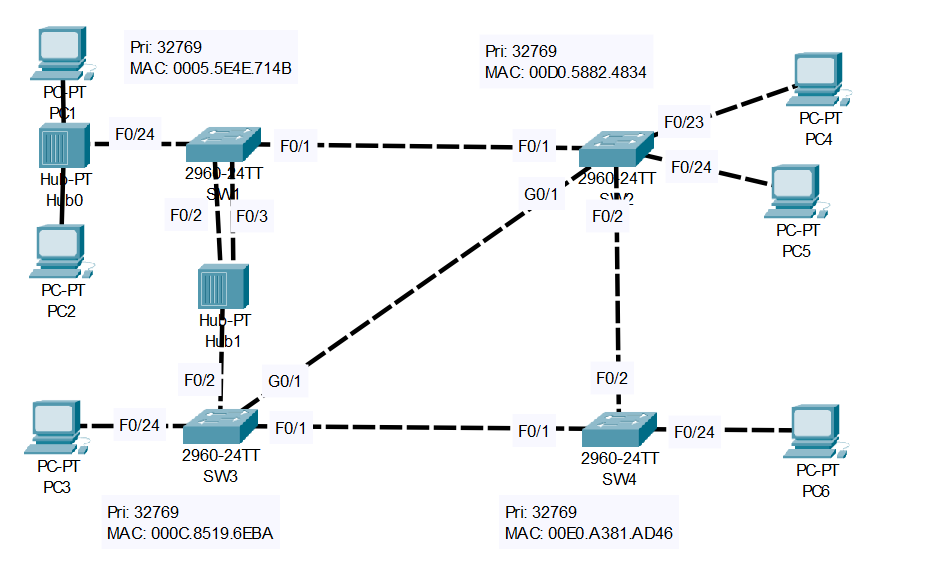
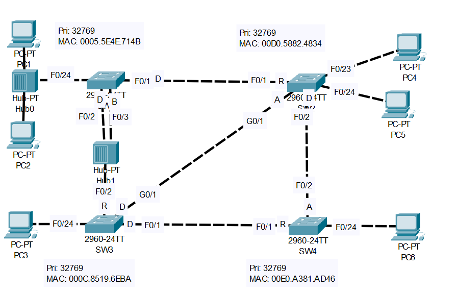

# **STP Configuration Part-03**
## Source (YouTube: Jeremy's IT Lab)
### Video Link: [Here](https://youtu.be/YG7r4XHy2JU?si=7hoY2Rub91vE_d3N)
### Lab File Link (pkt): [Here Day-22](https://mega.nz/file/mlJA1Qyb#2pL-tVRiWJEJLd5Q6owh5wc7fQSf-Zo61NYI2hydYgg)
### Scenario:



```
1. Which switch is the root bridge?
    Use the CLI to examine the port role/state of each interface on the root.
    What appears different than what you have learned about the root bridge?
    What is the cause of this?

2. Without using the CLI, determine the port role/state of each remaining switch interface.
    Use the CLI to confirm.

3. Manually configure the appropriate RSTP link type on each interface.
    What do you think is the correct link type for SW1's F0/24?
```

### **1. Which switch is the root bridge?**
- Use the CLI to examine the port role/state of each interface on the root.
- What appears different than what you have learned about the root bridge?
- What is the cause of this?
```
SW1#sh spanning-tree 
VLAN0001
  Spanning tree enabled protocol rstp
  Root ID    Priority    32769
             Address     0005.5E4E.714B
             This bridge is the root
             Hello Time  2 sec  Max Age 20 sec  Forward Delay 15 sec

  Bridge ID  Priority    32769  (priority 32768 sys-id-ext 1)
             Address     0005.5E4E.714B
             Hello Time  2 sec  Max Age 20 sec  Forward Delay 15 sec
             Aging Time  20

Interface        Role Sts Cost      Prio.Nbr Type
---------------- ---- --- --------- -------- --------------------------------
Fa0/1            Desg FWD 19        128.1    P2p
Fa0/2            Desg FWD 19        128.2    Shr
Fa0/3            Back BLK 19        128.3    Shr
Fa0/24           Desg FWD 19        128.24   Shr
```
> SW1 mac-address is the lowest so it is the root bridge.   

> If the root bridge has two interfaces in the same collision domain because they both connect to the same hub, the rule that there must be only one designated port per collision domain applies and the other interface will be backup port.   

>  Although every interface on the root bridge is designated in this case f0/3 isn't because its in the same collision domain as f0/2.   

### **2. Without using the CLI, determine the port role/state of each remaining switch interface. Use the CLI to confirm.**



> In SW4 we can see the root cost is same for both SW2 and SW3. But the SW3 mac address is lower than SW2. So the interface connected to SW3 will be the root port.   

> The g0/1 link between SW3 and SW2 which side will be designated port. Both have the same cost of 19. But the SW3 mac address is lower so the g0/1 interface of SW3 is the designated port and SW2's g0/1 will be alternate port.   

> SW2 has the lower root cost so it's f0/2 is designated.  


### **3. Manually configure the appropriate RSTP link type on each interface. What do you think is the correct link type for SW1's F0/24?**
```
SW1(config)#int range f0/2-3	
SW1(config-if-range)#spanning-tree link-type shared
SW1(config-if-range)#exit
SW1(config)#int f0/24
SW1(config-if)#spanning-tree link-type shared
SW1(config-if)#spanning-tree portfast
SW1(config-if)#exit
SW1(config)#int f0/1
SW1(config-if)#spanning-tree link-type point-to-point

SW2(config)#int range f0/1-2, g0/1
SW2(config-if-range)#spanning-tree link-type point-to-point
SW2(config-if-range)#int range f0/23-24
SW2(config-if-range)#spanning-tree portfast

SW3(config)#int range f0/1, g0/1
SW3(config-if-range)#spanning-tree link-type point-to-point
SW3(config-if-range)#int f0/2
SW3(config-if)#spanning-tree link-type shared
SW3(config-if)#int f0/24
SW3(config-if)#spanning-tree portfast

SW4(config)#int range f0/1-2
SW4(config-if-range)#spanning-tree link-type point-to-point
SW4(config-if-range)#int f0/24
SW4(config-if)#spanning-tree portfast
```
> F0/24? It still has the default type of point to point. Well, this is something I didn’t explain in the lecture. Edge ports connected to an end host like this will still be point to point links if they are using full duplex. There is no hub here, therefore the link is full duplex, so this is a point to point link. However, its also an edge port. It doesn’t work in packet tracer, but if you enter the SPANNING-TREE PORTFAST command on a port on a real switch, it will display both edge AND point to point here in the type section. Point to point means it is full duplex, edge means portfast is enabled. So, it’s both an edge port and a point to point port.   

## **[The End]**