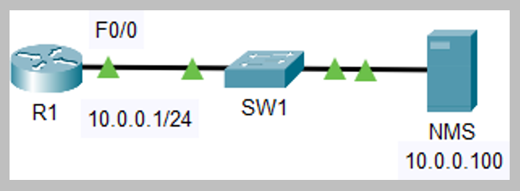
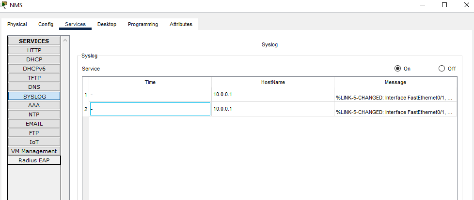

# SNMP and Syslog Configuration (Source: Udemy)
## Instructor: Neil Anderson  
### **Pkt file:** [Here](https://mega.nz/file/KhxgxIyQ#u438_2csaJlz9nLsc7psqoC_c56964eybBWBl6g_TrE)
### Scenario: 



## **SNMP and Syslog**

```
1)	Configure SNMP communities on R1. Use Flackbox1 as the Read Only community string, and Flackbox2 as the Read Write community string.

2)	Configure R1 so it will show events from all severity levels to the external Syslog server at 10.0.0.100.

3)	Verify you have set the correct severity level.

4)	Enable then disable the FastEthernet 0/1 interface on R1.

5)	On the Syslog server at 10.0.0.100, click ‘Services’ then ‘SYSLOG’ and check you can see events for the interface coming up then back down.
```

## **Solution** 

### **1) Configure SNMP communities on R1. Use Flackbox1 as the Read Only community string, and Flackbox2 as the Read Write community string.**
```
R1(config)#snmp-server community Flackbox1 ro 
R1(config)#snmp-server community Flackbox2 rw
```
### **2)	Configure R1 so it will show events from all severity levels to the external Syslog server at 10.0.0.100.**
```
R1(config)#logging host 10.0.0.100 
R1(config)#logging trap debugging
```
### **3)	Verify you have set the correct severity level.**
```
R1#sh logging
Syslog logging: enabled (0 messages dropped, 0 messages rate-limited,
          0 flushes, 0 overruns, xml disabled, filtering disabled)

No Active Message Discriminator.


No Inactive Message Discriminator.


    Console logging: level debugging, 3 messages logged, xml disabled,
          filtering disabled
    Monitor logging: level debugging, 3 messages logged, xml disabled,
          filtering disabled
    Buffer logging:  disabled, xml disabled,
          filtering disabled

    Logging Exception size (4096 bytes)
    Count and timestamp logging messages: disabled
    Persistent logging: disabled

No active filter modules.

ESM: 0 messages dropped
    Trap logging: level debugging ✅, 3 message lines logged
        Logging to 10.0.0.100  (udp port 514,  audit disabled,
             authentication disabled, encryption disabled, link up),
             2 message lines logged,
             0 message lines rate-limited,
             0 message lines dropped-by-MD,
             xml disabled, sequence number disabled
             filtering disabled
```
## **4)	Enable then disable the FastEthernet 0/1 interface on R1.**
```
R1(config)#int f0/1
R1(config-if)#no shut

R1(config-if)#
%LINK-5-CHANGED: Interface FastEthernet0/1, changed state to up

R1(config-if)#shut

R1(config-if)#
%LINK-5-CHANGED: Interface FastEthernet0/1, changed state to administratively down
```
### **5)	On the Syslog server at 10.0.0.100, click ‘Services’ then ‘SYSLOG’ and check you can see events for the interface coming up then back down.**


## **[The End]**

