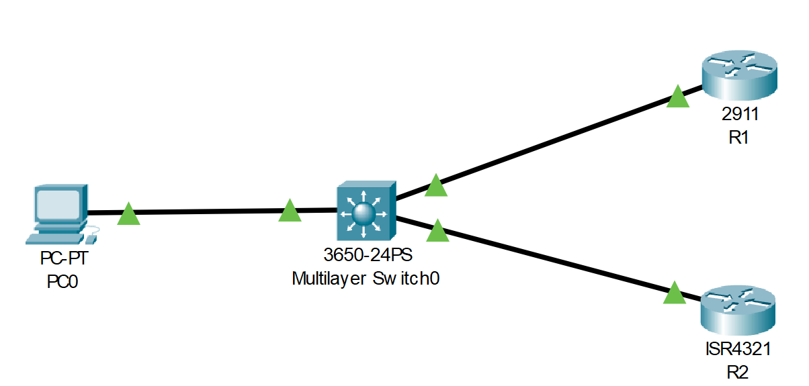

# SNMP (Source: Udemy)
## Instructor: David Bombal 
## This part is not necessary for the CCNA. You can skip it.  
### **Pkt file:** [Here](https://mega.nz/file/K1AwiJqQ#22ccf8oGnfyrimbXVXfzfQcWvaHI42ErSIiJktv2EGM)
### Scenario: 


```
Complete the following SNMP tasks:
1) Enable SNMP on both R1 and R2:
- ro community = public
- rw community = private
2) Use the MIB browser (SMNP v3) on the PC to view the hostname of R1 and R2
3) View the interfaces on R1 using the MIB browser on the PC
4) View the interface types on R1 via the MIB Browser
5) View the routing table of R1 via the MIB Browser
6) View the OSPF Area of R1 via the MIB Browser
7) View the router-id R1 via the MIB Browser
8) View the OSPF neighbors of R1 via the MIB Browser
9 Change the name of R1 to "Router1" using the MIB browser on the PC
 
```
> Watch this video:  

https://github.com/EZAZ-2281/CCNA-200-301-Lab/assets/81481142/b1db79ee-7cbc-462f-8033-dcf886d2fa56

## **[The End]**