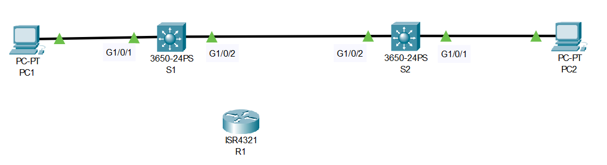
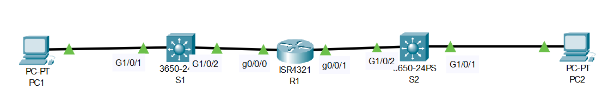
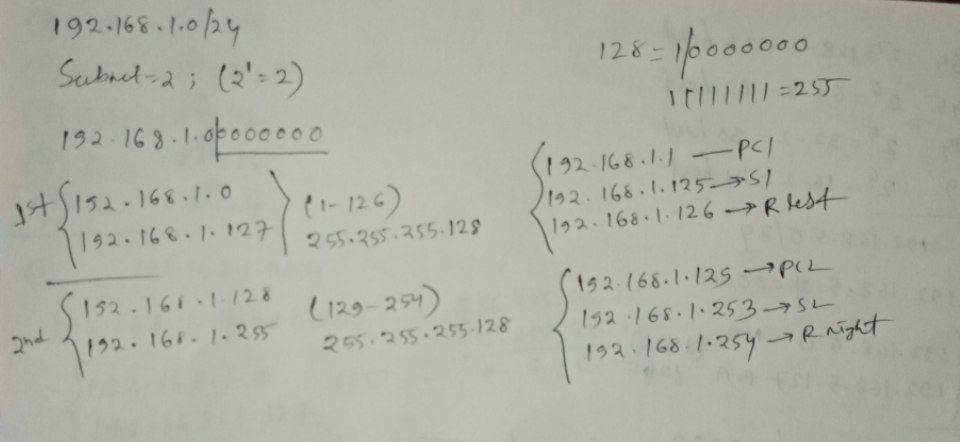

# Subnetting (Source: Udemy)
## Instructor: David Bombal 
### **Pkt file:** [Here](https://mega.nz/file/zsYymKob#cwkbXCVbHv3RC2wB4-Vrcp5zM2gC70o_MPmfRS8Demo)


Tasks:
1) Subnet the current subnet (192.168.1.0/24) into two subnets with as many hosts as possible
2) First subnet on left (S1). Second subnet on right (S2)
3) Configure PCs with first IP address in subnet
4) Configure Router with last IP address in subnet
5) Connect Router between switches
6) Configure Switches with second last IP address in subnet
7) Verify that all devices can ping each other
 
## **Solution**


```
R1(config)#int g0/0/0
R1(config-if)#ip add 192.168.1.126 255.255.255.128
R1(config-if)#no shut

R1(config-if)#int g0/0/1
R1(config-if)#ip add 192.168.1.254 255.255.255.128
R1(config-if)#no shut
```
```
S1(config)#int vlan 1
S1(config-if)#ip add 192.168.1.125 255.255.255.128

S2(config)#int vlan 1
S2(config-if)#ip add 192.168.1.253 255.255.255.128
```
```
PC1: 192.168.1.1
SM : 255.255.255.128
DG : 192.168.1.126

PC2: 192.168.1.129
SM : 255.255.255.128
DG : 192.168.1.254
```
```
C:\>ping 192.168.1.129

Pinging 192.168.1.129 with 32 bytes of data:

Request timed out.
Reply from 192.168.1.129: bytes=32 time=1ms TTL=127
Reply from 192.168.1.129: bytes=32 time<1ms TTL=127
Reply from 192.168.1.129: bytes=32 time<1ms TTL=127

Ping statistics for 192.168.1.129:
    Packets: Sent = 4, Received = 3, Lost = 1 (25% loss),
Approximate round trip times in milli-seconds:
    Minimum = 0ms, Maximum = 1ms, Average = 0ms
```

## **[The End]**