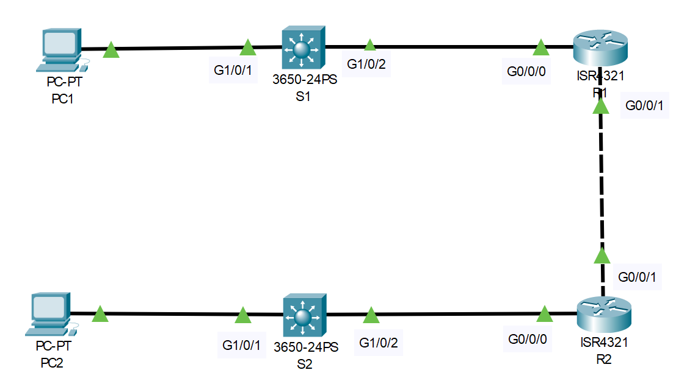
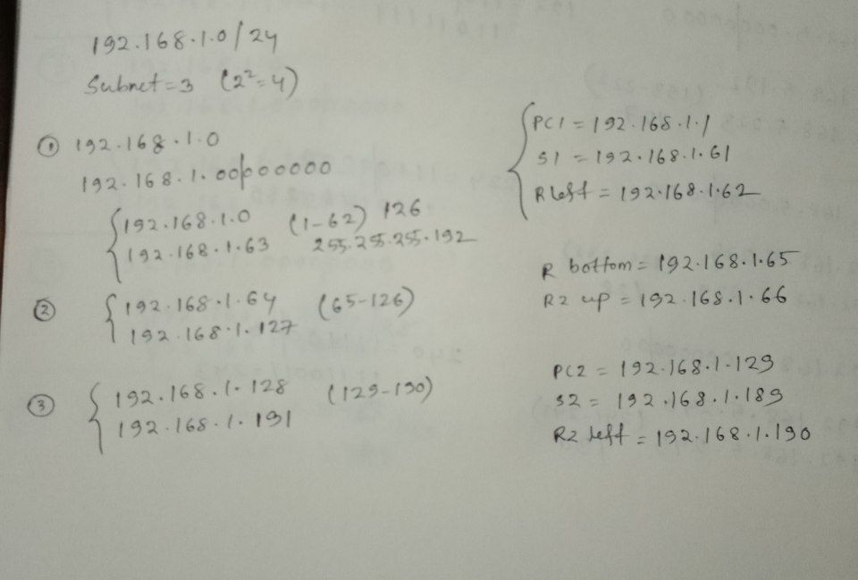

# Subnetting (Source: Udemy)
## Instructor: David Bombal 
### **Pkt file:** [Here](https://mega.nz/file/OhpGgAIQ#bLbrUMM98rOUxD84MHzRzXfJGxOLbpPXdHFEqoTSMSg)



Tasks:
1) Subnet 192.168.1.0/24 into three subnets
2) First subnet (PC1, S1 and R1). Second subnet between routers. Third subnet (PC2, S2 and R2).
3) Configure PCs with first IP address in subnet. 
4) Configure Routers with last IP address in subnet on connections to PCs. 
For the link between the routers set R1 to the first IP address and R2 to the second IP address in the subnet
5) Configure Switches with second last IP address in subnet
6) Verify that all devices can ping each other

## **Solution**

```
R1(config)#int g0/0/0
R1(config-if)#ip address 192.168.1.62 255.255.255.192
R1(config-if)#no shut

R1(config-if)#int g0/0/1
R1(config-if)#ip address 192.168.1.65 255.255.255.192
R1(config-if)#no shut

R2(config)#int g0/0/1
R2(config-if)#ip address 192.168.1.66 255.255.255.192
R2(config-if)#no shut

R2(config-if)#int g0/0/0
R2(config-if)#ip address 192.168.1.190 255.255.255.192
R2(config-if)#no shut

S1(config)#int vlan 1
S1(config-if)#ip address 192.168.1.61 255.255.255.192
S1(config-if)#no shut
S2(config)#int vlan 1
S2(config-if)#ip address 192.168.1.189 255.255.255.192
S2(config-if)#no shut
```
```
R1(config)#ip route 192.168.1.128 255.255.255.192 192.168.1.66
R2(config)#ip route 192.168.1.0 255.255.255.192 192.168.1.65
```
```
PC1: 192.168.1.1
SM : 255.255.255.192
DG : 192.168.1.62

PC2: 192.168.1.129
SM : 255.255.255.192
DG : 192.168.1.190
```
> Ping PC2 from PC1 and this ping must word...!  

## **[The End]**