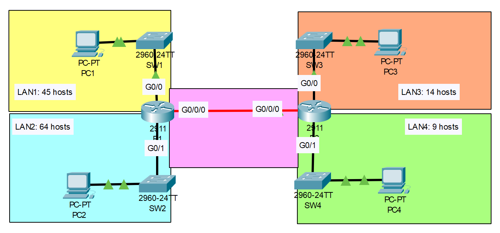
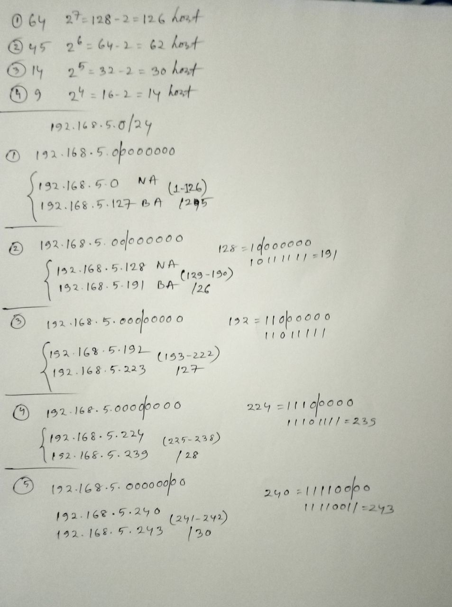

# **STP Configuration**
## Source (YouTube: Jeremy's IT Lab)
### Video Link: [Here](https://youtu.be/Rn_E1Qv8--I?si=48Udtz3VxXRErlTt)
### Lab File Link (pkt): [Here Day-15](https://mega.nz/file/nsBGwLiC#QsZt8mGflNCUUZDXAy_-atE18AgnDKLR68QjHbE3soI)
### Scenario:

```
Subnet the 192.168.5.0/24 network to provide sufficient addressing for each LAN.
(Also, the point-to-point connection between R1 and R2).

Assign the first usable address to the PC in each LAN.

Assign the last usable address to the router's interface in each LAN.

Configure static routes on each router so that all PCs can ping eachother.
```
## **Solution**

```
R1(config)#int g0/1
R1(config-if)#ip address 192.168.5.126 255.255.255.128
R1(config-if)#no shut

R1(config)#int g0/0
R1(config-if)#ip address 192.168.5.190 255.255.255.192
R1(config-if)#no shut

R2(config)#int g0/0
R2(config-if)#ip address 192.168.5.222 255.255.255.224
R2(config-if)#no shut

R2(config)#int g0/1
R2(config-if)#ip address 192.168.5.238 255.255.255.240
R2(config-if)#no shut

R1(config)#int g0/0/0
R1(config-if)#ip address 192.168.5.241 255.255.255.252
R1(config-if)#no shut

R2(config)#int g0/0/0
R2(config-if)#ip address 192.168.5.242 255.255.255.252
R2(config-if)#no shut
```
```
R1(config)#ip route 192.168.5.192 255.255.255.224 192.168.5.242
R1(config)#ip route 192.168.5.224 255.255.255.240 192.168.5.242

R2(config)#ip route 192.168.5.0 255.255.255.128 192.168.5.241
R2(config)#ip route 192.168.5.128 255.255.255.192 192.168.5.241
```
```
From PC1: 
C:\>ping 192.168.5.1
C:\>ping 192.168.5.193
C:\>ping 192.168.5.225
All ping should succeed. 
```
```
PC2: 
IP: 192.168.5.1
SM: 255.255.255.128
DG: 192.168.5.126

PC1: 
IP: 192.168.5.129
SM: 255.255.255.192
DG: 192.168.5.190

PC3: 
IP: 192.168.5.193
SM: 255.255.255.224
DG: 192.168.5.222

PC4:
IP: 192.168.5.225
SM: 255.255.255.240
DG: 192.168.5.238
```

## **[The End]**