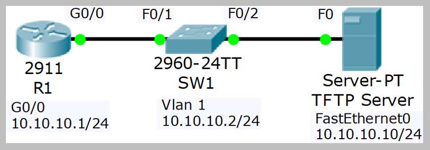

# Cisco Device Management (Source: Udemy)
## Instructor: Neil Anderson  
### **Pkt file:** [Here](https://mega.nz/file/e0xHCJCY#Xe5oYtOh04AgCAiYxS8nwOnFymzpc2L7hzqpv5dWGyA)
### Scenario: 


# **Factory Reset**

1)	View the running configuration on R1. Note that the hostname and interface have been configured
2)	Factory reset R1 and reboot
3)	Watch the boot up process as the router boots
4)	The router should boot into the Setup Wizard. Exit out of the wizard and then confirm the startup and running configurations are empty.
5)	Paste the configuration for R1 from the ‘15 Cisco Device Management Configs.zip’ file back into the configuration and save

https://github.com/EZAZ-2281/CCNA-200-301-Lab/assets/81481142/89558dd0-e7fd-4e8b-993a-af4e4bf83ae4

# **Password Recovery**

6)	Set the enable secret ‘Flackbox1’ on R1
7)	Configure the router to boot into the rommon prompt on next reload, and reboot the router. In a real world scenario you would enter the Break sequence on the keyboard when first powering up the router to access the rommon prompt
8)	Configure the router to ignore the startup-config when booting up, and reload the router
9)	The router should boot into the Setup Wizard. Exit out of the wizard
10)	What do you expect to see if you view the running and startup configurations? Confirm this.
> The running configuration should be empty because the router bypassed loading the startup config on boot up. The startup config should remain unchanged and all previous configuration should still be there.  
11)	Copy the startup config to the running config. Do not miss this step or you will factory reset the router!
12)	Remove the enable secret
13)	Ensure the router will reboot normally on the next reload and you will be able to access the router
14)	Reboot the router to confirm
```
rommon prompt on next reload 0x2120
ignore the startup-config 0x2142
reboot normally on the next reload 0x2102
```
https://github.com/EZAZ-2281/CCNA-200-301-Lab/assets/81481142/f84b2379-13b4-4914-a8fe-a63d60b43ba5

# **Configuration Backup**

15)	Backup the running configuration to Flash on R1. Use a suitable name for the backup file. Verify the configuration has been backed up.
16)	Backup the R1 startup configuration to the TFTP server. Use a suitable name for the backup file. Verify the configuration has been backed up.  

https://github.com/EZAZ-2281/CCNA-200-301-Lab/assets/81481142/f3e58eec-7487-453a-8917-0edb1a4f2781

# **IOS System Image Backup and Recovery**

17)	Backup the IOS system image on R1 to the TFTP server. Verify the configuration has been backed up.
18)	Delete the system image from Flash and reload.
19)	Use Internet search to find system recovery instructions for your model of router. Recover the system image using the TFTP server.
20)	If you are using the latest version of Packet Tracer the download will time out because the GigabitEthernet interface stays down in rommon mode. You have completed this part of the lab once you have entered the tftpdnld command.
> This is as far as we can go with this part of the lab. You’ve seen how to recover the system image, the only thing left to do in a real world scenario after the download has completed is: rommon 9 > reset  
> http://www.cisco.com/c/en/us/td/docs/routers/access/1900/software/configuration
/guide/Software_Configuration/appendixCrommon.html is the first hit when searching for ‘Cisco 2900 rommon recovery’.  
> Go to the “Recovering the System Image (tftpdnld)” section.  

https://github.com/EZAZ-2281/CCNA-200-301-Lab/assets/81481142/ef3269e9-d2a6-4ba6-906d-f162e6338920


# **IOS Image Upgrade**

21)	Verify SW1 is running C2960 Software (C2960-LANBASE-M), Version 12.2(25)FX
22)	Use the TFTP server to upgrade to C2960-lanbasek9-mz.150-2.SE4.bin
23)	Reboot and verify the switch is running the new software version

https://github.com/EZAZ-2281/CCNA-200-301-Lab/assets/81481142/9bedf916-e1da-4056-afd2-9200034f4ef4

## **[The End]**