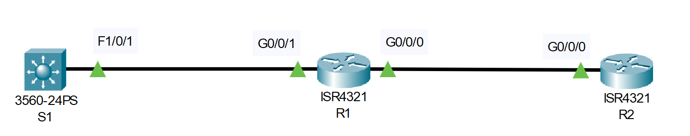

# Password Recovery (Source: Udemy)
## Instructor: David Bombal 
### **Pkt file:** [Here](https://mega.nz/file/u0BDmZLA#zMcWiX4LixdmJkmcCecBpwBdV0TQSbpuO8gSDuaYwZw)
### Scenario: 



```
Do a password recovery on devices:
1) R1 = reset enable password to "cisco"
Real world: https://goo.gl/fZJLnp
2) R2 = reset secret password to "cisco"
3) S1 = reset secret password to "cisco" (watch next video if needed as Packet Tracer does not support all required options)
Real world: https://goo.gl/vnCtvn
4) Very that device configurations are restored and that devices can ping all loopbacks
5) Verify that when devices are reloaded, configurations are restored using the new passwords
```
## **Part-01**
1. Turn off-on the router
2. Press ctrl+c to go the rommon prompt
3. rommon 1 > confreg 0x2142
   rommon 2 > reset
4. See the startup config using `sh start` command. 
5. Copy the startup to running config. 
6. No shut the interface if that interface contain an ip address. 
7. Set the enable password and service encryption if necessary. 
8. Set the config-register to 0x2102
9. Save the running config to startup config.
10. Reload the router then type no. 

Thats it, we just successfully reset the password of a router. 

## **Part-02**
1. flash_init
2. dir flash:
3. rename flash:config.text flash:config.text.old
4. boot
5. Go to Config tab > NVRAM > erase 
6. copy flash running
souce filename: config.text.old
7. Set enable secret to cisco
8. wr
9. reload
10. Again go to Config tab > NVRAM > erase 
Thats it, we just successfully reset the password of a router. 

Thats it, we just successfully reset the password of a switch.

## **[The End]**