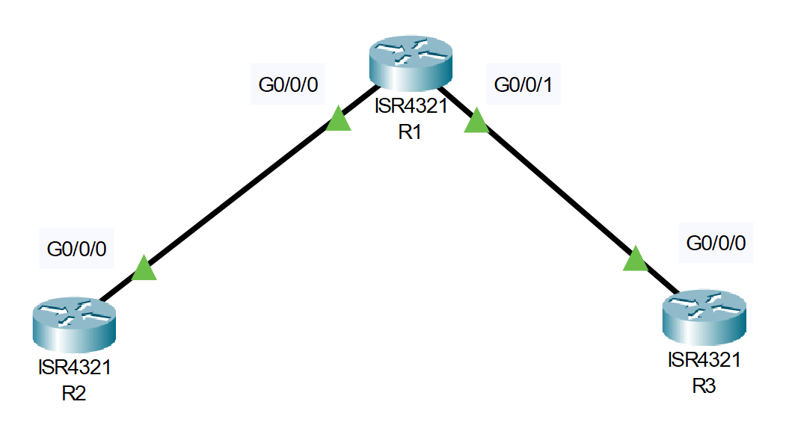

# Configuration Register Troubleshooting (Source: Udemy)
## Instructor: David Bombal 
### **Pkt file:** [Here](https://mega.nz/file/y9QGVKIb#82EKEss8n95EXeb0XoyNThxb96vI9O2AeZ4HMFzqyGE)



```
Lab overview:
After a power outage the network has stopped working.

IMPORTANT: To simulate this, click the "Power Cycle Devices" button in Packet Tracer.

Fix the issues and ensure configurations are restored so that the routers can ping all loopbacks.

Verification: Use the Power Cycle Devices option in Packet Tracer to reboot devices. Make sure that configs are restored and loopbacks are pingable.
```
## **First fix the Router 1**
```
Router#sh version
Configuration register is 0x2142
```
```
Router(config)#config-register 0x2102
```
```
Router#reload
System configuration has been modified. Save? [yes/no]:no
```
```
Router#sh version
Configuration register is 0x2102
```
> The factory-default setup for the configuration register is 0x2102.  
> After reload we need to type no otherwise we taking a blank configuration overriding our proper configuration.    
> If we use 0x2100 then after reload we directly redirect to rommon prompt.    

## **Now fix the Router 2**
```
Router#sh version
Configuration register is 0x2100
```
```
Router#reload 
```
```
rommon 1 > confreg 0x2102
rommon 2 > reset
```
## **Finally fix the Router 3**
```
R3#sh version
Configuration register is 0x2101
```
```
R3(config)#config-register 0x2102
R3(config)#do reload
```
```
R3#sh flash

System flash directory:
File  Length   Name/status
  3   486899872isr4300-universalk9.03.16.05.S.155-3.S5-ext.SPA.bin
  7   703      live-config ✅
  2   28282    sigdef-category.xml
  1   227537   sigdef-default.xml
[487156394 bytes used, 2761893206 available, 3249049600 total]
3.17338e+06K bytes of processor board System flash (Read/Write)


R3#more flash:live-config
```
> That `more flash:live-config` command allow me to read the configuration store in flash.  
```
R3#copy flash running-config 
Source filename []? live-config
Destination filename [running-config]? 
```
```
R3#wr 
R3#reload  
```
```
R3#ping 1.1.1.1 ✅

Type escape sequence to abort.
Sending 5, 100-byte ICMP Echos to 1.1.1.1, timeout is 2 seconds:
!!!!!
Success rate is 100 percent (5/5), round-trip min/avg/max = 0/0/0 ms

R3#ping 2.2.2.2 ✅

Type escape sequence to abort.
Sending 5, 100-byte ICMP Echos to 2.2.2.2, timeout is 2 seconds:
!!!!!
Success rate is 100 percent (5/5), round-trip min/avg/max = 0/0/0 ms
```

## **[The End]**