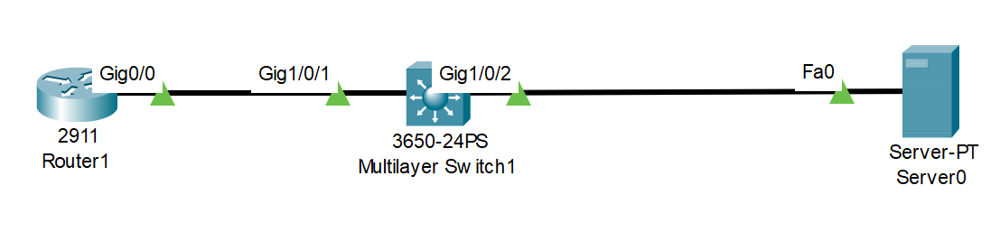

# Restore Cisco IOS Image (Source: Udemy)
## Instructor: David Bombal 
### **Pkt file:** [Here](https://mega.nz/file/W9ICTbTA#MspK6hzt9RV1T4vm6SSSQLDqn-ZeyWdGxLOVqACRP68)
### Scenario: 



```
An intern has deleted the operating system on your router!

Tasks:

1) Restore the operating system of the router from the TFTP server
- File to use: c2900-universalk9-mz.SPA.151-4.M4.bin

2) Verification
- Ensure the router boots correctly
- Make sure the router can ping the TFTP server 10.1.1.100 and switch 10.1.1.2
```
## **Solution**
> Press the router and copy-paste the following command inside the rommon prompt.
```
tftpdnld press-enter
IP_ADDRESS=10.1.1.1 (ip add of the router)
IP_SUBNET_MASK=255.255.255.0
DEFAULT_GATEWAY=10.1.1.100
TFTP_SERVER=10.1.1.100
TFTP_FILE=c2900-universalk9-mz.SPA.151-4.M4.bin
tftpdnld > y
reset
```
## **[The End]**