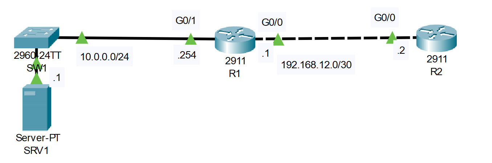

# **FTP and TFTP Configuration**
## Source (YouTube: Jeremy's IT Lab)
### Video Link: [Here](https://youtu.be/W9PLvA2wZ28?si=g4-xHLWA6csudl_H)
### Lab File Link (pkt): [Here Day-43](https://mega.nz/file/HpRHQT5a#h-nEvMwPSh45R6FZhJYY_jgElVKxDP_GtPD_odbdwU4)
### Scenario:



```
1. Configure the appropriate IP addresses on each device.
    Configure routing on the routers to allow full connectivity.

2. Use TFTP on R1 to retrieve the following file from SRV1:
    c2900-universalk9-mz.SPA.155-3.M4a.bin

3. Upgrade R1's OS and then delete the old file from flash.

4. Use FTP on R2 to retrieve the following file from SRV1:
    c2900-universalk9-mz.SPA.155-3.M4a.bin
    (FTP username: jeremy, password: ccna)
  **THE TRANSFER MAY TAKE ABOUT A MINUTE**

5. Upgrade R2's OS and then delete the old file from flash.
```

### **1. Configure the appropriate IP addresses on each device.**
- Configure routing on the routers to allow full connectivity.
```
R1(config)#int g0/1
R1(config-if)#ip add 10.0.0.254 255.255.255.0
R1(config-if)#no shut
R1(config-if)#int g0/0
R1(config-if)#ip add 192.168.12.1 255.255.255.0
R1(config-if)#no shut

R2(config)#int g0/0
R2(config-if)#ip add 192.168.12.2 255.255.255.0
R2(config-if)#no shut

R2(config)#ip route 10.0.0.0 255.0.0.0 192.168.12.1
``` 

### **2. Use TFTP on R1 to retrieve the following file from SRV1:**
- c2900-universalk9-mz.SPA.155-3.M4a.bin
- 3. Upgrade R1's OS and then delete the old file from flash.
```
r1
sh version
sh flash
copy tftp flash
10.0.0.1
paste file name > hit enter
sh flash
conf t
boot system flash paste
wr
reload > hit enter
sh version 
sh flash
copy old file nmae
delete flash:paste old file name 
sh flash 
```
### **4. Use FTP on R2 to retrieve the following file from SRV1:**
- c2900-universalk9-mz.SPA.155-3.M4a.bin
- (FTP username: jeremy, password: ccna)
- **THE TRANSFER MAY TAKE ABOUT A MINUTE**
- 5. Upgrade R2's OS and then delete the old file from flash.
```
r2
sh version 
ip ftp username jeremy
ip ftp password ccna
copy ftp flash
10.0.0.1
paste
sh flash
conf t
boot system flash file-name
wr
reload 
sh version
sh flash
delete flash:old file name 
sh flash 
```

> watch this video for step 1 to 5:  

https://github.com/EZAZ-2281/CCNA-200-301-Lab/assets/81481142/780887e7-5af1-4840-adc9-83b064de7a37

https://github.com/EZAZ-2281/CCNA-200-301-Lab/assets/81481142/66edf893-b4cc-4b15-af4f-896da5bdd83d

https://github.com/EZAZ-2281/CCNA-200-301-Lab/assets/81481142/f50deea9-3aec-4238-92da-ead6f7b507ea


## **[The End]**
