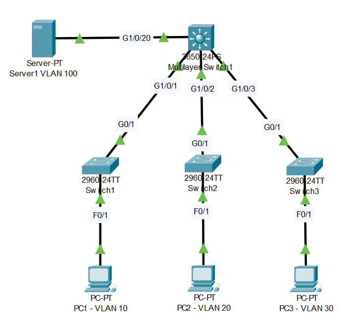

# Campus Network Design (Source: Udemy)
## Instructor: David Bombal 
### **Pkt file:** [Here](https://mega.nz/file/j14yUJ4T#ZOCY5qkv5f5tR4qNqpQs9W4ezoOx5F9y2h4E24hsFsk)
### Scenario: 



```
Configure the network as follows:
1) 3650 = layer 3 switch with IP addresses and interVLAN routing:
VLAN 1 = 10.1.1.254/24
VLAN 10 = 10.1.10.254/24,  
VLAN 20 = 10.1.20.254/24
VLAN 30 = 10.1.30.254/24,
VLAN 100 = 10.1.100.254/24  
2) Access layer switches will only have management IP addresses in VLAN 1:
Switch 1 = 10.1.1.1/24
Switch 2 = 10.1.1.2/24
Switch 3 = 10.1.1.3/24
3) Configure access ports as follows:
PC1 in VLAN 10 - 10.1.10.10/24
PC2 in VLAN 20 - 10.1.20.20/24
PC3 in VLAN 30 - 10.1.30.30/24
Server1 in VLAN 100 - 10.1.100.100/24
4) Configure ports between switches as trunks
5) Make sure that PCs can ping each other and the server
6) Make sure that switches can ping the PCs and server
```
# **Configure the network as follows:**
### **1) 3650 = layer 3 switch with IP addresses and interVLAN routing:**
VLAN 1 = 10.1.1.254/24  
VLAN 10 = 10.1.10.254/24  
VLAN 20 = 10.1.20.254/24  
VLAN 30 = 10.1.30.254/24  
VLAN 100 = 10.1.100.254/24    
```
Core(config)#vlan 10
Core(config-vlan)#vlan 20
Core(config-vlan)#vlan 30
Core(config-vlan)#vlan 100
```
```
Core(config)#int vlan 1 
Core(config-if)#ip address 10.1.1.254 255.255.255.0
Core(config-if)#no shut

Core(config-if)#int vlan 10
Core(config-if)#ip address 10.1.10.254 255.255.255.0
Core(config-if)#no shut

Core(config-if)#int vlan 20
Core(config-if)#ip address 10.1.20.254 255.255.255.0
Core(config-if)#no shut

Core(config-if)#int vlan 30
Core(config-if)#ip address 10.1.30.254 255.255.255.0
Core(config-if)#no shut

Core(config-if)#int vlan 100
Core(config-if)#ip address 10.1.100.254 255.255.255.0
Core(config-if)#no shut
```
```
Core(config)#ip routing
```
### **2) Access layer switches will only have management IP addresses in VLAN 1:**
Switch 1 = 10.1.1.1/24  
Switch 2 = 10.1.1.2/24  
Switch 3 = 10.1.1.3/24  
```
S1(config)#int vlan 1
S1(config-if)#ip address 10.1.1.1 255.255.255.0
S1(config-if)#no shut

S2(config)#int vlan 1
S2(config-if)#ip address 10.1.1.2 255.255.255.0
S2(config-if)#no shut

S3(config)#int vlan 1
S3(config-if)#ip address 10.1.1.3 255.255.255.0
S3(config-if)#no shut
```
### **3) Configure access ports as follows:**
PC1 in VLAN 10 - 10.1.10.10/24 (pc1 dg = 10.1.10.254)  
PC2 in VLAN 20 - 10.1.20.20/24 (pc2 dg = 10.1.20.254)   
PC3 in VLAN 30 - 10.1.30.30/24 (pc3 dg = 10.1.30.254)  
Server1 in VLAN 100 - 10.1.100.100/24 (server1 dg = 10.1.100.254)   
```
Core(config)#vtp domain kibria

S1(config)#vtp domain kibria
S1(config)#vtp mode client

S2(config)#vtp domain kibria
S2(config)#vtp mode client

S3(config)#vtp domain kibria
S3(config)#vtp mode client
```
```
S1(config-if)#int f0/1
S1(config-if)#switchport mode access
S1(config-if)#switchport access vlan 10

S2(config-if)#int f0/1
S2(config-if)#switchport mode access
S2(config-if)#switchport access vlan 20

S3(config-if)#int f0/1
S3(config-if)#switchport mode access
S3(config-if)#switchport access vlan 30

Core(config)#int g1/0/20
Core(config-if)#switchport mode access
Core(config-if)#switchport access vlan 100
```
```
S1(config)#ip default-gateway 10.1.1.254
S2(config)#ip default-gateway 10.1.1.254
S3(config)#ip default-gateway 10.1.1.254
```
> Configure the PC's as the instruction.
### **4) Configure ports between switches as trunks**
```
Core(config)#int range g1/0/1-3
Core(config-if-range)#switchport mode trunk 

S1(config)#int g0/1
S1(config-if)#switchport mode trunk 

S2(config)#int g0/1
S2(config-if)#switchport mode trunk 

S3(config)#int g0/1
S4(config-if)#switchport mode trunk 
```
### **5) Make sure that PCs can ping each other and the server**

### **6) Make sure that switches can ping the PCs and server**
> Watch this video for step 5 and 6.  

https://github.com/EZAZ-2281/freeCodeCamp/assets/81481142/410b5f8c-ae82-4c1b-a3a3-86751d4b2f23

## **[The End]**