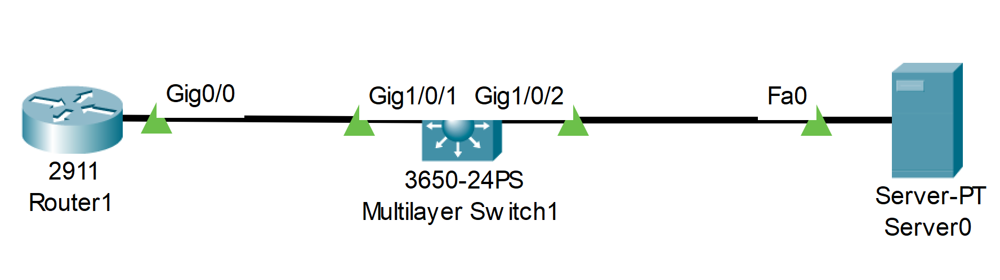

# Backup Configuration and IOS Files (Source: Udemy)
## Instructor: David Bombal 
### **Pkt file:** [Here](https://mega.nz/file/OhYnQBYY#pXp8Q1VjL8NQqu2bzzPh92IV54qjSwuJIdB3PG0goG0)
### Scenario: 


```
Tasks Part 1:
1) Backup the running and startup configurations of both the router and switch
2) Backup the operating systems of the router and switch
3) Verify that configurations and operating systems are on the TFTP server

Tasks Part 2:
1) Create a loopback interface on the router with IP address 1.1.1.1/32
2) Save the router configuration
3) Verify that the startup config displays the loopback interface
4) Copy the startup configuration from the TFTP server to the startup configuration of the router
5) Verify that the startup config no longer has the loopback interface 
6) Copy the current running config to the TFTP server
8) Delete the loopback interface on the router
9) Copy the new running config from the TFTP to the router's running config
10) Has the loopback been added to the router config?
11) Copy the previous running config from the TFTP to the running config of the router.
12) Was the loopback removed? Why or why not?

Tasks Part 3:
1) Upgrade the router IOS to c2900-universalk9-mz.SPA.155-3.M4a.bin (leave the current IOS in flash)
2) Use the relevant boot commands to ensure that the router boots with the new IOS
3) Reboot the router and confirm that the new IOS is being used by the router
```

# **Tasks Part 1:**
### **1) Backup the running and startup configurations of both the router and switch**
```
R1#copy start tftp
Address or name of remote host []? 10.1.1.100
Destination filename [R1-confg]? R1-start

R1#copy run tftp
Address or name of remote host []? 10.1.1.100
Destination filename [R1-confg]? R1-run

S1#copy start tftp
Address or name of remote host []? 10.1.1.100
Destination filename [S1-confg]? S1-start

S1#copy run tftp
Address or name of remote host []? 10.1.1.100
Destination filename [S1-confg]? S1-run
```
### **2) Backup the operating systems of the router and switch**
```
✅ R1
sh flash > copy the os name
copy flash tftp > paste the os name 
10.1.1.100
✅ S1
sh flash > copy the os name
copy flash tftp > paste the os name 
10.1.1.100
```
### **3) Verify that configurations and operating systems are on the TFTP server**
> Go to `server > services > tftp` and we can see the the running, startup and os files.  

# **Tasks Part 2:** 
### **1) Create a loopback interface on the router with IP address 1.1.1.1/32**
```
R1(config)#int loop 0
R1(config-if)#ip address 1.1.1.1 255.255.255.255
```
### **2) Save the router configuration**
```
R1#copy running-config startup-config 
```
### **3) Verify that the startup config displays the loopback interface**
```
R1#sh start 
!
interface Loopback0
 ip address 1.1.1.1 255.255.255.255
!
```
### **4) Copy the startup configuration from the TFTP server to the startup configuration of the router**
```
R1#copy tftp start
Address or name of remote host []? 10.1.1.100
Source filename []? R1-start
```
### **5) Verify that the startup config no longer has the loopback interface**
```
R1#sh start 
!
no loopback address 
!
```
> startup configuration is overwritten by the tftp startup config file  
### **6) Copy the current running config to the TFTP server**
```
R1#copy run tftp
Address or name of remote host []? 10.1.1.100
Destination filename [R1-confg]? R1-run-v2
```
### **8) Delete the loopback interface on the router**
```
R1(config)#no int loop 0
```
### **9) Copy the new running config from the TFTP to the router's running config**
```
R1#copy tftp run
Address or name of remote host []? 10.1.1.100
Source filename []? R1-run-v2
```
### **10) Has the loopback been added to the router config?**
> Yes it has.   
```
R1#sh ip int br
Interface              IP-Address      OK? Method Status                Protocol 
GigabitEthernet0/0     10.1.1.1        YES manual up                    up 
GigabitEthernet0/1     unassigned      YES unset  administratively down down 
GigabitEthernet0/2     unassigned      YES unset  administratively down down 
Loopback0              1.1.1.1         YES manual up                    up  ✅
Vlan1                  unassigned      YES unset  administratively down down
```
### **11) Copy the previous running config from the TFTP to the running config of the router.**
```
R1#copy tftp run
Address or name of remote host []? 10.1.1.100
Source filename []? R1-run
```
### **12) Was the loopback removed? Why or why not?**
> No  
```
R1#sh ip int br
Interface              IP-Address      OK? Method Status                Protocol 
GigabitEthernet0/0     10.1.1.1        YES manual up                    up 
GigabitEthernet0/1     unassigned      YES unset  administratively down down 
GigabitEthernet0/2     unassigned      YES unset  administratively down down 
Loopback0              1.1.1.1         YES manual up                    up ✅
Vlan1                  unassigned      YES unset  administratively down down
```
> So if you've got the running config of a router and you copy a config to the running config from a TFTP server, it's only going to replace stuff where there's a conflict, the rest is merged. That can be really confusing and that's maybe why you would prefer copying the config to the startup config of a router which is overwritten and then rebooting the router at a time that makes sense. Not always possible to do that, but it's easier to think about copying configs to the startup which is overwritten versus running config, which is a merge.  

# **Tasks Part 3:**
### **1) Upgrade the router IOS to c2900-universalk9-mz.SPA.155-3.M4a.bin (leave the current IOS in flash)**
```
R1#copy tftp flash
Address or name of remote host []? 10.1.1.100
Source filename []? c2900-universalk9-mz.SPA.155-3.M4a.bin
```
### **2) Use the relevant boot commands to ensure that the router boots with the new IOS**
```
R1(config)#boot system flash c2900-universalk9-mz.SPA.155-3.M4a.bin
```
### **3) Reboot the router and confirm that the new IOS is being used by the router**
```
R1#wr
Building configuration...
[OK]
R1#reload
```
```
R1#sh version 
Cisco IOS Software, C2900 Software (C2900-UNIVERSALK9-M), Version 15.5(3)M4a
```
## **[The End]**