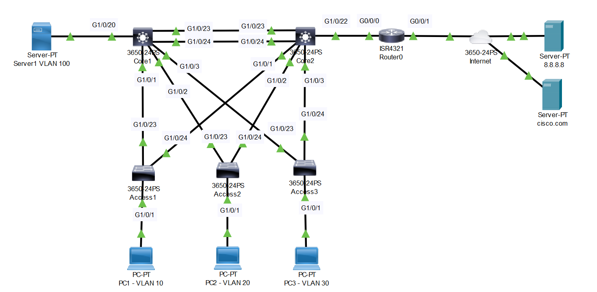

# Campus Network Design (Source: Udemy)
## Instructor: David Bombal 
### Scenario: 



# **Configure the network as follows:**
### **Pkt file:** [Here](https://mega.nz/file/yoJmwQxT#noEeiBzonnzsUiYv9WUPEfvnuzbk46cetLzrhrQNoe4)

```
1) Configure Host Names
2) Shutdown unused interfaces
3) Configure enable password and vty passwords of cisco
4) Use VTP mode transparent and domain ccna
5) Add VLANS 10,20,30,100 to the VLAN database
6) Configure ports between switches as trunks
7) Configure access ports on links to PCs
```
## **1) Configure Host Names**
- Do it on five switches and One router.  
## **2) Shutdown unused interfaces**
```
Access1(config)#int range g1/1/1-4, g1/0/2-22
Access1(config-if-range)#shut
- Same on Access2 and Access3. 

Core1(config)#int range g1/1/1-4, g1/0/21-22, g1/0/4-19
Core1(config-if-range)#shut

Core2(config)#int range g1/1/1-4, g1/0/4-21
Core2(config-if-range)#shut

R1(config-if)#int g0/0/0
R1(config-if)#no shut
R1(config-if)#int g0/0/1
R1(config-if)#no shut
```
## **3) Configure enable password and vty passwords of cisco**
- Do it on all devices also router except servers. 
```
R1(config)#enable password cisco
R1(config)#line vty 0 4
R1(config-line)#password cisco
R1(config-line)#login
```
## **4) Use VTP mode transparent and domain ccna**
- Do it on all devices except router and servers. 
```
Access1(config)#vtp mode transparent
Access1(config)#vtp domain ccna
```
## **5) Add VLANS 10,20,30,100 to the VLAN database**
- Do it on all devices except router and servers. 
```
Access1(config)#vlan 10
Access1(config-vlan)#vlan 20
Access1(config-vlan)#vlan 30
Access1(config-vlan)#vlan 100
```
## **6) Configure ports between switches as trunks**
```
Access1(config)#int range g1/0/23-24
Access1(config-if-range)#switchport mode trunk 
- Same on Access2 and Access3. 

Core1(config)#int range g1/0/1-3, g1/0/23-24
Core1(config-if-range)#sw mode trunk 
- Same on Core2. 
```
## **7) Configure access ports on links to PCs**
```
Access1(config)#int g1/0/1
Access1(config-if)#sw mode access
Access1(config-if)#sw access vlan 10
- Same on Access2 (vlan 20) and Access3 (vlan 30). 

Core1(config)#int g1/0/20
Core1(config-if)#sw mode acc
Core1(config-if)#sw acc vlan 100

Core2(config)#int g1/0/22
Core2(config-if)#sw mode acc
Core2(config-if)#sw acc vlan 1
```


# **Configure the network as follows:**
### **Pkt file:** [Here](https://mega.nz/file/bsQjBa5Z#1BmbQBFSGssPlc0AJpiAH2WGNeYiW57E9N5r_Szx0_o)
```
1) Use CDP and LLDP to verify links
2) Verify which ports are forwarding and blocking (spanning tree)
3) Optimize spanning tree with Core1 being root for odd VLANs and Core2 the root for even VLANS.
4) Configure Etherchannel on the core switches
5) Core switches should support layer 3 interVLAN routing:
VLAN 1 = Core 1 = 10.1.1.251/24, Core 2 = 10.1.1.252/24
VLAN 10 = Core 1 = 10.1.10.251/24, Core 2 = 10.1.10.252/24
VLAN 20 = Core 1 = 10.1.20.251/24, Core 2 = 10.1.20.252/24
VLAN 30 = Core 1 = 10.1.30.251/24, Core 2 = 10.1.30.252/24
VLAN 100 = Core 1 = 10.1.100.251/24, Core 2 = 10.1.100.252/24
6) Access layer switches will only have management IP addresses in VLAN 1:
Switch 1 = 10.1.1.1/24
Switch 2 = 10.1.1.2/24
Switch 3 = 10.1.1.3/24
```
## **1) Use CDP and LLDP to verify links**
```
R1(config)#cdp run
R1(config)#lldp run
- Do it on all other devices. CDP do not run on server. 
- Usefull show command
R1#sh cdp nei
R1#sh lldp nei 
```
## **2) Verify which ports are forwarding and blocking (spanning tree)**
- Use this command for see each vlan forwarding and blocking interface. `sh spanning-tree`. 
## **3) Optimize spanning tree with Core1 being root for 1,10,30 VLANs and Core2 the root for 20,100 VLANS.**
```
Core1(config)#spanning-tree vlan 1 root primary
Core1(config)#spanning-tree vlan 10 root primary
Core1(config)#spanning-tree vlan 30 root primary
Core1(config)#spanning-tree vlan 20 root secondary
Core1(config)#spanning-tree vlan 100 root secondary 

Core2(config)#spanning-tree vlan 1 root secondary
Core2(config)#spanning-tree vlan 10 root secondary
Core2(config)#spanning-tree vlan 30 root secondary
Core2(config)#spanning-tree vlan 20 root primary
Core2(config)#spanning-tree vlan 100 root primary
```
- We can also choose root bridge using priority like this `spanning-tree vlan 1 10 30 priority 0` and `spanning-tree vlan 20 100 priority 4096`. 
- The lower the priority the higher chance to become a root bridge. Priority must be multiple of 4096 remember this. 
- Usefull show command for checking `sh run | i spanning-tree`. 

## **4) Configure Etherchannel on the core switches**
```
Core1(config)#int range g1/0/23-24
Core1(config-if-range)#channel-group 1 mode active 
Core1(config-if-range)#int port-channel 1
Core1(config-if)#switchport mode trunk

Core2(config)#int range g1/0/23-24
Core2(config-if-range)#channel-group 1 mode active 
Core2(config-if-range)#int port-channel 1
Core2(config-if)#switchport mode trunk
```
- Usefull show command `Core1#sh etherchannel summary` and `Core1#sh etherchannel port-channel`. 
```
Core1(config)#int range g1/0/23-24
Core1(config-if-range)#spanning-tree link-type point-to-point
Core1(config-if-range)#int po1
Core1(config-if)#spanning-tree link-type point-to-point

Core2(config)#int range g1/0/23-24
Core2(config-if-range)#spanning-tree link-type point-to-point
Core2(config-if-range)#int po1
Core2(config-if)#spanning-tree link-type point-to-point
```
## **5) Core switches should support layer 3 interVLAN routing:**
VLAN 1 = Core 1 = 10.1.1.251/24, Core 2 = 10.1.1.252/24
VLAN 10 = Core 1 = 10.1.10.251/24, Core 2 = 10.1.10.252/24
VLAN 20 = Core 1 = 10.1.20.251/24, Core 2 = 10.1.20.252/24
VLAN 30 = Core 1 = 10.1.30.251/24, Core 2 = 10.1.30.252/24
VLAN 100 = Core 1 = 10.1.100.251/24, Core 2 = 10.1.100.252/24
```
Core1(config)#ip routing
Core1(config)#int vlan 1
Core1(config-if)#ip address 10.1.1.251 255.255.255.0
Core1(config-if)#no shut
Core1(config-if)#int vlan 10
Core1(config-if)#ip address 10.1.10.251 255.255.255.0
Core1(config-if)#no shut
Core1(config-if)#int vlan 20
Core1(config-if)#ip address 10.1.20.251 255.255.255.0
Core1(config-if)#no shut
Core1(config-if)#int vlan 30
Core1(config-if)#ip address 10.1.30.251 255.255.255.0
Core1(config-if)#no shut
Core1(config-if)#int vlan 100
Core1(config-if)#ip address 10.1.100.251 255.255.255.0
Core1(config-if)#no shut

Core2(config)#ip routing
Core2(config)#int vlan 1
Core2(config-if)#ip address 10.1.1.252 255.255.255.0
Core2(config-if)#no shut
Core2(config-if)#int vlan 10
Core2(config-if)#ip address 10.1.10.252 255.255.255.0
Core2(config-if)#no shut
Core2(config-if)#int vlan 20
Core2(config-if)#ip address 10.1.20.252 255.255.255.0
Core2(config-if)#no shut
Core2(config-if)#int vlan 30
Core2(config-if)#ip address 10.1.30.252 255.255.255.0
Core2(config-if)#no shut
Core2(config-if)#int vlan 100
Core2(config-if)#ip address 10.1.100.252 255.255.255.0
Core2(config-if)#no shut
```
## **6) Access layer switches will only have management IP addresses in VLAN 1:**
Switch 1 = 10.1.1.1/24
Switch 2 = 10.1.1.2/24
Switch 3 = 10.1.1.3/24
```
Access1(config)#int vlan 1
Access1(config-if)#ip address 10.1.1.1 255.255.255.0
Access1(config-if)#no shut
```
- Do similar for Access2 and Access3.  


# **Configure the network as follows:**  
### **Pkt file:** [Here](https://mega.nz/file/GlQCyLaZ#zHbdoTT7JKZUdb5gfZPsiwtrCL1wU_cBjSKRr5zGJMY)
```
1) Configure and optimize HSRP

2) Configure EIGRP on the core switches and ISR router

3) Configure PCs and Server:
PC1 in VLAN 10, IP = 10.1.10.10/24, DG = 10.1.10.254, DNS = 8.8.8.8
PC2 in VLAN 20, IP = 10.1.20.10/24, DG = 10.1.20.254, DNS = 8.8.8.8
PC3 in VLAN 30, IP = 10.1.30.10/24, DG = 10.1.30.254, DNS = 8.8.8.8
Server1 in VLAN 100, IP = 10.1.100.100/24, DG = 10.1.100.254, DNS = 8.8.8.8

4) Configure ISR g0/0/1 for DHCP
5) Enable NAT to NAT internal network to ISR G0/0/1 interface (PAT)
6) Verify that PCs can ping cisco.com
7) Make sure that PCs can ping each other and the server.
```
## **1) Configure and optimize HSRP**
```
Core1(config)#int vlan 1 
Core1(config-if)#standby 1 ip 10.1.1.254
Core1(config-if)#standby 1 priority 200
Core1(config-if)#standby 1 preempt 
Core1(config-if)#int vlan 10
Core1(config-if)#standby 1 ip 10.1.10.254
Core1(config-if)#standby 1 priority 200
Core1(config-if)#standby 1 preempt
Core1(config-if)#int vlan 30
Core1(config-if)#standby 1 ip 10.1.30.254
Core1(config-if)#standby 1 priority 200
Core1(config-if)#standby 1 preempt
Core1(config-if)#int vlan 20
Core1(config-if)#standby 1 ip 10.1.20.254
Core1(config-if)#int vlan 100
Core1(config-if)#standby 1 ip 10.1.100.254

Core2(config)#int vlan 1 
Core2(config-if)#standby 1 ip 10.1.1.254
Core2(config-if)#int vlan 10
Core2(config-if)#standby 1 ip 10.1.10.254
Core2(config-if)#int vlan 30
Core2(config-if)#standby 1 ip 10.1.30.254
Core2(config-if)#int vlan 20
Core2(config-if)#standby 1 ip 10.1.20.254
Core2(config-if)#standby 1 priority 200
Core2(config-if)#standby 1 preempt
Core2(config-if)#int vlan 100
Core2(config-if)#standby 1 ip 10.1.100.254
Core2(config-if)#standby 1 priority 200
Core2(config-if)#standby 1 preempt
```
## **2) Configure EIGRP on the core switches and ISR router. Router IP g0/0/0 = 10.1.1.253/24**
```
R1(config)#int g0/0/0
R1(config-if)#ip address 10.1.1.253 255.255.255.0
R1(config-if)#no shut
R1(config-if)#router eigrp 100
R1(config-router)#no auto-summary
R1(config-router)#network 10.1.1.0 0.0.0.255

Core1(config)#router eigrp 100
Core1(config-router)#network 10.0.0.0 
Core1(config-router)#no auto-summary

Core2(config)#router eigrp 100
Core2(config-router)#network 10.0.0.0 
Core2(config-router)#no auto-summary
```
- The reason you don't specify the subnet mask in this command is because EIGRP automatically considers all subnets of the specified network address. In other words, by just providing the network address, EIGRP will include all interfaces that fall within that network range, regardless of their subnet masks. Usefull show command `Core1#sh ip eigrp neighbors`. 

## **3) Configure PCs and Server:**
PC1 in VLAN 10, IP = 10.1.10.10/24, DG = 10.1.10.254, DNS = 8.8.8.8
PC2 in VLAN 20, IP = 10.1.20.10/24, DG = 10.1.20.254, DNS = 8.8.8.8
PC3 in VLAN 30, IP = 10.1.30.10/24, DG = 10.1.30.254, DNS = 8.8.8.8
Server1 in VLAN 100, IP = 10.1.100.100/24, DG = 10.1.100.254, DNS = 8.8.8.8
```
Access1(config)#ip default-gateway 10.1.1.254
Access2(config)#ip default-gateway 10.1.1.254
Access3(config)#ip default-gateway 10.1.1.254
```
## **4) Configure ISR g0/0/1 for DHCP**
```
R1(config)#int g0/0/1
R1(config-if)#ip address dhcp
```
## **5) Enable NAT to NAT internal network to ISR G0/0/1 interface (PAT)**
```
R1(config)#int g0/0/0
R1(config-if)#ip nat inside
R1(config-if)#int g0/0/1
R1(config-if)#ip nat outside
R1(config-if)#exit
R1(config)#access-list 1 permit any
R1(config)#ip nat inside source list 1 int g0/0/1 overload
```
```
Core1(config)#ip domain-lookup
Core1(config)#ip name-server 8.8.8.8

Core2(config)#ip domain-lookup
Core2(config)#ip name-server 8.8.8.8
```
```
R1(config)#router eigrp 100
R1(config-router)#redistribute static metric 10000 1000 255 1 1500
```
## **6) Verify that PCs can ping cisco.com**

## **7) Make sure that PCs can ping each other and the server.**

Watch this video for step 6 and 7. 

https://github.com/EZAZ-2281/CCNA-200-301-Lab/assets/81481142/45f6b0c8-8d92-4913-a74a-50cb1f41a426

## **[The End]**