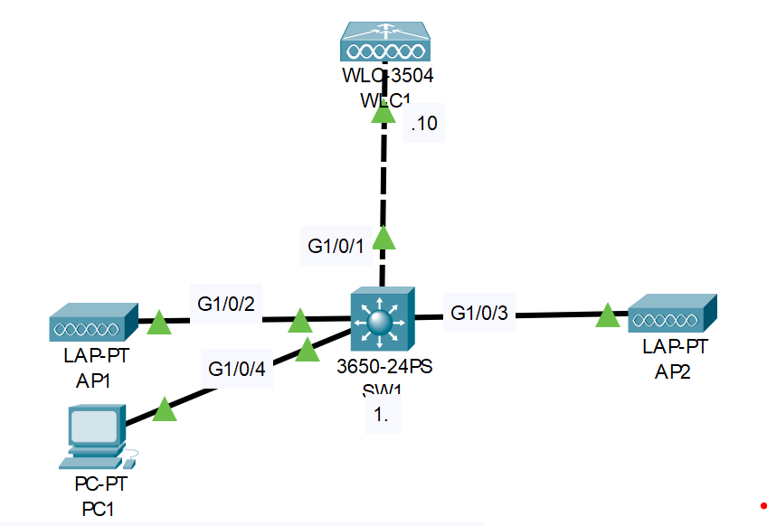

# **WLC Configuration**
## Source (YouTube: Jeremy's IT Lab)
### Video Link: [Here](https://youtu.be/Il8ev78fcqw?si=c8xUVwVU7CmQtRKu)
### Lab File Link (pkt): [Here Day-58](https://mega.nz/file/uhJUGJCa#0K8zPG2T5wTeg92M85SQKjTQUYJqB_LiK3SmCoFNcsA)
### Scenario:



1. Use the web browser on PC1 to access the GUI of WLC1.
- Username: admin
- Password: Cisco123 **You must use HTTPS**

2. Spend some time familiarizing yourself with the WLC GUI.
- What information can be viewed from each tab?
- What is the current state of the network?

3. Configure dynamic interfaces for the Internal & Guest WLANs.

4. Create the Internal & Guest WLANs using WPA2+PSK.

5. Add a wireless client to the network and associate it with an AP.

VLAN/WLAN info:  
VLAN10 (Management)= 172.16.1.0/24  
VLAN100 = 10.0.0.0/24, SSID = Internal  
VLAN200 = 10.1.0.0/24, SSID = Guest  

## **Solution:**
```
SW#sh run
ip dhcp excluded-address 10.0.0.1 10.0.0.10
ip dhcp excluded-address 10.1.0.1 10.1.0.10
ip dhcp excluded-address 172.16.1.1 172.16.1.10
!
ip dhcp pool VLAN10
 network 172.16.1.0 255.255.255.0
 default-router 172.16.1.1
 option 43 ip 172.16.1.10
ip dhcp pool VLAN100
 network 10.0.0.0 255.255.255.0
 default-router 10.0.0.1
ip dhcp pool VLAN200
 network 10.1.0.0 255.255.255.0
 default-router 10.1.0.1
!
vlan 10
 name Management
!
vlan 100
 name Internal
!
vlan 200
 name Guest
!
interface GigabitEthernet1/0/1
 switchport trunk native vlan 10
 switchport trunk allowed vlan 10,100,200
 switchport mode trunk
!
interface GigabitEthernet1/0/2
 switchport access vlan 10
 switchport mode access
 switchport nonegotiate
 spanning-tree portfast
!
interface GigabitEthernet1/0/3
 switchport access vlan 10
 switchport mode access
 switchport nonegotiate
 spanning-tree portfast
!
interface GigabitEthernet1/0/4
 switchport access vlan 10
 switchport mode access
 switchport nonegotiate
 spanning-tree portfast
!
interface Vlan10
 mac-address 00e0.f773.0601
 ip address 172.16.1.1 255.255.255.0
!
interface Vlan100
 mac-address 00e0.f773.0602
 ip address 10.0.0.1 255.255.255.0
!
interface Vlan200
 mac-address 00e0.f773.0603
 ip address 10.1.0.1 255.255.255.0
```
> Note that I added option 43, which will tell the APs the IP address of their WLC. In this network it actually isn’t necessary. When the APs boot up they will send broadcast CAPWAP messages to check if there are any WLCs on the local network. In this case WLC1 is connected to the same local network as AP1 and AP2, so it should reply to their broadcasts. No need for this option 43.    


> Watch this all part one by one for solution:  

https://github.com/EZAZ-2281/CCNA-200-301-Lab/assets/81481142/f4d09372-7f2a-4511-b364-17c4cace05cd


https://github.com/EZAZ-2281/CCNA-200-301-Lab/assets/81481142/519a6442-0057-451e-bd1e-774ea5f7bd20


https://github.com/EZAZ-2281/CCNA-200-301-Lab/assets/81481142/ea1246d9-3bb1-4233-98ec-c9a99fdda421


https://github.com/EZAZ-2281/CCNA-200-301-Lab/assets/81481142/e2c3c45e-fe96-400f-8f1d-1c9c40d416f8


> Notice that we can see the association here on the diagram, and also that it got an IP address. But there is a problem here, did you notice it? Look at the IP address of the phone. Even though we’re associated with the Internal WLAN, which is mapped to the Internal dynamic interface, which is in VLAN100 and should get an IP address from the VLAN100 pool, it got an IP address from the VLAN10 pool, the management subnet. Don’t worry, this isn’t a problem with our configurations. If we did the same configurations with real hardware, as I confirmed, the device will get an IP address from the correct pool. Packet tracer just doesn’t behave accurately, unfortunately. But that’s okay. The goal of this lab was to practice some basic WLAN configurations in the GUI of a Cisco WLC, and that’s what we did. That’s all for this lab.  

## **[The End]**