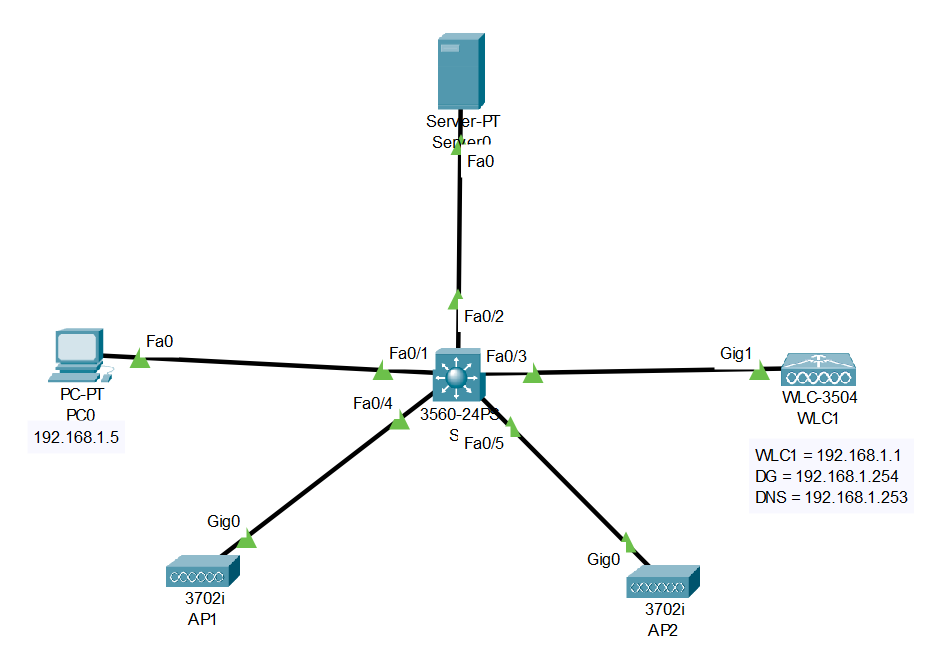
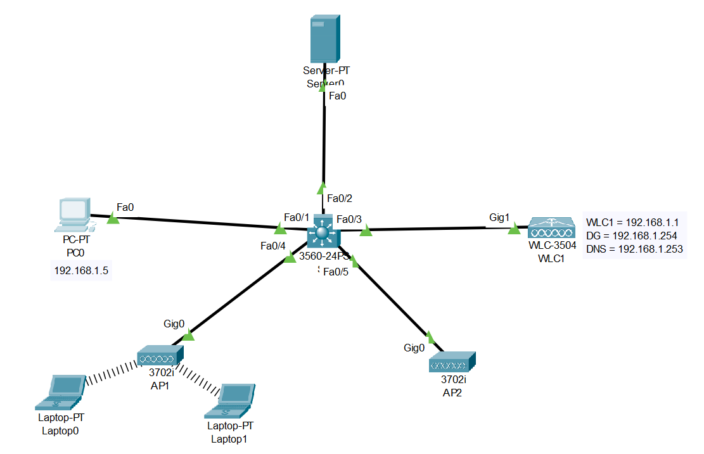

# Wireless Lan Controller (WLC) (Source: Udemy)
## Instructor: David Bombal 
### **Pkt file:** [Here](https://mega.nz/file/7tJ3SY7Z#y8H-S5_fC7UdSsH3FAlxIGEZy4PoLtz_Yr6ytZ97-1o)
### Scenario: 

> Watch this video for step by step solution:    

https://github.com/EZAZ-2281/CCNA-200-301-Lab/assets/81481142/b949f3e2-d87d-47ec-b013-a7538db71027

https://github.com/EZAZ-2281/CCNA-200-301-Lab/assets/81481142/c2114ed9-5120-4923-b08e-d99d33b0b1de

https://github.com/EZAZ-2281/CCNA-200-301-Lab/assets/81481142/144c7c8c-c153-454c-b840-412c25b1f2f1

https://github.com/EZAZ-2281/CCNA-200-301-Lab/assets/81481142/19b4a594-b10c-45ba-9a89-0ce51f709b48

https://github.com/EZAZ-2281/CCNA-200-301-Lab/assets/81481142/55f718fa-01ad-47dd-a53e-276b755eaa32

https://github.com/EZAZ-2281/CCNA-200-301-Lab/assets/81481142/cf2b858c-df8f-44d4-9077-90595f00574d

## **[The End]**