# David Bombal-VLAN Lab (Source: Udemy)
## Scenario: 

# 1. 3650 = layer 3 switch with IP addresses and interVLAN routing:
>**Given:**  
>VLAN 1 = 10.1.1.254/24  
>VLAN 10 = 10.1.10.254/24,    
>VLAN 20 = 10.1.20.254/24  
>VLAN 30 = 10.1.30.254/24,  
>VLAN 100 = 10.1.100.254/24    
```
Core>en
Core#conf t
Enter configuration commands, one per line.  End with CNTL/Z.
```
```
Core(config)#vlan 10
Core(config-vlan)#vlan 20
Core(config-vlan)#vlan 30
Core(config-vlan)#vlan 100
```
```
Core(config-vlan)#do sh vlan brief

VLAN Name                             Status    Ports
---- -------------------------------- --------- -------------------------------
1    default                          active    Gig1/0/1, Gig1/0/2, Gig1/0/3, Gig1/0/4
                                                Gig1/0/5, Gig1/0/6, Gig1/0/7, Gig1/0/8
                                                Gig1/0/9, Gig1/0/10, Gig1/0/11, Gig1/0/12
                                                Gig1/0/13, Gig1/0/14, Gig1/0/15, Gig1/0/16
                                                Gig1/0/17, Gig1/0/18, Gig1/0/19, Gig1/0/20
                                                Gig1/0/21, Gig1/0/22, Gig1/0/23, Gig1/0/24
                                                Gig1/1/1, Gig1/1/2, Gig1/1/3, Gig1/1/4
10   VLAN0010                         active    
20   VLAN0020                         active    
30   VLAN0030                         active    
100  VLAN0100                         active    
1002 fddi-default                     active    
1003 token-ring-default               active    
1004 fddinet-default                  active    
1005 trnet-default                    active    
```
```
Core(config-vlan)#do sh ip int brief
Interface              IP-Address      OK? Method Status                Protocol 
GigabitEthernet1/0/1   unassigned      YES unset  up                    up 
GigabitEthernet1/0/2   unassigned      YES unset  up                    up 
GigabitEthernet1/0/3   unassigned      YES unset  up                    up 
GigabitEthernet1/0/4   unassigned      YES unset  down                  down 
GigabitEthernet1/0/5   unassigned      YES unset  down                  down 
GigabitEthernet1/0/6   unassigned      YES unset  down                  down 
GigabitEthernet1/0/7   unassigned      YES unset  down                  down 
GigabitEthernet1/0/8   unassigned      YES unset  down                  down 
GigabitEthernet1/0/9   unassigned      YES unset  down                  down 
GigabitEthernet1/0/10  unassigned      YES unset  down                  down 
GigabitEthernet1/0/11  unassigned      YES unset  down                  down 
GigabitEthernet1/0/12  unassigned      YES unset  down                  down 
GigabitEthernet1/0/13  unassigned      YES unset  down                  down 
GigabitEthernet1/0/14  unassigned      YES unset  down                  down 
GigabitEthernet1/0/15  unassigned      YES unset  down                  down 
GigabitEthernet1/0/16  unassigned      YES unset  down                  down 
GigabitEthernet1/0/17  unassigned      YES unset  down                  down 
GigabitEthernet1/0/18  unassigned      YES unset  down                  down 
GigabitEthernet1/0/19  unassigned      YES unset  down                  down 
GigabitEthernet1/0/20  unassigned      YES unset  up                    up 🟩
GigabitEthernet1/0/21  unassigned      YES unset  down                  down 
GigabitEthernet1/0/22  unassigned      YES unset  down                  down 
GigabitEthernet1/0/23  unassigned      YES unset  down                  down 
GigabitEthernet1/0/24  unassigned      YES unset  down                  down 
GigabitEthernet1/1/1   unassigned      YES unset  down                  down 
GigabitEthernet1/1/2   unassigned      YES unset  down                  down 
GigabitEthernet1/1/3   unassigned      YES unset  down                  down 
GigabitEthernet1/1/4   unassigned      YES unset  down                  down 
Vlan1                  unassigned      YES unset  administratively down down
```
```
Core(config-vlan)#int g1/0/20
Core(config-if)#switchport mode access
Core(config-if)#switchport access vlan 100
```
```
Core(config-if)#do sh int g1/0/20 switchport
Name: Gig1/0/20
Switchport: Enabled
Administrative Mode: static access
Operational Mode: static access🟩 
Administrative Trunking Encapsulation: dot1q🟩  
Operational Trunking Encapsulation: native
Negotiation of Trunking: Off
Access Mode VLAN: 100 (VLAN0100)
Trunking Native Mode VLAN: 1 (default)
Voice VLAN: none
Administrative private-vlan host-association: none
Administrative private-vlan mapping: none
Administrative private-vlan trunk native VLAN: none
Administrative private-vlan trunk encapsulation: dot1q
Administrative private-vlan trunk normal VLANs: none
Administrative private-vlan trunk private VLANs: none
Operational private-vlan: none
Trunking VLANs Enabled: All
Pruning VLANs Enabled: 2-1001
Capture Mode Disabled
Capture VLANs Allowed: ALL
Protected: false
Appliance trust: none
```
```
Core(config-if)#int g1/0/1
Core(config-if)#switchport mode trunk 

Core(config-if)#int g1/0/2
Core(config-if)#switchport mode trunk 

Core(config-if)#int g1/0/3
Core(config-if)#switchport mode trunk 
```
```
Core(config-if)#do sh run
Building configuration...
interface GigabitEthernet1/0/1
 switchport mode trunk
!
interface GigabitEthernet1/0/2
 switchport mode trunk
!
interface GigabitEthernet1/0/3
 switchport mode trunk
!
interface GigabitEthernet1/0/20
 switchport access vlan 100
 switchport mode access
!
```
```
Core(config-if)#do sh int g1/0/1 switchport 
Name: Gig1/0/1
Switchport: Enabled
Administrative Mode: trunk 🟩
Operational Mode: trunk
Administrative Trunking Encapsulation: dot1q
Operational Trunking Encapsulation: dot1q
Negotiation of Trunking: On
Access Mode VLAN: 1 (default)
Trunking Native Mode VLAN: 1 (default)
Voice VLAN: none
Administrative private-vlan host-association: none
Administrative private-vlan mapping: none
Administrative private-vlan trunk native VLAN: none
Administrative private-vlan trunk encapsulation: dot1q
Administrative private-vlan trunk normal VLANs: none
Administrative private-vlan trunk private VLANs: none
Operational private-vlan: none
Trunking VLANs Enabled: All
Pruning VLANs Enabled: 2-1001
Capture Mode Disabled
Capture VLANs Allowed: ALL
Protected: false
Appliance trust: none
```
```
Core(config-if)#int vlan 1
Core(config-if)#ip address 10.1.1.254 255.255.255.0
Core(config-if)#no shut

Core(config-if)#int vlan 10
Core(config-if)#ip address 10.1.10.254 255.255.255.0
Core(config-if)#no shut

Core(config-if)#int vlan 20
Core(config-if)#ip address 10.1.20.254 255.255.255.0 
Core(config-if)#no shut 

Core(config-if)#int vlan 30
Core(config-if)#ip address 10.1.30.254 255.255.255.0
Core(config-if)#no shut

Core(config-if)#int vlan 40
Core(config-if)#ip address 10.1.40.254 255.255.255.0 
Core(config-if)#no shut 

Core(config-if)#int vlan 100
Core(config-if)#ip address 10.1.100.254 255.255.255.0 
Core(config-if)#no shut 
```
```
Core(config-if)#do sh ip int brief
Interface              IP-Address      OK? Method Status                Protocol 
GigabitEthernet1/0/1   unassigned      YES unset  up                    up 
GigabitEthernet1/0/2   unassigned      YES unset  up                    up 
GigabitEthernet1/0/3   unassigned      YES unset  up                    up 
GigabitEthernet1/0/20  unassigned      YES unset  up                    up 
Vlan1                  10.1.1.254      YES manual up                    up 
Vlan10                 10.1.10.254     YES manual up                    up 
Vlan20                 10.1.20.254     YES manual up                    up 
Vlan30                 10.1.30.254     YES manual up                    up 
Vlan40                 10.1.40.254     YES manual down                  down 🟩
Vlan100                10.1.100.254    YES manual up                    up
```
```
Core(config-if)#no vlan 40
```
```
Core(config)#do sh ip int brief
Interface              IP-Address      OK? Method Status                Protocol 
GigabitEthernet1/0/1   unassigned      YES unset  up                    up 
GigabitEthernet1/0/2   unassigned      YES unset  up                    up 
GigabitEthernet1/0/3   unassigned      YES unset  up                    up 
GigabitEthernet1/0/20  unassigned      YES unset  up                    up 
Vlan1                  10.1.1.254      YES manual up                    up 
Vlan10                 10.1.10.254     YES manual up                    up 
Vlan20                 10.1.20.254     YES manual up                    up 
Vlan30                 10.1.30.254     YES manual up                    up 
Vlan40                 10.1.40.254     YES manual down                  down 
Vlan100                10.1.100.254    YES manual up                    up
```
```
Core(config)#ip routing
```
> **All command at a glance: (for questin 1)**
```
Core(config)#vlan 10
Core(config-vlan)#vlan 20
Core(config-vlan)#vlan 30
Core(config-vlan)#vlan 100
-------------------------------------------
Core(config-vlan)#int g1/0/20
Core(config-if)#switchport mode access
Core(config-if)#switchport access vlan 100
-------------------------------------------
Core(config-if)#int g1/0/1
Core(config-if)#switchport mode trunk 
Core(config-if)#int g1/0/2
Core(config-if)#switchport mode trunk 
Core(config-if)#int g1/0/3
Core(config-if)#switchport mode trunk 
-------------------------------------------
Core(config-if)#int vlan 1
Core(config-if)#ip address 10.1.1.254 255.255.255.0
Core(config-if)#no shut
Core(config-if)#int vlan 10
Core(config-if)#ip address 10.1.10.254 255.255.255.0
Core(config-if)#no shut
Core(config-if)#int vlan 20
Core(config-if)#ip address 10.1.20.254 255.255.255.0 
Core(config-if)#no shut 
Core(config-if)#int vlan 30
Core(config-if)#ip address 10.1.30.254 255.255.255.0
Core(config-if)#no shut
Core(config-if)#int vlan 100
Core(config-if)#ip address 10.1.100.254 255.255.255.0 
Core(config-if)#no shut 
-------------------------------------------
Core(config)#ip routing
```

# 2) Access layer switches will only have management IP addresses in VLAN 1:
>**Given:**  
>Switch 1 = 10.1.1.1/24  
>Switch 2 = 10.1.1.2/24  
>Switch 3 = 10.1.1.3/24  
```
S1>en
S1#conf t
Enter configuration commands, one per line.  End with CNTL/Z.
```
```
S1(config)#int g0/1
S1(config-if)#switchport mode trunk 
S1(config-if)#do sh int g0/1 switchport 
Name: Gig0/1
Switchport: Enabled
Administrative Mode: trunk
Operational Mode: trunk 🟩
Administrative Trunking Encapsulation: dot1q 🟩
Operational Trunking Encapsulation: dot1q
Negotiation of Trunking: On
Access Mode VLAN: 1 (default)
Trunking Native Mode VLAN: 1 (default)
Voice VLAN: none
Administrative private-vlan host-association: none
Administrative private-vlan mapping: none
Administrative private-vlan trunk native VLAN: none
Administrative private-vlan trunk encapsulation: dot1q
Administrative private-vlan trunk normal VLANs: none
Administrative private-vlan trunk private VLANs: none
Operational private-vlan: none
Trunking VLANs Enabled: All
Pruning VLANs Enabled: 2-1001
Capture Mode Disabled
Capture VLANs Allowed: ALL
Protected: false
Unknown unicast blocked: disabled
Unknown multicast blocked: disabled
Appliance trust: none
```
```
S1(config-if)#do sh vlan brief

VLAN Name                             Status    Ports
---- -------------------------------- --------- -------------------------------
1    default                          active    Fa0/1, Fa0/2, Fa0/3, Fa0/4
                                                Fa0/5, Fa0/6, Fa0/7, Fa0/8
                                                Fa0/9, Fa0/10, Fa0/11, Fa0/12
                                                Fa0/13, Fa0/14, Fa0/15, Fa0/16
                                                Fa0/17, Fa0/18, Fa0/19, Fa0/20
                                                Fa0/21, Fa0/22, Fa0/23, Fa0/24
                                                Gig0/2
1002 fddi-default                     active    
1003 token-ring-default               active    
1004 fddinet-default                  active    
1005 trnet-default                    active    
```
```
S1(config-if)#do sh vtp status
VTP Version                     : 1
Configuration Revision          : 0
Maximum VLANs supported locally : 255
Number of existing VLANs        : 5
VTP Operating Mode              : Server 🟩
VTP Domain Name                 : 🟩
VTP Pruning Mode                : Disabled
VTP V2 Mode                     : Disabled
VTP Traps Generation            : Disabled
MD5 digest                      : 0x7D 0x5A 0xA6 0x0E 0x9A 0x72 0xA0 0x3A 
Configuration last modified by 0.0.0.0 at 0-0-00 00:00:00
Local updater ID is 0.0.0.0 (no valid interface found)
```
> **Now go to Core Switch:**  
```
Core>en
Core#sh vtp status
VTP Version capable             : 1 to 2
VTP version running             : 1
VTP Domain Name                 : 🟩
VTP Pruning Mode                : Disabled
VTP Traps Generation            : Disabled
Device ID                       : 0002.4A33.EC00
Configuration last modified by 0.0.0.0 at 3-1-93 00:00:32
Local updater ID is 10.1.1.254 on interface Vl1 (lowest numbered VLAN interface found)

Feature VLAN : 
--------------
VTP Operating Mode                : Server 🟩
Maximum VLANs supported locally   : 1005
Number of existing VLANs          : 9
Configuration Revision            : 16
MD5 digest                        : 0x17 0x38 0xFC 0xE1 0x56 0x55 0x10 0x24 
                                    0xEC 0xCC 0xEB 0x43 0x1C 0x9B 0x94 0x8E 
```
```
Core(config)#vtp domain kibria
Changing VTP domain name from NULL to kibria

Core(config)#do sh vtp status
VTP Version capable             : 1 to 2
VTP version running             : 1
VTP Domain Name                 : kibria 🟩
VTP Pruning Mode                : Disabled
VTP Traps Generation            : Disabled
Device ID                       : 0002.4A33.EC00
Configuration last modified by 0.0.0.0 at 3-1-93 00:00:32
Local updater ID is 10.1.1.254 on interface Vl1 (lowest numbered VLAN interface found)

Feature VLAN : 
--------------
VTP Operating Mode                : Server 🟩
Maximum VLANs supported locally   : 1005
Number of existing VLANs          : 9
Configuration Revision            : 0
MD5 digest                        : 0xF9 0x7A 0xA7 0x6B 0xF9 0xF5 0xE6 0x9F 
                                    0xD4 0x60 0x95 0x35 0x77 0x5A 0xEE 0x35 
```
```
Core(config)#do sh vlan brief

VLAN Name                             Status    Ports
---- -------------------------------- --------- -------------------------------
1    default                          active    Gig1/0/4, Gig1/0/5, Gig1/0/6, Gig1/0/7
                                                Gig1/0/8, Gig1/0/9, Gig1/0/10, Gig1/0/11
                                                Gig1/0/12, Gig1/0/13, Gig1/0/14, Gig1/0/15
                                                Gig1/0/16, Gig1/0/17, Gig1/0/18, Gig1/0/19
                                                Gig1/0/21, Gig1/0/22, Gig1/0/23, Gig1/0/24
                                                Gig1/1/1, Gig1/1/2, Gig1/1/3, Gig1/1/4
10   VLAN0010                         active    
20   VLAN0020                         active    
30   VLAN0030                         active    
100  VLAN0100                         active    Gig1/0/20
1002 fddi-default                     active    
1003 token-ring-default               active    
1004 fddinet-default                  active    
1005 trnet-default                    active 
```
>**Now Back to Switch1**  
```
S1(config-if)#vtp mode client
Setting device to VTP CLIENT mode.
S1(config)#vtp domain kibria
Domain name already set to kibria.
```
```
S1(config)#do sh vlan brief

VLAN Name                             Status    Ports
---- -------------------------------- --------- -------------------------------
1    default                          active    Fa0/1, Fa0/2, Fa0/3, Fa0/4
                                                Fa0/5, Fa0/6, Fa0/7, Fa0/8
                                                Fa0/9, Fa0/10, Fa0/11, Fa0/12
                                                Fa0/13, Fa0/14, Fa0/15, Fa0/16
                                                Fa0/17, Fa0/18, Fa0/19, Fa0/20
                                                Fa0/21, Fa0/22, Fa0/23, Fa0/24
                                                Gig0/2
10   VLAN0010                         active   🟩
20   VLAN0020                         active   🟩 
30   VLAN0030                         active   🟩 
100  VLAN0100                         active   🟩
1002 fddi-default                     active    
1003 token-ring-default               active    
1004 fddinet-default                  active    
1005 trnet-default                    active   
```
``` 
S1(config)#int vlan 1
S1(config-if)#ip address 10.1.1.1 255.255.255.0 
S1(config-if)#no shut

S1(config-if)#int f0/1
S1(config-if)#switchport mode access
S1(config-if)#switchport access vlan 10
S1(config-if)#end
```
```
S1#ping 10.1.1.254
Type escape sequence to abort.
Sending 5, 100-byte ICMP Echos to 10.1.1.254, timeout is 2 seconds:
.!!!!
Success rate is 80 percent 🟩 (4/5), round-trip min/avg/max = 0/0/0 ms
```
```
S1#conf t
Enter configuration commands, one per line.  End with CNTL/Z.
S1(config)#ip de
S1(config)#ip default-gateway 10.1.1.254
S1(config)#exit
```
```
S1#ping 10.1.1.254
Type escape sequence to abort.
Sending 5, 100-byte ICMP Echos to 10.1.1.254, timeout is 2 seconds:
!!!!!
Success rate is 100 percent 🟩 (5/5), round-trip min/avg/max = 0/0/0 ms
```
>**Switch 1 configuration at a glance:** 
```
S1(config)#int g0/1
S1(config-if)#switchport mode trunk 
-------------------------------------
Core(config)#vtp domain kibria
-------------------------------------
S1(config-if)#vtp mode client
S1(config)#vtp domain kibria
-------------------------------------
S1(config)#int vlan 1
S1(config-if)#ip address 10.1.1.1 255.255.255.0 
S1(config-if)#no shut
S1(config-if)#int f0/1
S1(config-if)#switchport mode access
S1(config-if)#switchport access vlan 10
-------------------------------------
S1(config)#ip default-gateway 10.1.1.254
-------------------------------------
S1#ping 10.1.1.254
```
>**Now Switch 2 configuration:**  
```
S2(config)#int g0/1
S2(config-if)#switchport mode trunk 
S2(config-if)#do sh vtp status
VTP Version                     : 1
Configuration Revision          : 0
Maximum VLANs supported locally : 255
Number of existing VLANs        : 5
VTP Operating Mode              : Server🟩
VTP Domain Name                 : kibria
VTP Pruning Mode                : Disabled
VTP V2 Mode                     : Disabled
VTP Traps Generation            : Disabled
MD5 digest                      : 0xE4 0x04 0x5A 0xC9 0xFE 0xA5 0x14 0x07 
Configuration last modified by 0.0.0.0 at 0-0-00 00:00:00
Local updater ID is 0.0.0.0 (no valid interface found)
```
```
S2(config-if)#do sh vlan brief

VLAN Name                             Status    Ports
---- -------------------------------- --------- -------------------------------
1    default                          active    Fa0/1, Fa0/2, Fa0/3, Fa0/4
                                                Fa0/5, Fa0/6, Fa0/7, Fa0/8
                                                Fa0/9, Fa0/10, Fa0/11, Fa0/12
                                                Fa0/13, Fa0/14, Fa0/15, Fa0/16
                                                Fa0/17, Fa0/18, Fa0/19, Fa0/20
                                                Fa0/21, Fa0/22, Fa0/23, Fa0/24
                                                Gig0/2
1002 fddi-default                     active    
1003 token-ring-default               active    
1004 fddinet-default                  active    
1005 trnet-default                    active    
```
```	
S2(config-if)#vtp mode client
Setting device to VTP CLIENT mode.
S2(config)#do sh vlan brief

VLAN Name                             Status    Ports
---- -------------------------------- --------- -------------------------------
1    default                          active    Fa0/1, Fa0/2, Fa0/3, Fa0/4
                                                Fa0/5, Fa0/6, Fa0/7, Fa0/8
                                                Fa0/9, Fa0/10, Fa0/11, Fa0/12
                                                Fa0/13, Fa0/14, Fa0/15, Fa0/16
                                                Fa0/17, Fa0/18, Fa0/19, Fa0/20
                                                Fa0/21, Fa0/22, Fa0/23, Fa0/24
                                                Gig0/2
10   VLAN0010                         active    
20   VLAN0020                         active    
30   VLAN0030                         active    
100  VLAN0100                         active    
1002 fddi-default                     active    
1003 token-ring-default               active    
1004 fddinet-default                  active    
1005 trnet-default                    active   
 ```
 ```
S2(config)#int f0/1
S2(config-if)#switchport mode access
S2(config-if)#switchport access vlan 20
S2(config-if)#int vlan 1
S2(config-if)#ip address 10.1.1.2 255.255.255.0 
S2(config-if)#no shut 
```
```
S2(config-if)#ip default-gateway 10.1.1.254
S2(config)#exit
```
```
S2#ping 10.1.1.254
Type escape sequence to abort.
Sending 5, 100-byte ICMP Echos to 10.1.1.254, timeout is 2 seconds:
.!!!!
Success rate is 80 percent (4/5), round-trip min/avg/max = 0/0/0 ms
```
```
S2#ping 10.1.1.1
Type escape sequence to abort.
Sending 5, 100-byte ICMP Echos to 10.1.1.1, timeout is 2 seconds:
..!!!
Success rate is 60 percent (3/5), round-trip min/avg/max = 0/0/0 ms
```
>**Switch 2 configuration at a glance:** 
```
S2(config)#int g0/1
S2(config-if)#switchport mode trunk 
-------------------------------------
S2(config-if)#vtp mode client
S2(config)#vtp domain kibria
-------------------------------------
S2(config)#int vlan 1
S2(config-if)#ip address 10.1.1.2 255.255.255.0 
S2(config-if)#no shut
S2(config-if)#int f0/1
S2(config-if)#switchport mode access
S2(config-if)#switchport access vlan 20
-------------------------------------
S2(config)#ip default-gateway 10.1.1.254
-------------------------------------
S2#ping 10.1.1.254
S2#ping 10.1.1.1
```
>**Now Switch 3 configuration:**  
```
S3(config)#int g0/1
S3(config-if)#switchport mode trunk 
S3(config-if)#do sh vlan brief

VLAN Name                             Status    Ports
---- -------------------------------- --------- -------------------------------
1    default                          active    Fa0/1, Fa0/2, Fa0/3, Fa0/4
                                                Fa0/5, Fa0/6, Fa0/7, Fa0/8
                                                Fa0/9, Fa0/10, Fa0/11, Fa0/12
                                                Fa0/13, Fa0/14, Fa0/15, Fa0/16
                                                Fa0/17, Fa0/18, Fa0/19, Fa0/20
                                                Fa0/21, Fa0/22, Fa0/23, Fa0/24
                                                Gig0/2
1002 fddi-default                     active    
1003 token-ring-default               active    
1004 fddinet-default                  active    
1005 trnet-default                    active   
```
``` 
S3(config-if)#do sh vtp status
VTP Version                     : 1
Configuration Revision          : 0
Maximum VLANs supported locally : 255
Number of existing VLANs        : 5
VTP Operating Mode              : Server 🟩
VTP Domain Name                 : kibria
VTP Pruning Mode                : Disabled
VTP V2 Mode                     : Disabled
VTP Traps Generation            : Disabled
MD5 digest                      : 0xE4 0x04 0x5A 0xC9 0xFE 0xA5 0x14 0x07 
Configuration last modified by 0.0.0.0 at 0-0-00 00:00:00
Local updater ID is 0.0.0.0 (no valid interface found)
S3(config-if)#exit
```
```
S3(config)#vtp mode client
Setting device to VTP CLIENT mode.
```
```
S3(config)#do sh vlan brief

VLAN Name                             Status    Ports
---- -------------------------------- --------- -------------------------------
1    default                          active    Fa0/1, Fa0/2, Fa0/3, Fa0/4
                                                Fa0/5, Fa0/6, Fa0/7, Fa0/8
                                                Fa0/9, Fa0/10, Fa0/11, Fa0/12
                                                Fa0/13, Fa0/14, Fa0/15, Fa0/16
                                                Fa0/17, Fa0/18, Fa0/19, Fa0/20
                                                Fa0/21, Fa0/22, Fa0/23, Fa0/24
                                                Gig0/2
10   VLAN0010                         active    
20   VLAN0020                         active    
30   VLAN0030                         active    
100  VLAN0100                         active    
1002 fddi-default                     active    
1003 token-ring-default               active    
1004 fddinet-default                  active    
1005 trnet-default                    active   
```
```
S3(config)#int f0/1
S3(config-if)#switchport mode access
S3(config-if)#switchport access vlan 30
S3(config-if)#int vlan 1
S3(config-if)#ip address 10.1.1.3 255.255.255.0
S3(config-if)#no shut 
```
```
S3(config-if)#ip default-gateway 10.1.1.254
S3(config)#exit
```
```
S3#ping 10.1.1.254

Type escape sequence to abort.
Sending 5, 100-byte ICMP Echos to 10.1.1.254, timeout is 2 seconds:
.!!!!
Success rate is 80 percent (4/5), round-trip min/avg/max = 0/0/0 ms
```
```
S3#ping 10.1.1.1

Type escape sequence to abort.
Sending 5, 100-byte ICMP Echos to 10.1.1.1, timeout is 2 seconds:
..!!!
Success rate is 60 percent (3/5), round-trip min/avg/max = 0/0/0 ms
```
>**Switch 3 configuration at a glance:** 
```
S3(config)#int g0/1
S3(config-if)#switchport mode trunk 
-------------------------------------
S3(config-if)#vtp mode client
S3(config)#vtp domain kibria
-------------------------------------
S3(config)#int vlan 1
S3(config-if)#ip address 10.1.1.3 255.255.255.0 
S3(config-if)#no shut
S3(config-if)#int f0/1
S3(config-if)#switchport mode access
S3(config-if)#switchport access vlan 30
-------------------------------------
S3(config)#ip default-gateway 10.1.1.254
-------------------------------------
S3#ping 10.1.1.254
S3#ping 10.1.1.1
```
>**All Switch Configuration:**  

|Switch 1|Switch 2|Switch 3|  
|--------|--------|--------|
|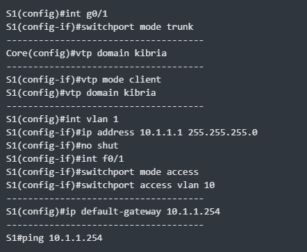|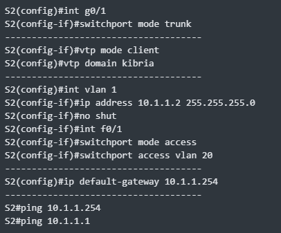|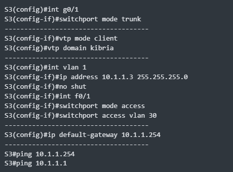|

# 3. Configure access ports as follows:
>PC1 in VLAN 10 - 10.1.10.10/24  
>PC2 in VLAN 20 - 10.1.20.20/24  
>PC3 in VLAN 30 - 10.1.30.30/24  
>Server1 in VLAN 100 - 10.1.100.100/24  

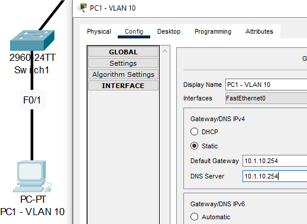
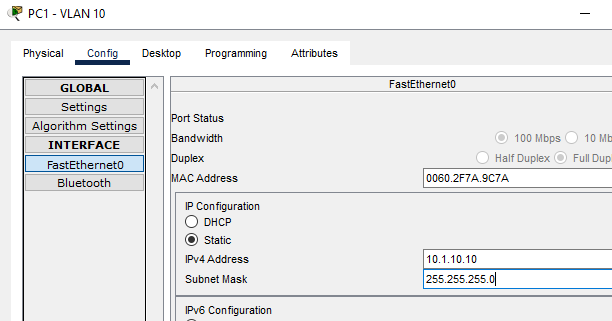
```
PC2 DG and DNS would be: 10.1.20.254 and 
IP would be: 10.1.20.20/255.255.255.0
Then perform: C:\>ping 10.1.10.10 (to PC1)

PC3 DG and DNS would be: 10.1.30.254 and 
IP would be: 10.1.30.30/255.255.255.0
Then perform: C:\>ping 10.1.10.10 (to PC1)
```
>**Server**    
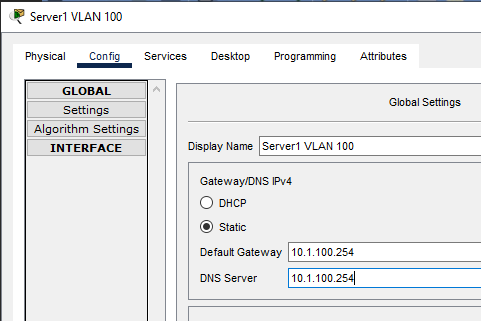
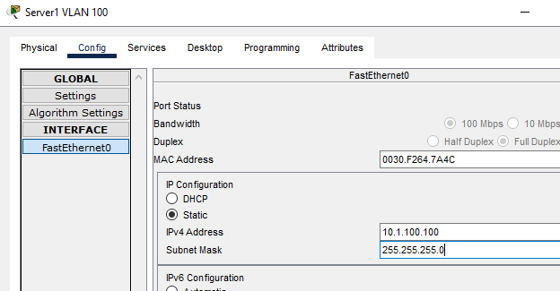

# 4. Checking Connectivity: 
### **From PC1**
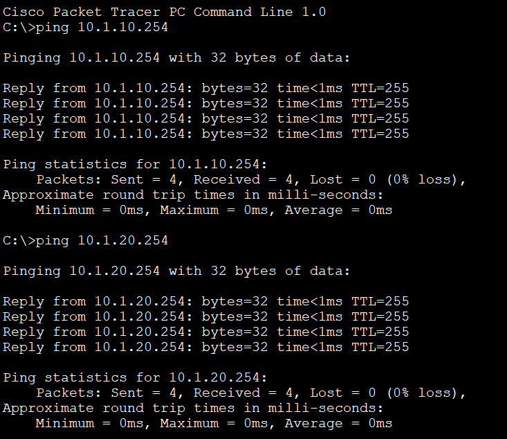
### **From PC1**
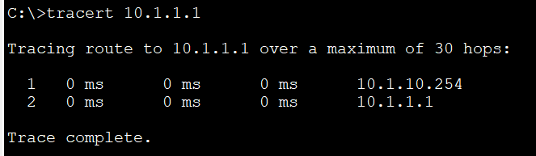
### **Ping From Server**
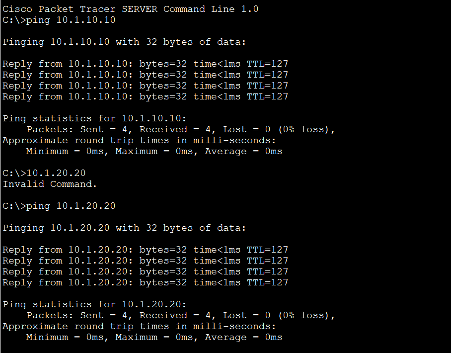
### **Ping From PC to Server**
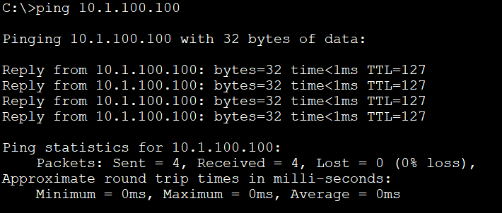

### **[The End]**