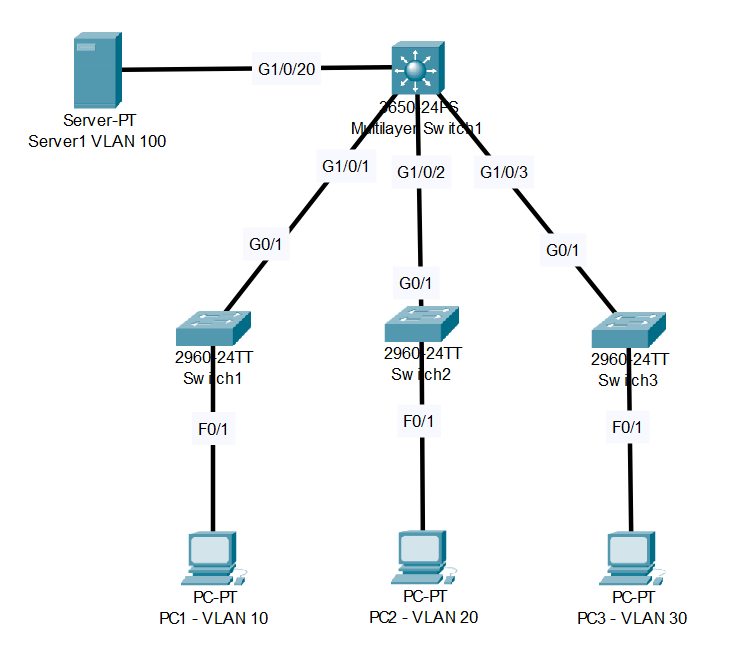

# David Bombal-VLAB Lab (Source: Udemy)
## Scenario: 

## 1. 3650 = layer 3 switch with IP addresses and interVLAN routing:
>**Given:**  
>VLAN 1 = 10.1.1.254/24  
>VLAN 10 = 10.1.10.254/24,    
>VLAN 20 = 10.1.20.254/24  
>VLAN 30 = 10.1.30.254/24,  
>VLAN 100 = 10.1.100.254/24    
```
Core>en
Core#conf t
Enter configuration commands, one per line.  End with CNTL/Z.
```
```
Core(config)#vlan 10
Core(config-vlan)#vlan 20
Core(config-vlan)#vlan 30
Core(config-vlan)#vlan 100
```
```
Core(config-vlan)#do sh vlan brief

VLAN Name                             Status    Ports
---- -------------------------------- --------- -------------------------------
1    default                          active    Gig1/0/1, Gig1/0/2, Gig1/0/3, Gig1/0/4
                                                Gig1/0/5, Gig1/0/6, Gig1/0/7, Gig1/0/8
                                                Gig1/0/9, Gig1/0/10, Gig1/0/11, Gig1/0/12
                                                Gig1/0/13, Gig1/0/14, Gig1/0/15, Gig1/0/16
                                                Gig1/0/17, Gig1/0/18, Gig1/0/19, Gig1/0/20
                                                Gig1/0/21, Gig1/0/22, Gig1/0/23, Gig1/0/24
                                                Gig1/1/1, Gig1/1/2, Gig1/1/3, Gig1/1/4
10   VLAN0010                         active    
20   VLAN0020                         active    
30   VLAN0030                         active    
100  VLAN0100                         active    
1002 fddi-default                     active    
1003 token-ring-default               active    
1004 fddinet-default                  active    
1005 trnet-default                    active    
```
```
Core(config-vlan)#do sh ip int brief
Interface              IP-Address      OK? Method Status                Protocol 
GigabitEthernet1/0/1   unassigned      YES unset  up                    up 
GigabitEthernet1/0/2   unassigned      YES unset  up                    up 
GigabitEthernet1/0/3   unassigned      YES unset  up                    up 
GigabitEthernet1/0/4   unassigned      YES unset  down                  down 
GigabitEthernet1/0/5   unassigned      YES unset  down                  down 
GigabitEthernet1/0/6   unassigned      YES unset  down                  down 
GigabitEthernet1/0/7   unassigned      YES unset  down                  down 
GigabitEthernet1/0/8   unassigned      YES unset  down                  down 
GigabitEthernet1/0/9   unassigned      YES unset  down                  down 
GigabitEthernet1/0/10  unassigned      YES unset  down                  down 
GigabitEthernet1/0/11  unassigned      YES unset  down                  down 
GigabitEthernet1/0/12  unassigned      YES unset  down                  down 
GigabitEthernet1/0/13  unassigned      YES unset  down                  down 
GigabitEthernet1/0/14  unassigned      YES unset  down                  down 
GigabitEthernet1/0/15  unassigned      YES unset  down                  down 
GigabitEthernet1/0/16  unassigned      YES unset  down                  down 
GigabitEthernet1/0/17  unassigned      YES unset  down                  down 
GigabitEthernet1/0/18  unassigned      YES unset  down                  down 
GigabitEthernet1/0/19  unassigned      YES unset  down                  down 
GigabitEthernet1/0/20  unassigned      YES unset  up                    up 🟩
GigabitEthernet1/0/21  unassigned      YES unset  down                  down 
GigabitEthernet1/0/22  unassigned      YES unset  down                  down 
GigabitEthernet1/0/23  unassigned      YES unset  down                  down 
GigabitEthernet1/0/24  unassigned      YES unset  down                  down 
GigabitEthernet1/1/1   unassigned      YES unset  down                  down 
GigabitEthernet1/1/2   unassigned      YES unset  down                  down 
GigabitEthernet1/1/3   unassigned      YES unset  down                  down 
GigabitEthernet1/1/4   unassigned      YES unset  down                  down 
Vlan1                  unassigned      YES unset  administratively down down
```
```
Core(config-vlan)#int g1/0/20
Core(config-if)#switchport mode access
Core(config-if)#switchport access vlan 100
```
```
Core(config-if)#do sh int g1/0/20 switchport
Name: Gig1/0/20
Switchport: Enabled
Administrative Mode: static access
Operational Mode: static access🟩 
Administrative Trunking Encapsulation: dot1q🟩  
Operational Trunking Encapsulation: native
Negotiation of Trunking: Off
Access Mode VLAN: 100 (VLAN0100)
Trunking Native Mode VLAN: 1 (default)
Voice VLAN: none
Administrative private-vlan host-association: none
Administrative private-vlan mapping: none
Administrative private-vlan trunk native VLAN: none
Administrative private-vlan trunk encapsulation: dot1q
Administrative private-vlan trunk normal VLANs: none
Administrative private-vlan trunk private VLANs: none
Operational private-vlan: none
Trunking VLANs Enabled: All
Pruning VLANs Enabled: 2-1001
Capture Mode Disabled
Capture VLANs Allowed: ALL
Protected: false
Appliance trust: none
```
```
Core(config-if)#int g1/0/1
Core(config-if)#switchport mode trunk 

Core(config-if)#int g1/0/2
Core(config-if)#switchport mode trunk 

Core(config-if)#int g1/0/3
Core(config-if)#switchport mode trunk 
```
```
Core(config-if)#do sh run
Building configuration...
interface GigabitEthernet1/0/1
 switchport mode trunk
!
interface GigabitEthernet1/0/2
 switchport mode trunk
!
interface GigabitEthernet1/0/3
 switchport mode trunk
!
interface GigabitEthernet1/0/20
 switchport access vlan 100
 switchport mode access
!
```
```
Core(config-if)#do sh int g1/0/1 switchport 
Name: Gig1/0/1
Switchport: Enabled
Administrative Mode: trunk 🟩
Operational Mode: trunk
Administrative Trunking Encapsulation: dot1q
Operational Trunking Encapsulation: dot1q
Negotiation of Trunking: On
Access Mode VLAN: 1 (default)
Trunking Native Mode VLAN: 1 (default)
Voice VLAN: none
Administrative private-vlan host-association: none
Administrative private-vlan mapping: none
Administrative private-vlan trunk native VLAN: none
Administrative private-vlan trunk encapsulation: dot1q
Administrative private-vlan trunk normal VLANs: none
Administrative private-vlan trunk private VLANs: none
Operational private-vlan: none
Trunking VLANs Enabled: All
Pruning VLANs Enabled: 2-1001
Capture Mode Disabled
Capture VLANs Allowed: ALL
Protected: false
Appliance trust: none
```
```
Core(config-if)#int vlan 1
Core(config-if)#ip address 10.1.1.254 255.255.255.0
Core(config-if)#no shut

Core(config-if)#int vlan 10
Core(config-if)#ip address 10.1.10.254 255.255.255.0
Core(config-if)#no shut

Core(config-if)#int vlan 20
Core(config-if)#ip address 10.1.20.254 255.255.255.0 
Core(config-if)#no shut 

Core(config-if)#int vlan 30
Core(config-if)#ip address 10.1.30.254 255.255.255.0
Core(config-if)#no shut

Core(config-if)#int vlan 40
Core(config-if)#ip address 10.1.40.254 255.255.255.0 
Core(config-if)#no shut 

Core(config-if)#int vlan 100
Core(config-if)#ip address 10.1.100.254 255.255.255.0 
Core(config-if)#no shut 
```
```
Core(config-if)#do sh ip int brief
Interface              IP-Address      OK? Method Status                Protocol 
GigabitEthernet1/0/1   unassigned      YES unset  up                    up 
GigabitEthernet1/0/2   unassigned      YES unset  up                    up 
GigabitEthernet1/0/3   unassigned      YES unset  up                    up 
GigabitEthernet1/0/20  unassigned      YES unset  up                    up 
Vlan1                  10.1.1.254      YES manual up                    up 
Vlan10                 10.1.10.254     YES manual up                    up 
Vlan20                 10.1.20.254     YES manual up                    up 
Vlan30                 10.1.30.254     YES manual up                    up 
Vlan40                 10.1.40.254     YES manual down                  down 🟩
Vlan100                10.1.100.254    YES manual up                    up
```
```
Core(config-if)#no vlan 40
```
```
Core(config)#do sh ip int brief
Interface              IP-Address      OK? Method Status                Protocol 
GigabitEthernet1/0/1   unassigned      YES unset  up                    up 
GigabitEthernet1/0/2   unassigned      YES unset  up                    up 
GigabitEthernet1/0/3   unassigned      YES unset  up                    up 
GigabitEthernet1/0/20  unassigned      YES unset  up                    up 
Vlan1                  10.1.1.254      YES manual up                    up 
Vlan10                 10.1.10.254     YES manual up                    up 
Vlan20                 10.1.20.254     YES manual up                    up 
Vlan30                 10.1.30.254     YES manual up                    up 
Vlan40                 10.1.40.254     YES manual down                  down 
Vlan100                10.1.100.254    YES manual up                    up
```
```
Core(config)#ip routing
```
> **All command at a glance:**
```
Core(config)#vlan 10
Core(config-vlan)#vlan 20
Core(config-vlan)#vlan 30
Core(config-vlan)#vlan 100
-------------------------------------------
Core(config-vlan)#int g1/0/20
Core(config-if)#switchport mode access
Core(config-if)#switchport access vlan 100
-------------------------------------------
Core(config-if)#int g1/0/1
Core(config-if)#switchport mode trunk 
Core(config-if)#int g1/0/2
Core(config-if)#switchport mode trunk 
Core(config-if)#int g1/0/3
Core(config-if)#switchport mode trunk 
-------------------------------------------
Core(config-if)#int vlan 1
Core(config-if)#ip address 10.1.1.254 255.255.255.0
Core(config-if)#no shut
Core(config-if)#int vlan 10
Core(config-if)#ip address 10.1.10.254 255.255.255.0
Core(config-if)#no shut
Core(config-if)#int vlan 20
Core(config-if)#ip address 10.1.20.254 255.255.255.0 
Core(config-if)#no shut 
Core(config-if)#int vlan 30
Core(config-if)#ip address 10.1.30.254 255.255.255.0
Core(config-if)#no shut
Core(config-if)#int vlan 100
Core(config-if)#ip address 10.1.100.254 255.255.255.0 
Core(config-if)#no shut 
-------------------------------------------
Core(config)#ip routing
```