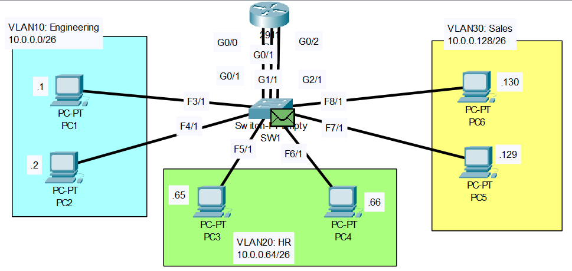

# VLAN Part-01
YouTube Video Link: [Here](https://www.youtube.com/watch?v=-tq7f3xtyLQ&list=PLxbwE86jKRgMpuZuLBivzlM8s2Dk5lXBQ&index=30&pp=iAQB)
## Scenario

>**R1 Configuration**
```
R1>en
R1#conf t
Enter configuration commands, one per line.  End with CNTL/Z.
R1(config)#int g0/0
R1(config-if)#ip address 10.0.0.62
% Incomplete command.
R1(config-if)#ip address 10.0.0.62 255.255.255.192
R1(config-if)#no shut
```
```
R1(config-if)#int g0/1
R1(config-if)#ip add 10.0.0.126 255.255.255.192
R1(config-if)#no shut 
```
```
R1(config-if)#int g0/2
R1(config-if)#ip address 10.0.0.190 255.255.255.192
R1(config-if)#no shut
```
```
R1(config-if)#do sh ip int brief
Interface              IP-Address      OK? Method Status                Protocol 
GigabitEthernet0/0     10.0.0.62       YES manual up                    up 
GigabitEthernet0/1     10.0.0.126      YES manual up                    up 
GigabitEthernet0/2     10.0.0.190      YES manual up                    up 
Vlan1                  unassigned      YES unset  administratively down down
```
