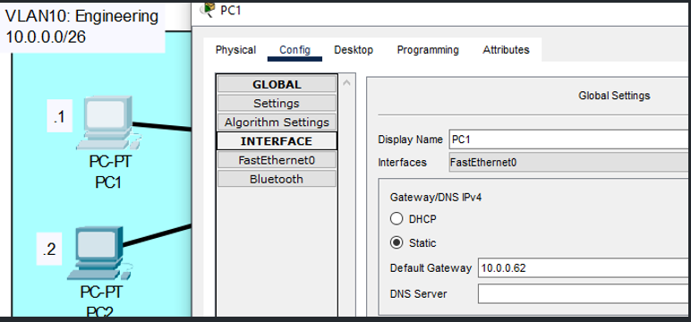
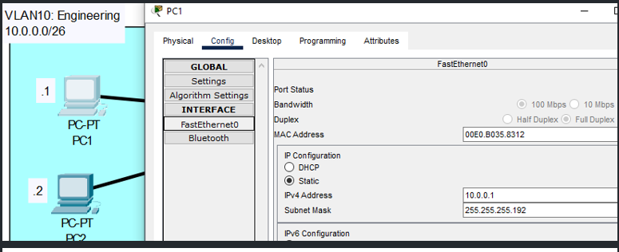
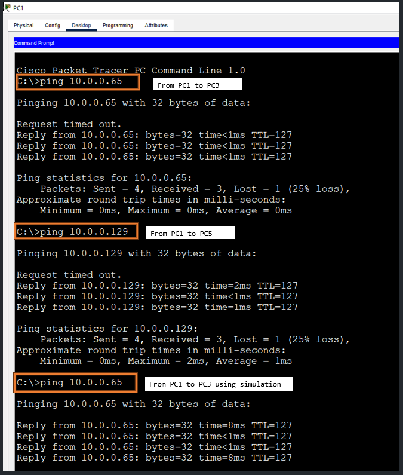

# VLAN Part-01
YouTube Video Link: [Here](https://www.youtube.com/watch?v=-tq7f3xtyLQ&list=PLxbwE86jKRgMpuZuLBivzlM8s2Dk5lXBQ&index=30&pp=iAQB)  
Lab File Link: [Here-Day-16](https://mega.nz/folder/n8QXiR7S#Rognn2PnGaD4hQAA0EleEQ)
## Scenario

## 1. Configure the correct IP address/subnet mask on each PC. Set the gateway address as the LAST USABLE address of the subnet.
```
VLAN 10 -> Default Gateway: 10.0.0.62
IP address of PC's: 10.0.0.1 and 10.0.0.2  
VLAN 20 -> Default Gateway: 10.0.0.126
IP address of PC's: 10.0.0.65 and 10.0.0.66
VLAN 30 -> Default Gateway: 10.0.0.190
IP address of PC's: 10.0.0.129 and 10.0.0.130
```
|DG|IP|
|--|--|
|||

## 2. Configure SW1's interfaces in the proper VLANs Remember the interfaces that connect to R1! Name the VLANs (Engeering, HR, Sales)
```
SW1>en
SW1#conf t
Enter configuration commands, one per line.  End with CNTL/Z.
```
```
SW1(config)#int range g0/1, f3/1, f4/1
SW1(config-if-range)#switchport mode access
SW1(config-if-range)#switchport access vlan 10
% Access VLAN does not exist. Creating vlan 10

SW1(config-if-range)#int range g1/1,f5/1,f6/1
SW1(config-if-range)#switchport mode access 
SW1(config-if-range)#switchport access vlan 20
% Access VLAN does not exist. Creating vlan 20

SW1(config-if-range)#int range g2/1,f7/1,f8/1
SW1(config-if-range)#switchport mode access
SW1(config-if-range)#switchport access valn 30                                       ^
% Invalid input detected at '^' marker.	
SW1(config-if-range)#switchport access vlan 30
% Access VLAN does not exist. Creating vlan 30
```
```
SW1(config-if-range)#do sh vlan brief

VLAN Name                             Status    Ports
---- -------------------------------- --------- -------------------------------
1    default                          active    Fa9/1
10   VLAN0010                         active    Gig0/1, Fa3/1, Fa4/1
20   VLAN0020                         active    Gig1/1, Fa5/1, Fa6/1
30   VLAN0030                         active    Gig2/1, Fa7/1, Fa8/1
1002 fddi-default                     active    
1003 token-ring-default               active    
1004 fddinet-default                  active    
1005 trnet-default                    active    
```
```
SW1(config-if-range)#vlan 10
SW1(config-vlan)#name Engineering
SW1(config-vlan)#vlan 20
SW1(config-vlan)#name HR
SW1(config-vlan)#vlan 30
SW1(config-vlan)#name Sales
```
```
SW1(config-vlan)#do sh vlan brief

VLAN Name                             Status    Ports
---- -------------------------------- --------- -------------------------------
1    default                          active    Fa9/1
10   Engineering                      active    Gig0/1, Fa3/1, Fa4/1
20   HR                               active    Gig1/1, Fa5/1, Fa6/1
30   Sales                            active    Gig2/1, Fa7/1, Fa8/1
1002 fddi-default                     active    
1003 token-ring-default               active    
1004 fddinet-default                  active    
1005 trnet-default                    active   

```
## 3. Make three connections between R1 and SW1 Configure one interface on R1 for each VLAN. Make sure the IP addresses are the gateway address you configured on the PCs.
>**R1 Configuration**
```
R1>en
R1#conf t
Enter configuration commands, one per line.  End with CNTL/Z.
R1(config)#int g0/0
R1(config-if)#ip address 10.0.0.62
% Incomplete command.
R1(config-if)#ip address 10.0.0.62 255.255.255.192
R1(config-if)#no shut
```
```
R1(config-if)#int g0/1
R1(config-if)#ip add 10.0.0.126 255.255.255.192
R1(config-if)#no shut 

R1(config-if)#int g0/2
R1(config-if)#ip address 10.0.0.190 255.255.255.192
R1(config-if)#no shut
```
```
R1(config-if)#do sh ip int brief
Interface              IP-Address      OK? Method Status                Protocol 
GigabitEthernet0/0     10.0.0.62       YES manual up                    up 
GigabitEthernet0/1     10.0.0.126      YES manual up                    up 
GigabitEthernet0/2     10.0.0.190      YES manual up                    up 
Vlan1                  unassigned      YES unset  administratively down down
```
## 4. Ping between the PCs to check connectivity.

### **[The End]**

