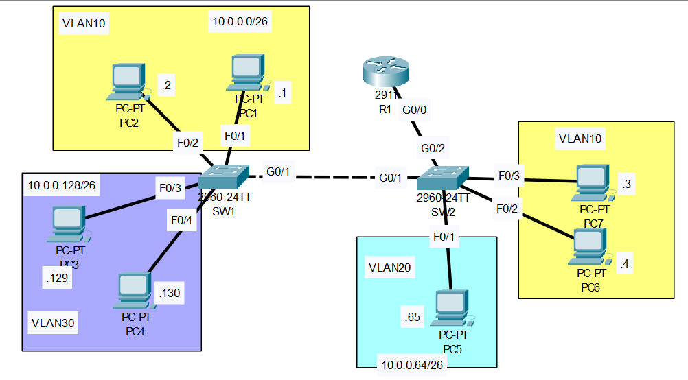

# VLAN Part-02
YouTube Video Link: [Here](https://youtu.be/iRkFE_lpYgc?si=_RnlB9TKfMgECLHR)
## Scenario:


## 1. Configure the switch interfaces connected to PCs as access ports in the correct VLAN.
>**SW1 Configuration**
```
SW1>en
SW1#conf t
Enter configuration commands, one per line.  End with CNTL/Z.
SW1(config)#int range f0/1-2
SW1(config-if-range)#switchport mode access
SW1(config-if-range)#switchport access vlan 10
% Access VLAN does not exist. Creating vlan 10
SW1(config-if-range)#int range f0/3-4
SW1(config-if-range)#switchport mode access
SW1(config-if-range)#switchport access vlan 30
% Access VLAN does not exist. Creating vlan 30
SW1(config-if-range)#
```
>**SW2 Configuration**
```
SW2>en
SW2#conf t
Enter configuration commands, one per line.  End with CNTL/Z.
SW2(config)#int f0/1
SW2(config-if)#switchport mode access
SW2(config-if)#switchport access vlan 20
% Access VLAN does not exist. Creating vlan 20
SW2(config-if)#int range f0/2-3
SW2(config-if-range)#switchport mode access
SW2(config-if-range)#switchport access vlan 10
% Access VLAN does not exist. Creating vlan 10
SW2(config-if-range)#
```

## 2. Configure the connection between SW1 and SW2 as a trunk, allowing only the necessary VLANs. Configure an unused VLAN as the native VLAN. **Make sure all necessary VLANs exist on each switch**
>**SW1 Configuration**
```
SW1#conf t
SW1(config)#int g0/1
SW1(config-if)#switchport mode trunk
SW1(config-if)#switchport trunk ?
  allowed  Set allowed VLAN characteristics when interface is in trunking mode
  native   Set trunking native characteristics when interface is in trunking mode
SW1(config-if)#switchport trunk allowed vlan 10,30
(we don't allow vlan 20 because there is no vlan 20 connceted to sw1)
SW1(config-if)#switchport trunk native vlan 1001
SW1(config-if)#
```

```
SW1(config-if)#do sh vlan brief

VLAN Name                             Status    Ports
---- -------------------------------- --------- -------------------------------
1    default                          active    Fa0/5, Fa0/6, Fa0/7, Fa0/8
                                                Fa0/9, Fa0/10, Fa0/11, Fa0/12
                                                Fa0/13, Fa0/14, Fa0/15, Fa0/16
                                                Fa0/17, Fa0/18, Fa0/19, Fa0/20
                                                Fa0/21, Fa0/22, Fa0/23, Fa0/24
                                                Gig0/2
10   VLAN0010                         active    Fa0/1, Fa0/2
30   VLAN0030                         active    Fa0/3, Fa0/4
1002 fddi-default                     active    
1003 token-ring-default               active    
1004 fddinet-default                  active    
1005 trnet-default                    active    
SW1(config-if)#
```
>**SW2 Configuration**
```
SW2>en
SW2#conf t
SW2(config)#int g0/1
SW2(config-if)#switchport mode trunk 
SW2(config-if)#switchport trunk allowed vlan 10,30
SW2(config-if)#switchport trunk native vlan 1001
```

```
SW2(config-if)#do sh vlan brief

VLAN Name                             Status    Ports
---- -------------------------------- --------- -------------------------------
1    default                          active    Fa0/4, Fa0/5, Fa0/6, Fa0/7
                                                Fa0/8, Fa0/9, Fa0/10, Fa0/11
                                                Fa0/12, Fa0/13, Fa0/14, Fa0/15
                                                Fa0/16, Fa0/17, Fa0/18, Fa0/19
                                                Fa0/20, Fa0/21, Fa0/22, Fa0/23
                                                Fa0/24, Gig0/2
10   VLAN0010                         active    Fa0/2, Fa0/3
20   VLAN0020                         active    Fa0/1
1002 fddi-default                     active    
1003 token-ring-default               active    
1004 fddinet-default                  active    
1005 trnet-default                    active  
```

```
SW2(config-if)#do sh int trunk
Port        Mode         Encapsulation  Status        Native vlan
Gig0/1      on           802.1q         trunking      1001

Port        Vlans allowed on trunk
Gig0/1      10,30

Port        Vlans allowed and active in management domain
Gig0/1      10

Port        Vlans in spanning tree forwarding state and not pruned
Gig0/1      10
```

```
SW2(config-if)#vlan 30
SW2(config-vlan)#exit
SW2(config)#do sh vlan trunk 
sh vlan trunk
        ^
% Invalid input detected at '^' marker.
```

```
SW2(config)#do sh int trunk
Port        Mode         Encapsulation  Status        Native vlan
Gig0/1      on           802.1q         trunking      1001

Port        Vlans allowed on trunk
Gig0/1      10,30

Port        Vlans allowed and active in management domain
Gig0/1      10,30

Port        Vlans in spanning tree forwarding state and not pruned
Gig0/1      10,30

SW2(config)#
```

## 3. Configure the connection between SW2 and R1 using 'router on a stick'. Assign the last usable address of each subnet to R1's subinterfaces.
>**SW2 Configuration**
```
SW2(config)#int g0/2
SW2(config-if)#switchport mode trunk 
SW2(config-if)#switchport trunk allowed vlan 10,20,30
SW2(config-if)#switchport trunk native vlan 1001
```
>**R1 Configuration**
```
R1>en
R1#conf t
R1(config)#int g0/0
R1(config-if)#no shut
```

```
R1(config-if)#int g0/0.10
R1(config-subif)#encapsulation dot1q 10
R1(config-subif)#ip address 10.0.0.62 255.255.255.192
```

```
R1(config-subif)#int g0/0.20
R1(config-subif)#encapsulation dot1q 20
R1(config-subif)#ip address 10.0.0.126 255.255.255.192
```

```
R1(config-subif)#int g0/0.30
R1(config-subif)#encapsulation dot1q 30
R1(config-subif)#ip address 10.0.0.190 255.255.255.192
```
## 4. Test connectivity by pinging between PCs.  All PCs should be able to reach each other.

> From PC7 to PC1: 

```
C:\>ping 10.0.0.1

Pinging 10.0.0.1 with 32 bytes of data:

Reply from 10.0.0.1: bytes=32 time<1ms TTL=128
Reply from 10.0.0.1: bytes=32 time<1ms TTL=128
Reply from 10.0.0.1: bytes=32 time<1ms TTL=128
Reply from 10.0.0.1: bytes=32 time<1ms TTL=128

Ping statistics for 10.0.0.1:
    Packets: Sent = 4, Received = 4, Lost = 0 (0% loss),
Approximate round trip times in milli-seconds:
    Minimum = 0ms, Maximum = 0ms, Average = 0ms
```

> From PC7 to PC5: 

```
C:\>ping 10.0.0.65

Pinging 10.0.0.65 with 32 bytes of data:

Request timed out.
Reply from 10.0.0.65: bytes=32 time<1ms TTL=127
Reply from 10.0.0.65: bytes=32 time=1ms TTL=127
Reply from 10.0.0.65: bytes=32 time<1ms TTL=127

Ping statistics for 10.0.0.65:
    Packets: Sent = 4, Received = 3, Lost = 1 (25% loss),
Approximate round trip times in milli-seconds:
    Minimum = 0ms, Maximum = 1ms, Average = 0ms
```

> From PC7 to PC3: 

```
C:\>ping 10.0.0.129

Pinging 10.0.0.129 with 32 bytes of data:

Request timed out.
Reply from 10.0.0.129: bytes=32 time=1ms TTL=127
Reply from 10.0.0.129: bytes=32 time<1ms TTL=127
Reply from 10.0.0.129: bytes=32 time<1ms TTL=127

Ping statistics for 10.0.0.129:
    Packets: Sent = 4, Received = 3, Lost = 1 (25% loss),
Approximate round trip times in milli-seconds:
    Minimum = 0ms, Maximum = 1ms, Average = 0ms
```
### **[The End]**