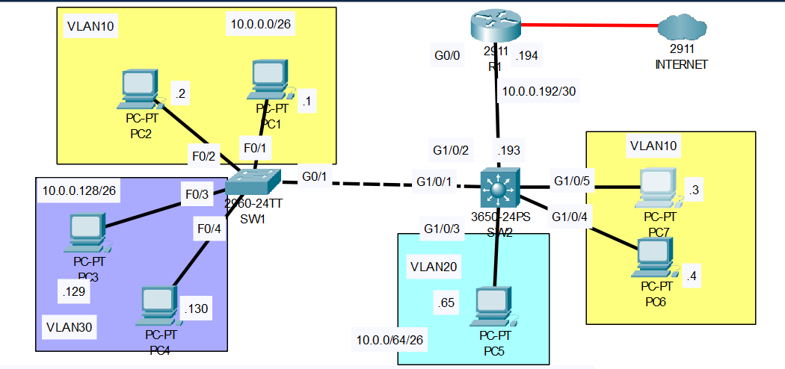

# VLAN Part-03
YouTube Video Link: [Here](https://youtu.be/MQcCr3QW1vE?si=v0w0QYcjHe04d5y0)
## Scenario


>Hosts are in the correct VLANs.  
>SW1-SW2 are connected via trunk.  
>R1-SW2 are connected via ROAS.  

## 1. Replace the ROAS configuration on R1-SW2 with a point-to-point Layer 3 connection. Use the IP addresses given in the network diagram. Configure a default route on SW2, with R1's G0/0 interface as the next hop.
>**R1 Configuration**
```
R1>en
R1#sh run
!
interface GigabitEthernet0/0.10
 encapsulation dot1Q 10
 ip address 10.0.0.62 255.255.255.192
!
interface GigabitEthernet0/0.20
 encapsulation dot1Q 20
 ip address 10.0.0.126 255.255.255.192
!
interface GigabitEthernet0/0.30
 encapsulation dot1Q 30
 ip address 10.0.0.190 255.255.255.192
!
```
```
R1#sh ip int brief
Interface              IP-Address      OK? Method Status                Protocol 
GigabitEthernet0/0     unassigned      YES NVRAM  up                    up 
GigabitEthernet0/0.10  10.0.0.62       YES manual up                    up 
GigabitEthernet0/0.20  10.0.0.126      YES manual up                    up 
GigabitEthernet0/0.30  10.0.0.190      YES manual up                    up 
GigabitEthernet0/1     unassigned      YES NVRAM  administratively down down 
GigabitEthernet0/2     unassigned      YES NVRAM  administratively down down 
GigabitEthernet0/0/0   1.1.1.2         YES manual up                    up 
Vlan1                  unassigned      YES unset  administratively down down
```
```
R1#conf t
Enter configuration commands, one per line.  End with CNTL/Z.
R1(config)#no int g0/0.10
R1(config)#no int g0/0.20
R1(config)#no int g0/0.30
R1(config)#do sh ip int brief
Interface              IP-Address      OK? Method Status                Protocol 
GigabitEthernet0/0     unassigned      YES NVRAM  up                    up 
GigabitEthernet0/1     unassigned      YES NVRAM  administratively down down 
GigabitEthernet0/2     unassigned      YES NVRAM  administratively down down 
GigabitEthernet0/0/0   1.1.1.2         YES manual up                    up 
Vlan1                  unassigned      YES unset  administratively down down
```
```
R1(config)#int g0/0
R1(config-if)#ip address 10.0.0.194 255.255.255.252
R1(config-if)#do sh ip int brief
Interface              IP-Address      OK? Method Status                Protocol 
GigabitEthernet0/0     10.0.0.194      YES manual up                    up 
GigabitEthernet0/1     unassigned      YES NVRAM  administratively down down 
GigabitEthernet0/2     unassigned      YES NVRAM  administratively down down 
GigabitEthernet0/0/0   1.1.1.2         YES manual up                    up 
Vlan1                  unassigned      YES unset  administratively down down
```
>**SW2 Configuration**
```
SW2#sh run
!
interface GigabitEthernet1/0/2
 switchport trunk allowed vlan 10,20,30
 switchport mode trunk
!
SW2# conf t
Enter configuration commands, one per line.  End with CNTL/Z.
SW2(config)#default int g1/0/2
Building configuration...
Interface GigabitEthernet1/0/2 set to default configuration
```
```
SW2(config)# do sh run
!
interface GigabitEthernet1/0/2
!

SW2(config)#int g1/0/2
SW2(config-if)#ip ?
  access-group  Specify access control for packets
  arp           Configure ARP features
  dhcp          Configure DHCP parameters for this interface
  ```
  ```
SW2(config-if)#no switchport
SW2(config-if)#ip address 10.0.0.193 255.255.255.252
SW2(config-if)#exit
SW2(config)#do sh ip route
Default gateway is not set

Host               Gateway           Last Use    Total Uses  Interface
ICMP redirect cache is empty

SW2(config)#ip routing
SW2(config)#do sh ip route
Codes: C - connected, S - static, I - IGRP, R - RIP, M - mobile, B - BGP
       D - EIGRP, EX - EIGRP external, O - OSPF, IA - OSPF inter area
       N1 - OSPF NSSA external type 1, N2 - OSPF NSSA external type 2
       E1 - OSPF external type 1, E2 - OSPF external type 2, E - EGP
       i - IS-IS, L1 - IS-IS level-1, L2 - IS-IS level-2, ia - IS-IS inter area
       * - candidate default, U - per-user static route, o - ODR
       P - periodic downloaded static route

Gateway of last resort is not set

     10.0.0.0/30 is subnetted, 1 subnets
C       10.0.0.192 is directly connected, GigabitEthernet1/0/2
```
```
SW2(config)#ip route 0.0.0.0 0.0.0.0 10.0.0.194
SW2(config)#do sh ip route
Codes: C - connected, S - static, I - IGRP, R - RIP, M - mobile, B - BGP
       D - EIGRP, EX - EIGRP external, O - OSPF, IA - OSPF inter area
       N1 - OSPF NSSA external type 1, N2 - OSPF NSSA external type 2
       E1 - OSPF external type 1, E2 - OSPF external type 2, E - EGP
       i - IS-IS, L1 - IS-IS level-1, L2 - IS-IS level-2, ia - IS-IS inter area
       * - candidate default, U - per-user static route, o - ODR
       P - periodic downloaded static route

Gateway of last resort is 10.0.0.194 to network 0.0.0.0

     10.0.0.0/30 is subnetted, 1 subnets
C       10.0.0.192 is directly connected, GigabitEthernet1/0/2
S*   0.0.0.0/0 [1/0] via 10.0.0.194
```

## 2. Configure SVIs on SW2, one for each VLAN. Assign the last usable IP address of each subnet to the appropriate SVI.
>**SW2 Configuration**
```
SW2(config)#do sh vlan brief
VLAN Name                             Status    Ports
---- -------------------------------- --------- -------------------------------
1    default                          active    Gig1/0/6, Gig1/0/7, Gig1/0/8, Gig1/0/9
                                                Gig1/0/10, Gig1/0/11, Gig1/0/12, Gig1/0/13
                                                Gig1/0/14, Gig1/0/15, Gig1/0/16, Gig1/0/17
                                                Gig1/0/18, Gig1/0/19, Gig1/0/20, Gig1/0/21
                                                Gig1/0/22, Gig1/0/23, Gig1/0/24, Gig1/1/1
                                                Gig1/1/2, Gig1/1/3, Gig1/1/4
10   VLAN0010                         active    Gig1/0/4, Gig1/0/5
20   VLAN0020                         active    Gig1/0/3
30   VLAN0030                         active    
1002 fddi-default                     active    
1003 token-ring-default               active    
1004 fddinet-default                  active    
1005 trnet-default                    active    
```
```
SW2(config)#int vlan 10
SW2(config-if)#ip address 10.0.0.62 255.255.255.192
SW2(config-if)#int vlan 20
SW2(config-if)#ip address 10.0.0.126 255.255.255.192
SW2(config-if)#int vlan 30
SW2(config-if)#ip address 10.0.0.190 255.255.255.192
SW2(config-if)#exit
```
```
SW2(config)#do sh ip int brief
Interface              IP-Address      OK? Method Status                Protocol 
GigabitEthernet1/0/1   unassigned      YES unset  up                    up 
GigabitEthernet1/0/2   10.0.0.193      YES manual up                    up 
GigabitEthernet1/0/3   unassigned      YES unset  up                    up 
GigabitEthernet1/0/4   unassigned      YES unset  up                    up 
GigabitEthernet1/0/5   unassigned      YES unset  up                    up 
GigabitEthernet1/0/6   unassigned      YES unset  down                  down 
GigabitEthernet1/0/7   unassigned      YES unset  down                  down 
GigabitEthernet1/0/8   unassigned      YES unset  down                  down 
GigabitEthernet1/0/9   unassigned      YES unset  down                  down 
GigabitEthernet1/0/10  unassigned      YES unset  down                  down 
GigabitEthernet1/0/11  unassigned      YES unset  down                  down 
GigabitEthernet1/0/12  unassigned      YES unset  down                  down 
GigabitEthernet1/0/13  unassigned      YES unset  down                  down 
GigabitEthernet1/0/14  unassigned      YES unset  down                  down 
GigabitEthernet1/0/15  unassigned      YES unset  down                  down 
GigabitEthernet1/0/16  unassigned      YES unset  down                  down 
GigabitEthernet1/0/17  unassigned      YES unset  down                  down 
GigabitEthernet1/0/18  unassigned      YES unset  down                  down 
GigabitEthernet1/0/19  unassigned      YES unset  down                  down 
GigabitEthernet1/0/20  unassigned      YES unset  down                  down 
GigabitEthernet1/0/21  unassigned      YES unset  down                  down 
GigabitEthernet1/0/22  unassigned      YES unset  down                  down 
GigabitEthernet1/0/23  unassigned      YES unset  down                  down 
GigabitEthernet1/0/24  unassigned      YES unset  down                  down 
GigabitEthernet1/1/1   unassigned      YES unset  down                  down 
GigabitEthernet1/1/2   unassigned      YES unset  down                  down 
GigabitEthernet1/1/3   unassigned      YES unset  down                  down 
GigabitEthernet1/1/4   unassigned      YES unset  down                  down 
Vlan1                  unassigned      YES unset  administratively down down 
Vlan10                 10.0.0.62       YES manual up                    up
Vlan20                 10.0.0.126      YES manual up                    up 
Vlan30                 10.0.0.190      YES manual up                    up
```
## 3. Test inter-VLAN connectivity by pinging between VLANs.
>From PC7 to PC5:   
```
C:\>ping 10.0.0.129

Pinging 10.0.0.129 with 32 bytes of data:

Request timed out.
Reply from 10.0.0.129: bytes=32 time<1ms TTL=127
Reply from 10.0.0.129: bytes=32 time<1ms TTL=127
Reply from 10.0.0.129: bytes=32 time<1ms TTL=127

Ping statistics for 10.0.0.129:
    Packets: Sent = 4, Received = 3, Lost = 1 (25% loss),
Approximate round trip times in milli-seconds:
    Minimum = 0ms, Maximum = 0ms, Average = 0ms
```
## 4. Test connectivity to the Internet by pinging 1.1.1.1 (Routes have already been configured on R1 and the Internet router)
> From PC7 to Internet:   
```
C:\>ping 1.1.1.1

Pinging 1.1.1.1 with 32 bytes of data:

Request timed out.
Request timed out.
Request timed out.
Reply from 1.1.1.1: bytes=32 time<1ms TTL=253

Ping statistics for 1.1.1.1:
    Packets: Sent = 4, Received = 1, Lost = 3 (75% loss),
Approximate round trip times in milli-seconds:
    Minimum = 0ms, Maximum = 0ms, Average = 0ms
```
### **[The End]**